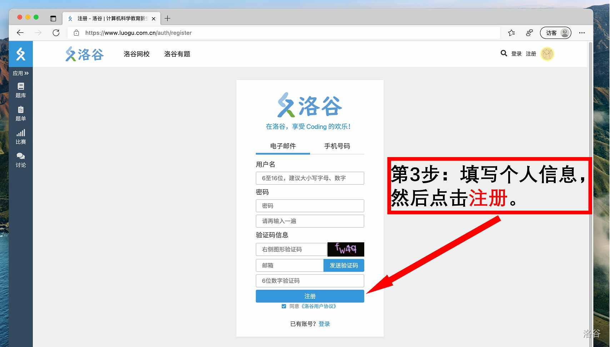
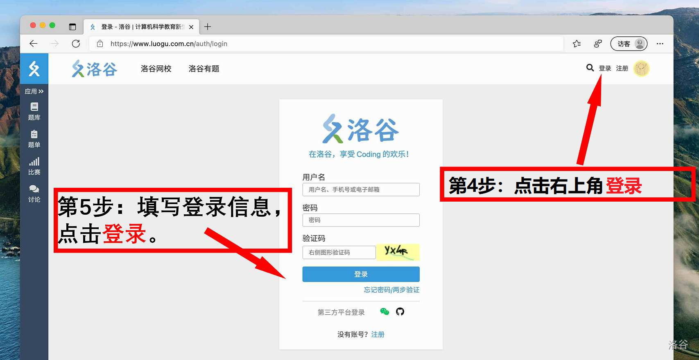
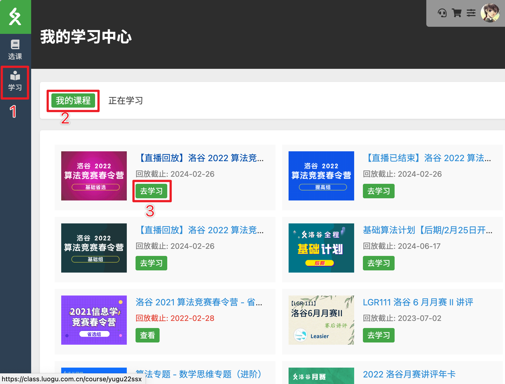

# 常见问题集合

:::tip

本页面集合了网校用户常见问题，您可点击右侧目录直接跳转到对应问题。

:::

## Q：如何注册洛谷网校账号？ {#register}

A：洛谷网校使用**洛谷账号**，若未注册洛谷账号，请按照图中方式注册。

## Q: 怎么上课？/上课后怎么看回放？ {#how-to-learn}

A：洛谷网校的课时上课入口在相应课程包目录内，点击【去上课】即可进入学习界面。

进入课程包后，已购买状态会自动显示目录标签页，这时直接点击想看的对应课时的【去上课】按钮即可。

课程结束后，可在同一页面查看回放，入口与上课时一致。直播课程由于回放需要转码因此需要一些时间，一般在次日上午前能开放回放。
