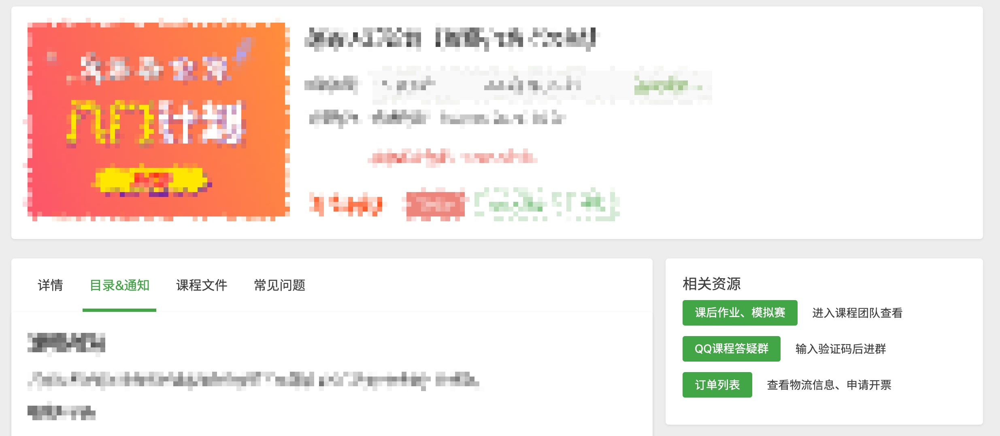
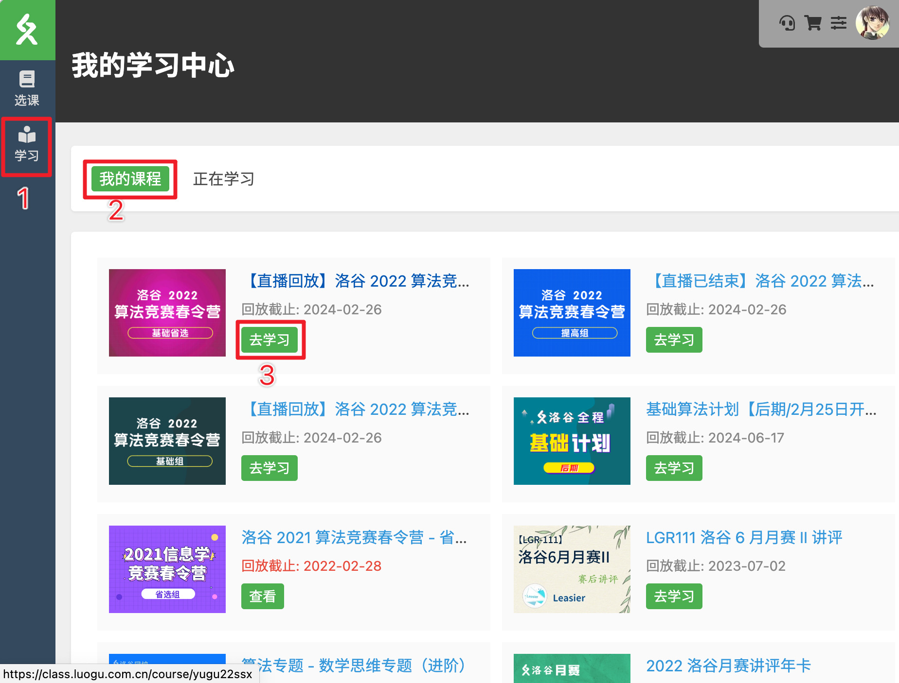
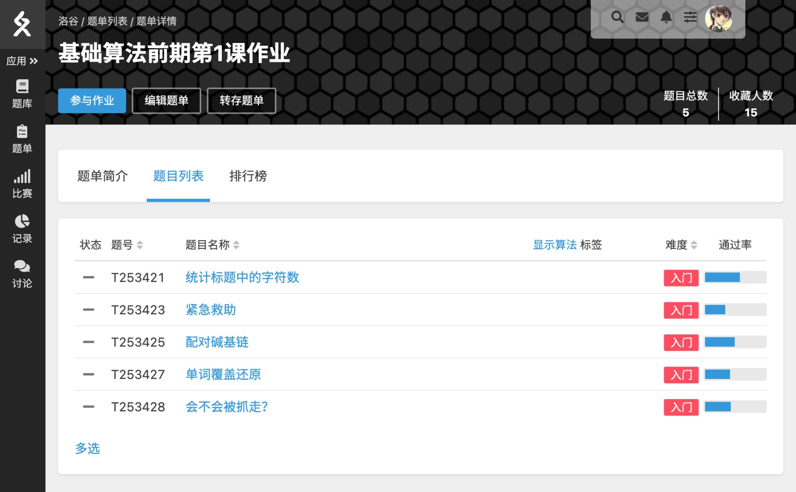

# 洛谷网校常见问题集合

:::tip

本页面集合了网校用户常见问题，您可点击目录直接跳转到对应问题。

:::

## Q：如何注册洛谷网校账号？ {#register}

A：洛谷网校使用**洛谷账号**，若未注册洛谷账号，请按照图中方式注册。

## Q：赠品物流信息在哪里查询？{#logistics-info}

A：进入[个人中心](https://class.luogu.com.cn/me#history) 切换到【历史订单】找到相应的订单，订单中的物流信息显示的就是赠品的快递单号，如果为【N/A】 那就是暂未发出或者还没更新单号。

## Q：报名后，课前需要提前准备什么吗？{#system-requirement}

A：

- 请根据[系统技术要求](system-requirement.md) 安装指定浏览器。
- 【家长】在对应课程（进入方式可参考下一条）的【目录&通知】扫描微信家长群的二维码加入课程通知群。
- 【学员】在对应课程的【相关资源】点击【QQ课程答疑群】按钮，搜索群号填写加群验证信息申请入群，和同学们打打招呼。

**注：不是所有课程都有微信家长群和课程QQ群，请以课程页面为准。**

## Q：怎么上课？/上课后怎么看回放？ {#how-to-learn}

:::tip

请使用最新版的 Chrome浏览器浏览洛谷网校。建议您将[我的学习中心](https://class.luogu.com.cn/learn)或对应课程详情页加入浏览器的收藏夹内，以便快速进入上课页面。

:::
A：洛谷网校的课时上课入口在相应课程包目录内，点击【去上课】即可进入学习界面。

先点击左侧的【学习】进入“我的学习中心”页面，再切换至【我的课程】，点相应的【去学习】跳转到至对应课程包。

进入课程包后，已购买状态会自动显示目录标签页，这时直接点击想看的对应课时的【去上课】按钮即可。

课程结束后，可在同一页面查看回放，入口与上课时一致。直播课程由于回放需要转码因此需要一些时间，一般在次日上午前能开放回放。

## Q：课程的课后作业在哪里查看和完成？{#homework}

A：已购买的课程包会在右侧显示【相关资源】，内有课程团队的跳转按钮，点击即可跳转到课程团队内。

跳转到课程团队后先点击【作业】切换至作业列表，再点击对应作业的标题进入作业页面。

进入作业页面后，点击【题目列表】查看题目，点击题目名称做题。具体交题帮助：[提交题目](../luogu/problem/submit)。

点击【排行榜】查看作业完成情况，如果您的用户名没出现在榜单内就是没有提交记录。

