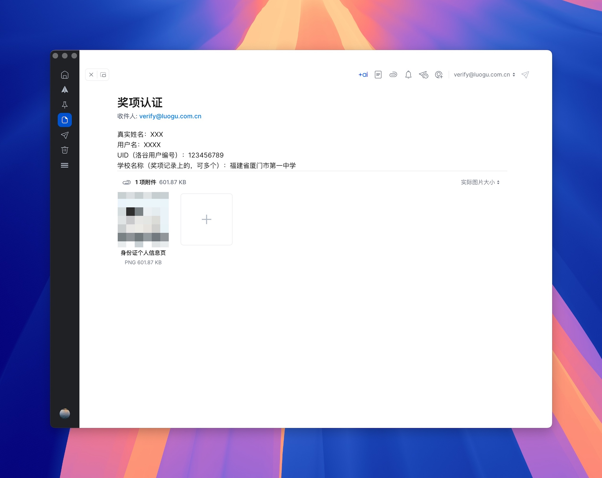

# 洛谷 OI 程序设计能力认证

一直以来，我们都希望可以为洛谷用户们提供更高效的用户识别机制，帮助大家对用户的真实水平进行综合判断。个人认证正是基于这个想法进行的尝试。现在，我们上线了信息学奖项认证功能，将洛谷账号和获得奖项对应起来，证明自己的水平。

洛谷已上线 ICPC/CCPC 部分奖项的奖项认证，具体详见：[奖项认证（ICPC/CCPC）](award-certify-cpc.md)

## 认证需要满足什么条件吗

用户如果希望进行奖项认证，首先需要获得 OI 系列比赛的奖项。

目前可以认证的 OI 系列奖项有：

- CSP-J/S 第二轮获奖（不包括第一轮获奖，以及其他个别省份单独组织的评级活动）
- NOIP 普及组一、二等奖（或等同、非初中组）
- NOIP 提高组一、二等奖（或等同、非初中组）
- NOI 奖牌，包括邀请赛（不包括 online 线上赛）
- WC / APIO / CTSC

:::caution[常见不可认证情况]

- CCF GESP 认证
- 仅获得 CSP-J/S 第一轮的证书
- 个别省份单独举行的 CSP 评级活动，如：小学组
- 于小学或初中时获得的 NOIP 奖项
- 其他非 CCF 主办的各类评级或比赛

:::

非以上奖项无法在洛谷获得认证（包括 CSP 第一轮），以上奖项以 **CCF 官方公布名单**（[https://www.noi.cn/hjmd/mdcx/](https://www.noi.cn/hjmd/mdcx/)）为准，与是否领取到了纸质证书无关，洛谷使用的数据以 [OIerDB](https://github.com/OIerDb-ng/OIerDb-data-generator) 为准。目前 CCF 不公布初中组的获奖信息，没有一个统一的可信数据源进行参考，因此没法单独进行认证，更没法计算积分。

OI 系列比赛积分计算参考 [CCF 评价标准](https://www.noi.cn/xw/2019-08-26/715369.shtml)，但部分**线上比赛**仅认证奖项而不计算积分。洛谷保留积分计算的最终解释权。

:::caution

同一人的实人认证和奖项认证信息只能绑定在同一个洛谷账号上，且不接受奖项迁移申请。

:::

## 如何进行认证 {#how-to-certify}

### 认证方式 1: 自动认证 {#auto-certify}

奖项认证分为 2 个步骤，实人认证和奖项认证。

#### 实人认证 {#id-verify}

:::caution

- 洛谷将通过人脸核验来核实用户提供的姓名、身份证号码（或港澳台居民居住证号码）与申请者是否一致。
- 实人认证仅确认用户的真实身份，是进行奖项认证的前置条件。
- 即使您已有奖项认证，在追加新的奖项认证前，也需要先完成实人认证。
- 一旦认证通过认证，绑定的实人信息无法自主更改。**请务必**使用自己的身份信息进行认证，如有错误请立即联系管理员处理。

:::

具体流程为：

1. 进入[用户设置-安全设置](https://www.luogu.com.cn/user/setting/security)，找到实人认证设置项，点击【开始认证】。
2. 输入真实姓名和身份证号码（或港澳台居民居住证号码），点击提交。
3. 使用手机扫描页面上显示的二维码，根据页面提示完成人脸识别操作。（可使用系统相机、浏览器、微信、支付宝等能扫描二维码的应用。）
4. 支付宝认证通过后将自动返回安全设置页。

#### 奖项认证 {#award-certify}

1. 实人认证完成后，进入[用户设置-奖项认证](https://www.luogu.com.cn/user/setting/prize)，点击【奖项认证】。
2. 选择认证类型。
3. 选择自己获得过的奖项。（系统会根据当前用户 ip 地址和账号的实人认证信息匹配所有同地域同名的奖项，请诚实选择自己的奖项。）
4. 完成认证，系统会自动计算洛谷认证等级。

认证后您的奖项以及洛谷认证等级将会默认在个人中心对所有人展示。您可在设置中隐藏不希望展示的奖项或评级。

##### 自动关联新奖项以及再次认证

当新奖项导入后（以[当前可认证的比赛](https://www.luogu.com.cn/offline-prize/supported-events#contest-CspJunior)为准，待 OIerDB 数据基本稳定后），洛谷将自动追加同名同校的新增奖项以及对部分同地域的升学情形进行自动匹配。

若未能自动自动更新，您可尝试再次奖项认证，手动选择自己的奖项。

### 认证方式 2: 人工认证 {#manual-certify}

**本认证方式即将通过工单系统进行，以下内容仅供参考，请随时关注本帮助内容的更新。**

:::tip

**人工认证前，请先确认有符合要求的奖项：**

 1. 请先完成 [实人认证](#id-verify)，通过后才能认证奖项。如果确实无法通过实人认证，也可将报错信息复制或截图后发邮件反馈。
 2. 前往 [CCF 官方获奖名单查询](https://www.noi.cn/hjmd/mdcx/)，确认是否属于 CCF 公布的奖项。
 3. 前往 [OIerDB](https://oier.baoshuo.dev/) 确认已收录该奖项，如未收录或信息出错请及时[反馈至 OIerDB 项目](https://github.com/OIerDb-ng/OIerDb-data-generator/issues/new/choose)。
 4. 确认该比赛以收录至 [当前可认证的比赛](https://www.luogu.com.cn/offline-prize/supported-events#contest-CspJunior)。（待 OIerDB 数据基本稳定后进行数据导入及自动关联奖项）

**找不到奖项或奖项遗漏**

请在奖项记录所属地进行奖项认证，否则可能会找不到奖项。如果已确认符合洛谷的奖项要求，那可以尝试**人工认证**找回该奖项。

:::

如果因为任何原因有遗漏的奖项、无法进行实人认证等特殊情况，请将按照下列要求发送**电子邮件**至 `verify@luogu.com.cn`，我们将尽快为您处理。

本邮箱**只处理奖项认证相关邮件，不接受其他咨询**。人工认证仅关联对应奖项至指定账户，并不直接干预奖项计算过程。因此不接受除了奖项遗漏之外的任何申诉（**其他账号申诉**请发送至：[申诉邮箱](/contact-us)）。也请不要在邮件内提及想认证的具体等级（因为没用）。

#### 邮件格式要求

邮件标题为【奖项认证】，邮件内容请参照以下模板（直接写在**正文内**，不要放在附件）：

```plain
真实姓名：
证件号码（实人认证失败时需要提供）：
用户名：
UID（洛谷用户编号）：
被遗漏的奖项（奖项名称、报名单位）：
```

同时，您需要按照材料要求提供相关证明，**直接**以单张图片的形式放在附件中。

#### 附件要求

- 请使用 JPG，JPEG 或 PNG 格式建议使用邮箱的压缩图片功能；
- **不要使用** rar/zip 等压缩包、Word 文档、PDF 文档；
- **不要使用** 超大附件、文件中转站功能。

#### 材料要求

**无法通过实人认证的情况，请提供：**

- 本人身份证件：身份证（含港澳台居民居住证）个人信息页、户口本个人信息页、港澳台居民来往大陆通行证、护照个人信息页。
- 本人手持该证件的照片。
- 以上两张照片都需要（强烈建议参考下方示例加上水印）。
- 对于证件上的名称是外文的，请同时确认获奖记录与获奖记录上的名字是否一致。如不一致请提供相应的证明材料。

**奖项认证缺失的情况，请提供：**

- 被遗漏的奖项的纸质证书扫描件或者拍照件或电子证书。
- 举办单位提供的其他证明文件。

**不接受非上述范围的证明**，请不要提供不符合要求的额外材料。

**如果没有特殊情况，请不要在正文中输入其他内容**，请再次注意邮件标题为【奖项认证】，以免被邮箱错误识别为垃圾邮件，以提高我们的处理效率。

格式示例：




## 认证后有什么用

1. 在个人中心中显示自己曾经获得的奖项，用户名旁边根据奖项显示已认证标记。并根据积分规则计算等级并展示（3-5 级为绿色，6-7 级为蓝色，8 级以上为金色），以增加社区活动的学术可信度。
2. 咕值将增加一项“成就分”，完成认证的用户根据最高奖项可以获得 20 到 100 的成就分。咕值高低会影响到用户举报、题解审核、公开赛申请、题目提交限制、图床与专栏配额等行为的优先度，高咕值用户会拥有更多的话语权。但如果选择不展示自己的洛谷认证等级则无法增加成就分。
3. 管理员可能会优先处理认证用户的反馈。
4. 只有认证后的用户才有资格担任洛谷月赛出题的任务，并可以获取数量可观的出题奖金。

## 关于洛谷认证等级的提示

1. 计算的洛谷认证等级仅供参考。由于可参考的数据有限，目前仅支持算出 3 级以上的等级，且 8 级以上的积分计算功能暂时无法正确处理 WC 成绩。
2. 由于缺失数据，2013 年及以前获得的 NOIP 奖项无法正确计算等级。
3. 由于公平原因，洛谷对于部分线上进行的比赛只认证奖项不计算积分。
4. 为了保证奖项认证的含金量，洛谷将对部分奖项分数线进行上浮调整，调整后的奖项分数线会在讨论区内置顶公告，请实时留意。

## 我们将如何处理用户隐私信息

保护大家的个人隐私信息安全是洛谷的一贯原则，申请时提交的证明材料仅供系统进行资质审核，不会另作他用。如果个人信息或者奖项有更新，也请联系我们进行更新。
