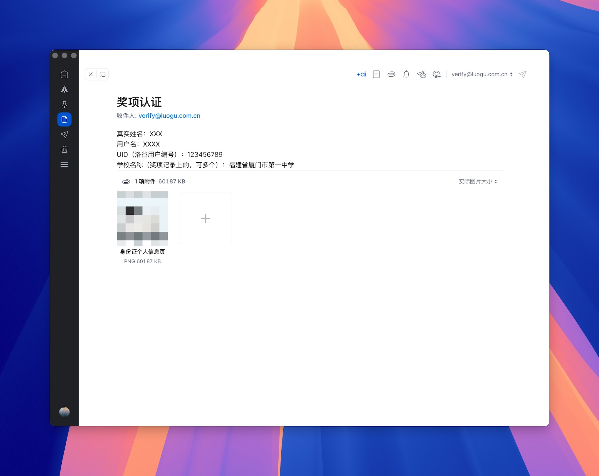
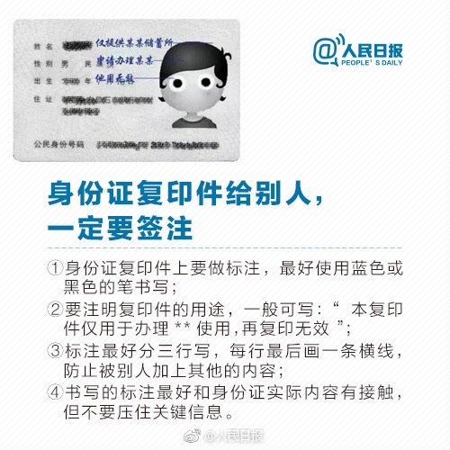

# 奖项认证

一直以来，我们都希望可以为洛谷用户们提供更高效的用户识别机制，帮助大家对用户的真实水平进行综合判断。个人认证正是基于这个想法进行的尝试。现在，我们上线了信息学奖项认证功能，将洛谷账号和获得奖项对应起来，证明自己的水平。**后续 CSP 只要官方有公布名单，或者提供查询的方式，洛谷奖项认证也会跟进。**

## 认证需要满足什么条件吗

用户如果希望进行奖项认证，必须首先获得 NOI 系列比赛的奖项。目前可以认证的奖项有：

    - CSP-J/S 第二轮获奖（不包括第一轮获奖，以及其他个别省份单独组织的评级活动）
    - NOIP 普及组一、二等奖（或等同、非初中组）
    - NOIP 提高组一、二等奖（或等同、非初中组）
    - NOI 奖牌，包括邀请赛（不包括初中组和小学组，不包括 online 线上赛）
    - WC / APIO / CTSC

以上奖项以 **CCF 官方公布名单**（<https://www.noi.cn/hjmd/mdcx/>）为准,部分**线上比赛**洛谷仅认证奖项而不计算积分。  

积分计算仅参考 CCF 计算方法，洛谷保留获奖积分计算的最终解释权。  

非以上奖项无法在洛谷获得认证（包括CSP第一轮）。跟你是否领取到了纸质证书无关，我们是根据OIerDB数据库进行认证的，现在 CCF 不统一公布初中组的获奖信息，导致这边没法有个统一的信源更新数据库。所以我们也没法单独进行认证，更没法计算积分。

:::caution

一个洛谷账号只能绑定一个人的奖项信息，不能重复绑定，并且不接受奖项迁移申请。

:::

## 如何进行认证

**认证方式1: 自动认证**

用户应当拥有自己的支付宝账号，且可以使用手机登录支付宝手机客户端。

用户在个人设置中的“奖项认证”项目点击认证，即可开始认证。在多数情况下，认证是自动进行的，不受人工干涉。认证的流程如下：

1. 填写个人信息并选择学校。
2. 点击开始认证，并使用**本人**的手机支付宝，支付宝账号扫码，按照说明进行操作。
3. 点击“完成认证”，并查看是否成功认证。

如果未能认证成功，或者找不到学校等，请进行人工认证。

认证后您的奖项以及CCF评级将会默认在个人中心对所有人展示。您可在设置中隐藏不希望展示的奖项或评级。

**认证方式2: 人工认证**

如果因为任何原因未能进行自动认证，或找不到学校、有遗漏的奖项、奖项分布在多个学校等特殊情况，请将相关证明资料和您的用户ID发送**电子邮件**至 `verify@luogu.com.cn`，我们将尽快为您处理（一般为 5个工作日内）。  

本邮箱**只处理奖项认证相关邮件，不接受其他咨询**。人工认证仅关联对应奖项至指定账户，并不直接干预奖项计算过程。因此不接受除了奖项遗漏之外的任何申诉( **其他账号申诉**请发送至：`shensu283@luogu.com.cn`)。  也请不要在邮件内提及想认证的具体等级（因为没用）。

请按照下面的模板发送邮件（直接写在正文内，不要放在附件）：

```
真实姓名：
用户名：
UID（洛谷用户编号）：
学校名称（奖项记录上的，可多个）：
```

同时，您需要提供以下材料其中至少一种，**直接**以单张图片的形式放在附件中(请压缩图片至500k内，**不要使用压缩文件、word文档、PDF文档，不要使用超大附件、文件中转站功能**）：

- 身份证个人信息页照片(不是**肖像照**)，**国徽页不需要**, 本人社保卡亦可（建议打上“仅供洛谷认证使用”的水印）；
- 带有姓名和学校的学生证或校卡；
- 本人任一 符合认证范围的比赛纸质证书扫描件或者拍照件。单独的电子证书（包括打印件）不是有效的材料。
- **不接受**noi平台帐号密码以及截图，也请保管好相关账户信息，不要提供给任何人。  

**如果没有特殊情况，请不要在正文中输入其他内容**，以提高我们的处理效率。

格式示例：

   



## 认证后有什么用

1. 在个人中心中显示自己曾经获得的奖项，用户名旁边根据奖项显示已认证标记（CCF 3-5级为绿色，6-7级为蓝色，8级以上为金色），增加社区活动的学术可信度。
2. 根据 CCF 中学生程序设计能力等级评价标准，给出模拟评级。
3. 咕值将增加一项“成就分”，完成认证的用户根据最高奖项可以获得 20 到 100 的成就分。咕值高低会影响到用户举报、题解审核、公开赛申请、题目提交限制、图床与博客配额等行为的优先度，高咕值用户会拥有更多的话语权。但如果选择不展示自己的CCF等级则无法增加成就分。
4. 管理员可能会优先处理认证用户的反馈。
5. 只有认证后的用户才有资格担任洛谷月赛出题的任务，并可以获取数量可观的出题奖金。

## 关于获奖记录的【自动更新/同步】

并没有奖项认证一定能【自动同步】的说法，目前能自动更新的情况只有已有获奖记录，新增记录的获奖者名字和报名学校能完全对得上才会自动更新上去。洛谷的获奖记录的合并方式和OIerDB的逻辑不是完全一样的，更不是照搬它们的个人获奖数据。我们会更加的严谨。所以未来也只是会提供自主更新获奖信息的功能，并且会做限制，以防止滥用事件的发生。  

PS：除非CCF的获奖名单能增加身份证号这一字段，那确实会方便很多，但想想也是不可能的。

## 关于 CCF 等级的提示

1. 计算的CCF等级仅供参考。由于可参考的数据有限，目前仅支持算出3级以上的等级，且8级以上的积分计算功能暂时无法正确处理 WC 成绩。
2. 由于缺失数据，2013年及以前获得的 NOIP 奖项无法正确计算等级。
3. 该评级的计算方法请参考 <http://www.noi.cn/xw/2019-08-26/715369.shtml>
4. 由于公平原因，洛谷对于部分线上进行的比赛只认证奖项不计算积分。

## 我们将如何处理用户隐私信息

保护大家的个人隐私信息安全是洛谷的一贯原则，申请时提交的证明材料仅供系统进行资质审核，不会另作他用。如果个人信息或者奖项有更新，也请联系我们进行更新。
