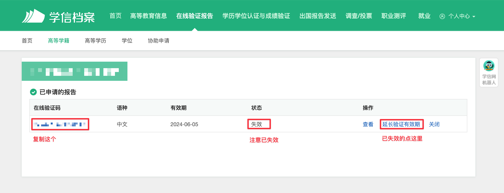

# 如何获取《教育部学籍在线验证报告》的验证码

## 生成《教育部学籍在线验证报告》

1. 访问学信网“学信档案”(<https://my.chsi.com.cn/archive/index.jsp>)，使用学信网账号进行登录
2. 成功登录后，点击顶部菜单中的“在线验证报告”栏目(或[直接点击此](https://my.chsi.com.cn/archive/bab/index.action))，点击**教育部学籍在线验证报告** 的申请按钮;
3. 根据网站指引申请在线验证报告。

## 获取在线验证码

1. 重新进入“在线验证报告”栏目(或[直接点击此](https://my.chsi.com.cn/archive/bab/index.action))，点击**教育部学籍在线验证报告** 的查看按钮;
2. 验证后进入已申请的报告页面，**先确认该报告的有效期**如已失效或临近失效请先延长有效期;
3. 直接复制该在线验证码，填入表单。

