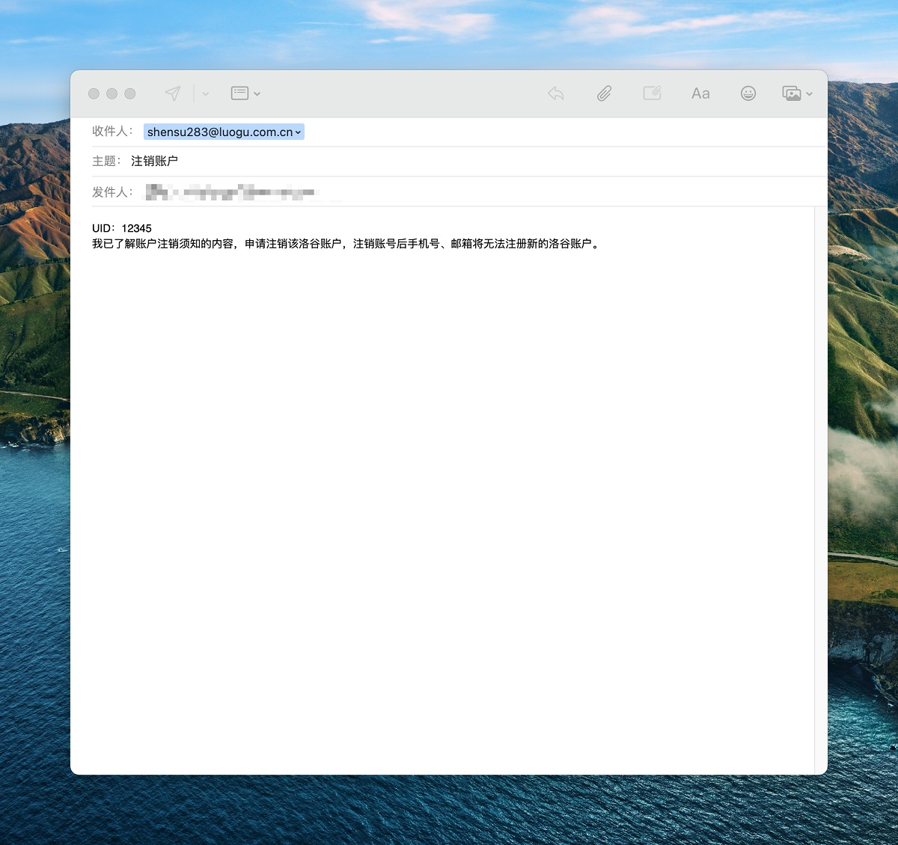

# 注销账号须知

目前可通过邮件注销本邮箱地址绑定的洛谷账号。仅绑定手机号的账户无法通过此方式注销账号。

要注销的账号需注册满 90 天，且未有违规记录。

请注意：

1. 申请注销后原则上无法恢复。该账号绑定的邮箱和手机也不再允许重新注册洛谷。
2. 注销后，包括洛谷网校在内的所有服务均无法继续使用。
3. 注销账户申请需要**人工处理**，一般 1 周处理一次。请勿催促或发送多封邮件。

## 邮件格式

邮箱地址为 shensu283@luogu.com.cn

[点击该连接可直接发送邮件](mailto:shensu283@luogu.com.cn?subject=%E6%B3%A8%E9%94%80%E8%B4%A6%E6%88%B7&body=UID%EF%BC%9A%20%20%0D%0A%E6%88%91%E5%B7%B2%E4%BA%86%E8%A7%A3%E8%B4%A6%E6%88%B7%E6%B3%A8%E9%94%80%E9%A1%BB%E7%9F%A5%E7%9A%84%E5%86%85%E5%AE%B9%EF%BC%8C%E7%94%B3%E8%AF%B7%E6%B3%A8%E9%94%80%E8%AF%A5%E6%B4%9B%E8%B0%B7%E8%B4%A6%E6%88%B7%EF%BC%8C%E6%B3%A8%E9%94%80%E8%B4%A6%E5%8F%B7%E5%90%8E%E6%89%8B%E6%9C%BA%E5%8F%B7%E3%80%81%E9%82%AE%E7%AE%B1%E5%B0%86%E6%97%A0%E6%B3%95%E6%B3%A8%E5%86%8C%E6%96%B0%E7%9A%84%E6%B4%9B%E8%B0%B7%E8%B4%A6%E6%88%B7%E3%80%82) ，前提是手机、电脑已经配置好了邮件发送客户端。

主题为：注销账户

正文内容为：  

> UID：<在个人中心可查看>  
> 我已了解账户注销须知的内容，申请注销该洛谷账户，注销账号后手机号、邮箱将无法注册新的洛谷账户。

[点击该连接可直接发送邮件](mailto:shensu283@luogu.com.cn?subject=%E6%B3%A8%E9%94%80%E8%B4%A6%E6%88%B7&body=UID%EF%BC%9A%20%20%0D%0A%E6%88%91%E5%B7%B2%E4%BA%86%E8%A7%A3%E8%B4%A6%E6%88%B7%E6%B3%A8%E9%94%80%E9%A1%BB%E7%9F%A5%E7%9A%84%E5%86%85%E5%AE%B9%EF%BC%8C%E7%94%B3%E8%AF%B7%E6%B3%A8%E9%94%80%E8%AF%A5%E6%B4%9B%E8%B0%B7%E8%B4%A6%E6%88%B7%EF%BC%8C%E6%B3%A8%E9%94%80%E8%B4%A6%E5%8F%B7%E5%90%8E%E6%89%8B%E6%9C%BA%E5%8F%B7%E3%80%81%E9%82%AE%E7%AE%B1%E5%B0%86%E6%97%A0%E6%B3%95%E6%B3%A8%E5%86%8C%E6%96%B0%E7%9A%84%E6%B4%9B%E8%B0%B7%E8%B4%A6%E6%88%B7%E3%80%82)

## 其他

如想要在注销账户后还想用原手机号/邮箱 注册新账号的话，请通过换绑操作提前转移至新账户。
