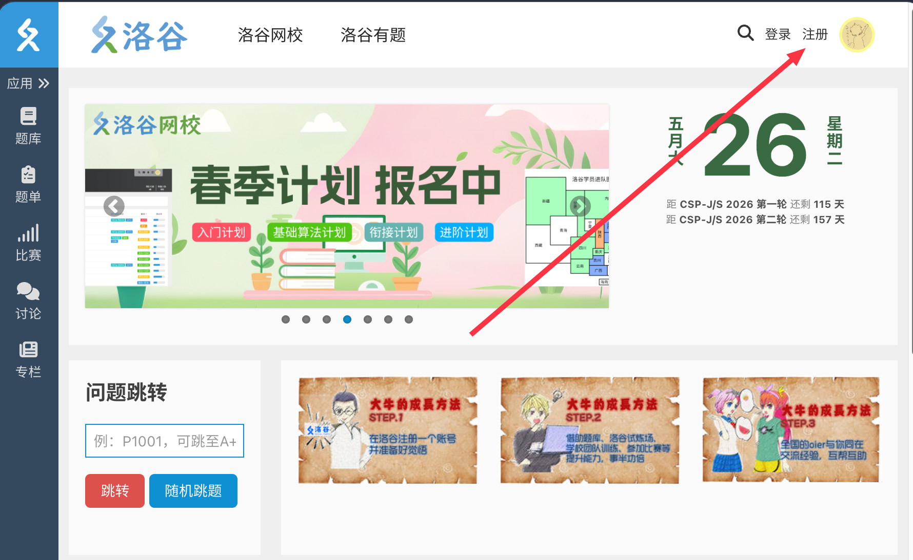
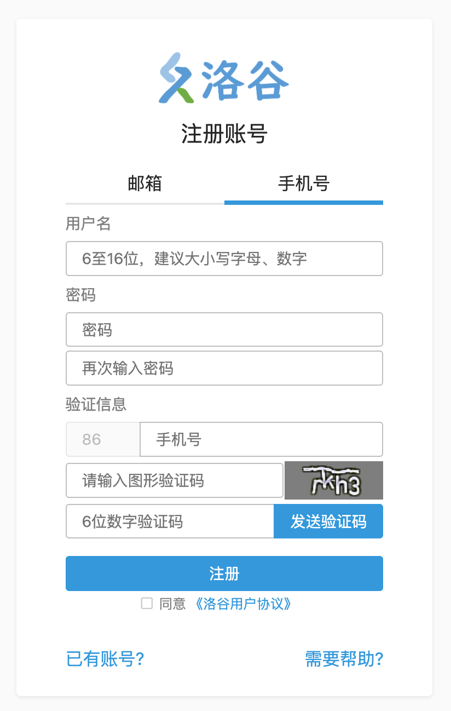
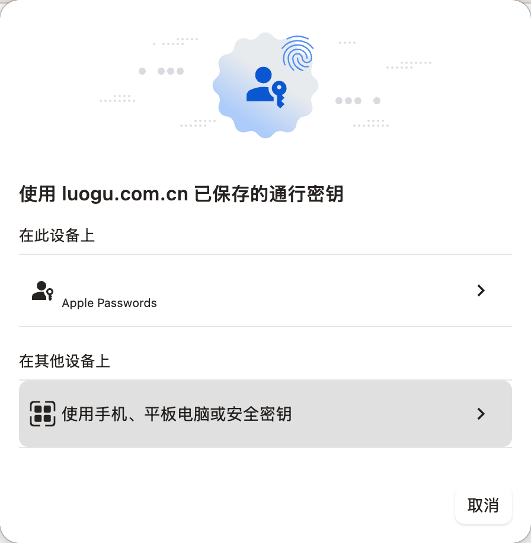
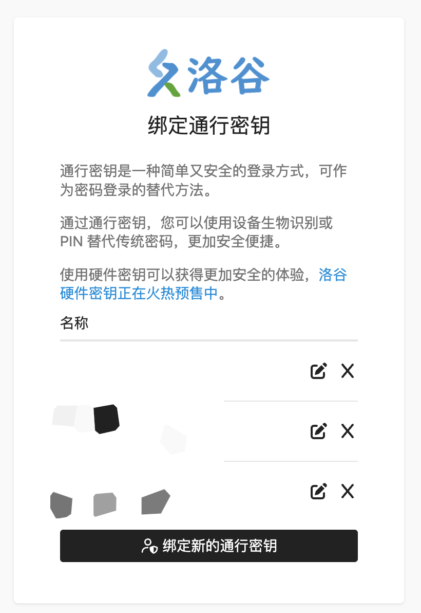
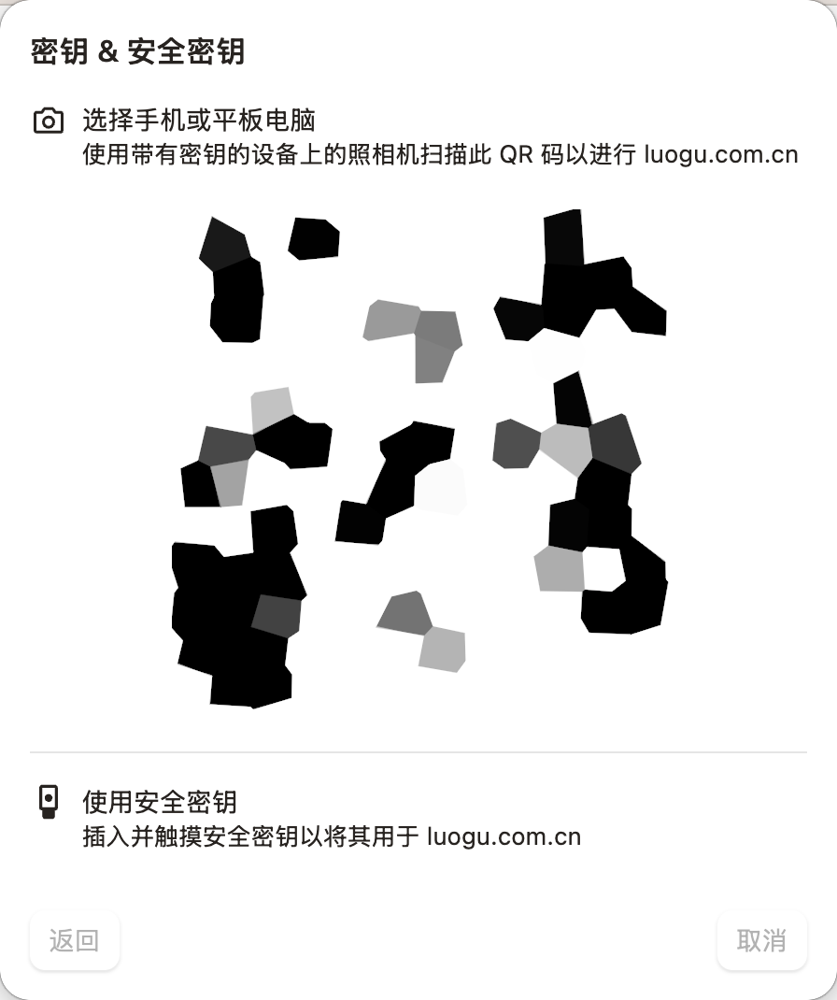

# 洛谷账号并设置安全保护

## 注册账号

建议使用电脑浏览器进行账号注册流程。以下是完整流程（以使用手机号注册为例，邮箱注册同理）：
1. 打开浏览器访问[洛谷首页（https://www.luogu.com.cn/）](https://www.luogu.com.cn/)，点击右上角的【注册】按钮。
2. 点击【手机号】切换到手机号注册页面。
3. 依次填入用户名、密码、手机号、图形验证码。建议设置一个独特的带有大小写字母和数字的混合密码，并且定期修改以防密码泄露。
4. 点击最后一行右侧的【发送验证码】按钮，获取短信验证码。
5. 输入短信验证码，阅读并勾选同意《洛谷用户协议》后，点击【注册】按钮完成注册。

## 保护账号安全

刚注册的账号仅有账号密码和手机号作为安全保护，比较容易遭到账号盗用的威胁。因此请立即前往账号设置页面，添加安全邮箱并且有条件的话绑定两步验证码和通行密钥（passkey），以增强账号的安全性。

### 添加安全邮箱

进入个人设置-安全设置页面（[https://www.luogu.com.cn/user/setting/security](https://www.luogu.com.cn/user/setting/security)），点击【绑定邮箱】按钮，按照页面提示绑定邮箱。建议使用 QQ 邮箱、163 邮箱等国内常用邮箱服务。

请注意：绑定安全邮箱后无法直接解绑，只能换绑邮箱。因此请务必使用常用邮箱服务，避免使用临时邮箱或测试邮箱。

### 双因素认证

设置完两步验证码后，未来登录洛谷账号或进行敏感操作是都将会被要求进行双因素认证。如果无法完成认证可能导致账号被锁定。

双因素认证可使用手机验证码、邮箱验证码、两步验证码、通行密钥（passkey）通过。

因此请确认绑定的邮箱或手机号可以正常收信，避免因为无法收到验证码而导致账号被锁定。

### 设置两步验证码

进入个人设置-安全设置页面（[https://www.luogu.com.cn/user/setting/security](https://www.luogu.com.cn/user/setting/security)），点击【设置验证码】按钮，按照页面提示设置两步验证码。

### 设置通行密钥（passkey）

进入个人设置-安全设置页面（[https://www.luogu.com.cn/user/setting/security](https://www.luogu.com.cn/user/setting/security)），点击【设置通行密钥】按钮，按照页面提示设置通行密钥。

目前现代浏览器都支持通行密钥（passkey），在进入通行密钥设置页面后，会自动触发浏览器的通行密钥功能弹窗。请在弹窗内选择对应的安全密钥选项。根据系统不同和浏览器不同，界面内显示的选项会略有不同，建议查阅浏览器的官方文档或系统的帮助文档。

建议设置 2 个通行密钥，分别为软件通行密钥和硬件通行密钥。

#### 软件通行密钥

建议使用常用电脑的系统级通行密钥（passkey），如 Windows hello、Apple password 等。不建议使用浏览器提供的内置通行密钥功能，一旦浏览器被删除或卸载，该通行密钥也会丢失无法找回。

在洛谷账号通行密钥管理页面，可对重命名、删除已有的通行密钥,也可继续绑定新的通行密钥。

您可额外绑定手机设备的通行密钥（passkey），在触发的通行密钥弹窗中选择【使用手机、平板电脑或安全密钥】选项。会跳转至带有二维码的页面，使用符合要求的手机相机扫码该二维码，会进入绑定流程。

 

#### 硬件通行密钥

可使用符合 **FIDO2 标准**的硬件安全密钥作为替代。常见产品包括：

- **YubiKey 系列**
- **Google Titan 安全密钥**
- **飞天诚信 FIDO 系列**
- 其他通过 FIDO2 认证的安全密钥

将硬件密钥插入电脑的 USB 插口，在刚才触发的使用手机、平板电脑或安全密钥弹窗中触摸硬件密钥的触摸区域，输入硬件密钥的 PIN 码，即可完成绑定。

洛谷硬件密钥正在火热预售中, 详情请查看[Luogu Passkey 购买页](https://class.luogu.com.cn/course/passkey)。
