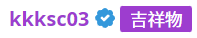
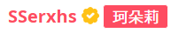
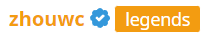

# 用户名牌子

目前洛谷用户名后显示的 tag 分为四种类型。分别为管理员牌子、永久荣誉牌子、洛谷网校课程优秀学员牌子，以及对应作弊者的惩罚。牌子的颜色和用户名一致。

## 管理员牌子

所有管理员均为紫色用户名，管理员的牌子默认字段为【管理员】，但管理员上任时都可以向 kkk 申请自定义称号。在管理员任上一直有效。

## 永久荣誉牌子

- 管理员退任后将保留其称号
- 报名省选计划且最终进入省队

## 洛谷网校优秀学员

报名洛谷计划类课程，且符合该课程优秀学员标准的。授予规则取决于所报名课程，具体标准需报名后向班主任咨询。该称号有效期最长一年。

## 作弊者

因为作弊或其他学术不端行为，所获得的惩罚的一部分，将被强制更改用户名颜色并加上作弊者标签，15 天后重置。
