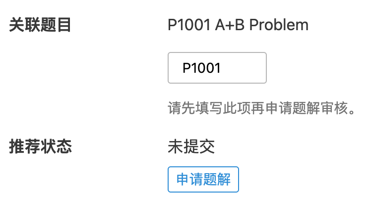

# 个人专栏文章功能说明

所有已实名用户可发布文章和题解，所有个人发布内容可在 *个人中心-专栏* 标签查看。

用户使用该功能发表的内容应遵守中国相关法律法规，以及[《洛谷社区规则》](../../rules/community/index.md)的相关条目，如有违反管理员将会根据洛谷社区规则处理。

## 新建/编辑文章

用户可在 *个人中心-专栏* 标签页面点击【新建】按钮新建文章，或在 *文章广场* 点击【新建文章】按钮新建文章。

用户可通过文章卡片的文章标题后的笔型图标，*文章管理-所有文章* 的编辑按钮，*文章详情页* 底部编辑按钮进入编辑页面。

## 文章评论区

用户可设置该文章是否允许其他用户评论或仅允许用户自己关注的用户评论，或关闭该文章的评论功能。

## 文章分类

文章分为：**算法·理论**、**科技·工程**、**学习·文化课**、**生活·游记**、**休闲·娱乐**、**题解**、**个人记录**、**闲话**。  

其中**个人记录**、**闲话**分类无法全站推荐展示，仅能设置为*个人公开*文章。

其中**题解**分类的文章将经管理员依据[《洛谷主题库题解规范》](../../rules/academic/solution-standard.md)审核通过后在对应题目的题解区以及 *文章广场-题解分区* 内展示。

## 文章公开度

公开度分为：*全站推荐*、*已审核题解*、*个人公开*、*个人隐藏*、*已删除*。

全站推荐：将在 *文章广场* 内展示，高质量内容将会得到更多曝光。文章的内容修改后会被降级为**个人公开**，需重新申请审核。

已审核题解：将在对应题目的题解区以及 *文章广场-题解分区* 内展示。文章的内容修改后会被降级为**个人公开**，需重新申请审核。

个人公开：仅在 *个人中心* 内公开展示。

个人隐藏：仅限作者自己查看，会显示在自己的 *个人中心* 内，但不会对访客显示。 访客无法通过 url 访问。

已删除：不显示在 *文章管理-回收站* 内，但会保留在数据库内。

## 全局公开文章

文章需审核后才能在全站范围内（包括国内站）公开展示。

:::caution[注意]

请编辑完文章并保存后，再点击按钮投稿合集、提交题解或全站推荐。

:::

### 申请全站推荐 {#submit-artcle}

用户可在文章编辑页内点击【申请全站推荐】按钮提交审核，审核通过后会被变更为*全站推荐*文章。

提交审核后，一般情况下，文章将于十天内被审核。

已推荐文章可修改文章分类（**个人记录**、**闲话**、**题解**除外），修改文章内容将会被自动变更为 *个人公开* 文章，需重新申请推荐审核。

### 投稿至官方合集

用户可在文章编辑页内点击【投稿至官方合集】按钮提交审核，审核通过后会被变更为*全站推荐*文章，并且直接进入对应官方合集。

请注意：官方合集有分类限制，并且有投稿时间窗口，具体要求请留意讨论区内置顶帖。

### 申请提交为题解 {#submit-solution}

提交题解审核时请先填写关联题目的**题号**,并将文章分类设置为**题解**。

用户可在文章编辑页内点击【申请题解】按钮提交审核，审核通过后会被变更为 *已审核题解* 文章。

提交审核后，一般情况下，题解将于七天内被审核。如果超过七天仍未被审核，可以私信管理提醒，七天内禁止催审。

已审核题解不可修改文章分类，修改文章内容将会被自动变更为 *个人公开* 文章，需重新申请推荐审核。
