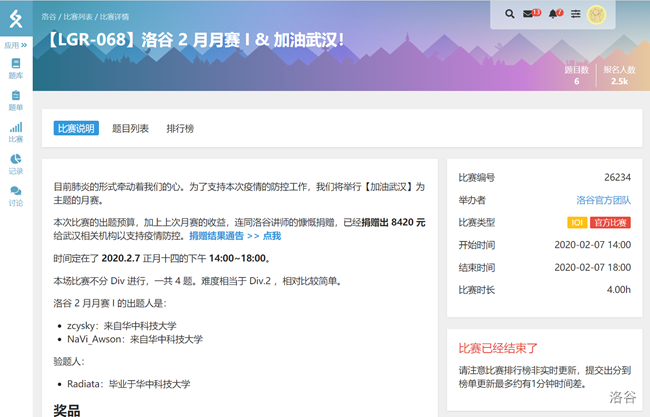
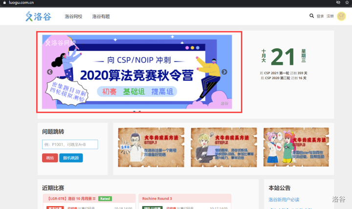
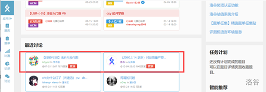
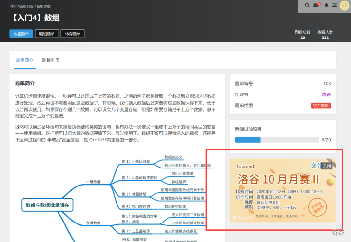
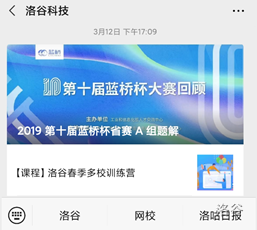
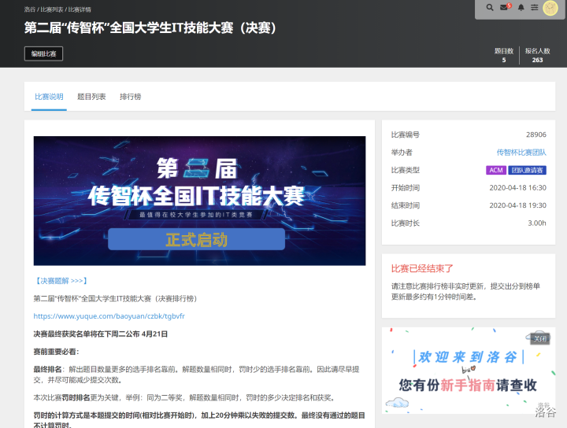

# 举办线上商业性算法比赛

对于各类需要举办线上算法竞赛的企业院校，洛谷 <https://www.luogu.com.cn> 提供完善的竞赛平台，可提供线上公开或者非公开的算法竞赛的协助和便利，同时可以进行合理的商业宣传。

对于非盈利的组织机构进行的非商业比赛，可以酌情减少或者免除合作的费用。

对于一般的学生出题人举办的公开赛，不适用于本文，请根据[《公开比赛规范及要求》](../../rules/academic/opencontest-standard.md)中的要求提交比赛和审核。  

## 提供赛时平台

洛谷可为比赛提供举办平台。参赛者需要自行注册洛谷账号并报名，即可按照预定的时间参加比赛。参赛者可以自由报名比赛，也可以使用邀请码报名比赛。主办方可以另行实现报名系统，自行收集参赛者的报名信息，然后将邀请码反馈给参赛者，然后使用邀请码报名。洛谷不会提供用户的隐私信息。

比赛可以使用 OI 赛制、ACM 赛制、IOI 赛制。洛谷组织过 5 千人同时参加的比赛，预计可以承办最多一万人同时参加的比赛。

主办方可以在比赛描述中进行合理的商业宣传，包括实习机会、产品发布等。主办方也可以向优秀选手提供奖品或者奖金。洛谷有权拒接认为不合适的比赛。

赛后，洛谷提供基本的反作弊机制，可以筛查非常相似或者直接复制的提交记录，在一定程度上保障线上比赛的公平。可以导出比赛结果和榜单，反馈给主办方进行分析或者后续处理。

## 提供比赛宣传

洛谷是国内最为知名的算法竞赛社区之一，拥有相当可观的流量。日 PV 数十万，DAU 约 1 到 2 万，日评测量数万。洛谷提供如下的宣传方式，让更多的人知道比赛。

- 洛谷首页大图宣传（需要自行提供图）

- 首页帖子置顶

- 洛谷部分页面右下方广告位

- 洛谷科技微信公众号（约1万关注者）

向注册用户发送短信（需要没有关闭推送的用户）
以上宣传渠道仅用于宣传比赛本身。洛谷不对其他商业行为单独进行宣传。

## 提供比赛内容

洛谷拥有强大的教研与出题团队，包括在 NOI 系列比赛、ICPC 系列比赛取得过优秀成绩的选手，已经为洛谷的月赛、各类培训课程提供过很多优秀题目。洛谷的教研出题团队可以协助提供科学合理的算法竞赛出题任务。可以根据难度和范围等进行定制。题目的版权归主办方所有。

洛谷也提供验题服务，对主办方自行提供题目的科学性和标程解法的正确性进行评估，减少出错或者撞题的可能性。如果是面向不特定公众公开报名的比赛，且由主办方自行供题，且出题人不是知名选手或出题人（以洛谷界定为准），则这项服务是强制选择的，否则可能会出现题目质量低下而影响双方的口碑。

## 费用和服务流程

洛谷竞赛平台的服务费用透明，各项服务的费用请直接询问我们获取报价。

合作举办比赛流程：商谈比赛形式、参与者等事宜并报价→签订合同，支付第一笔费用→准备题目（出题、验题），同时进行宣传→进行比赛→赛后总结、评奖→支付剩余费用。

如果需要的定制的内容，也可根据实际情况讨论。

## 成功案例

洛谷于 2020 年 4 月成功协办 3 千人规模的“传智杯”线上比赛。洛谷为传智杯提供了报名认证、题目审查等服务，最终使得比赛顺利举办。  

  

比赛官网：<http://dasai.ityxb.com/>

洛谷线上初赛：<https://www.luogu.com.cn/contest/28762>

洛谷线上复赛：<https://www.luogu.com.cn/contest/29004>

## 联系我们

如有这方面的需求，欢迎通过我们的邮箱 <mailto:k@luogu.org> 联系我们，之后会有专人负责对接。
