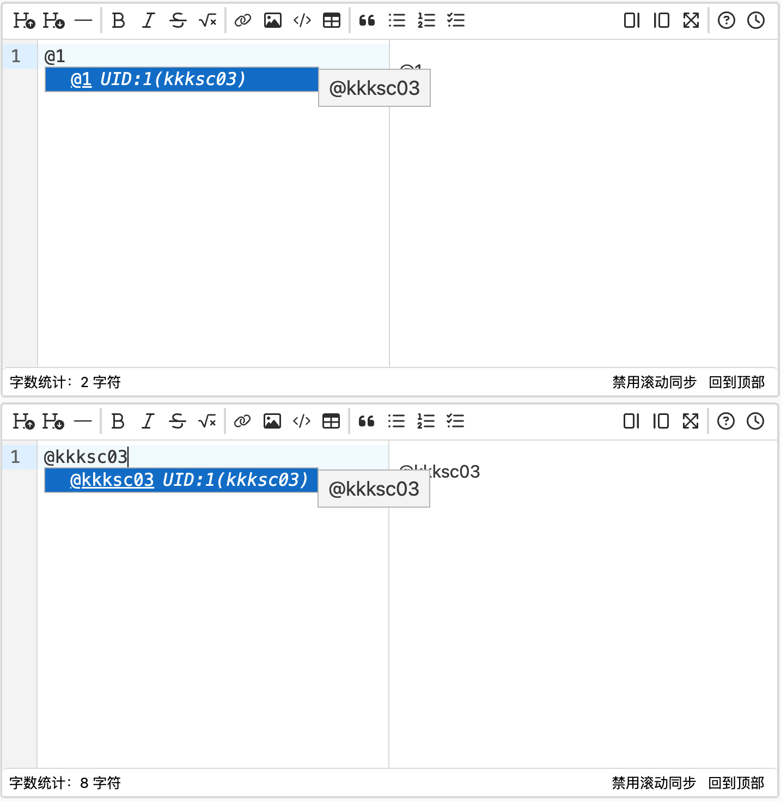

# 讨论

## 板块

讨论区共分为若干板块

- 站务版：管理团队将会正在这里发布网站重要信息。不允许普通用户在此发帖。
- 题目总版：你可以在这里提出关于洛谷中题目的各种问题。
- 学术版：你可以在这里提出其他学术问题。
- 灌水区：为所有有话想说的同学们敞开大门。
- 反馈版：反馈遇到的问题。
- 小黑屋：用来公开严重损害洛谷的行为。

除此之外，每一道题目都有一个专属板块，可以从题目详情页面进入，也可以在讨论区主页右侧输入题号进入。各个团队也有私有的讨论区

## 发帖

:::caution

发帖前建议先阅读[讨论区规范](https://www.luogu.com.cn/discuss/152590)、[提问的艺术](https://studyingfather.blog.luogu.org/how-to-ask-questions-the-smart-way-luogu-edition)  
多次违规发帖将被禁言乃至封禁账户。

:::

在讨论区主页选择板块后，在页面下方可以发帖。在每一帖子页面下方可以进行回帖。帖子可以用 Markdown 进行美化和 @ 其他用户。详见[帮助：Markdown](../../rules/academic/handbook/markdown.md)。

## 提及（at）他人

要在洛谷讨论区回复中提及其他用户（即“at”该用户），可以在 Markdown 编辑器内使用符号 @ 后面紧跟该用户的用户名或 uid，再紧跟空格。会自动触发编辑器的自动补全功能，确认提及的对象后在按下 Enter 键确认后，编辑器会自动补全。

:::caution

本功能仅适用于洛谷**讨论区的回复**中，在其他使用 Markdown 的地方无效。

只有使用此方式才能让被提及的用户收到**系统通知**，获知是在什么时间、哪篇帖子内的回复、被哪位用户提及了。

:::