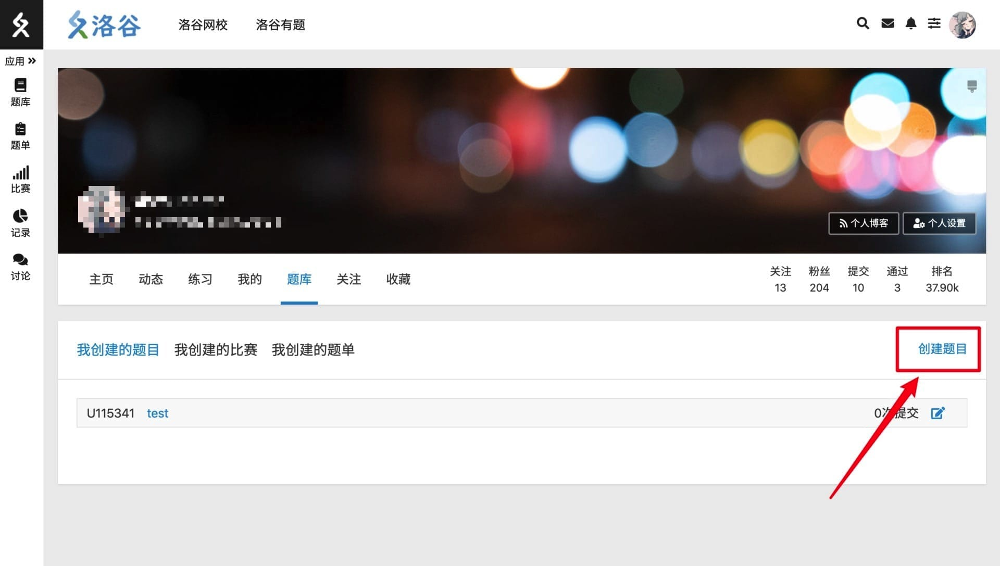
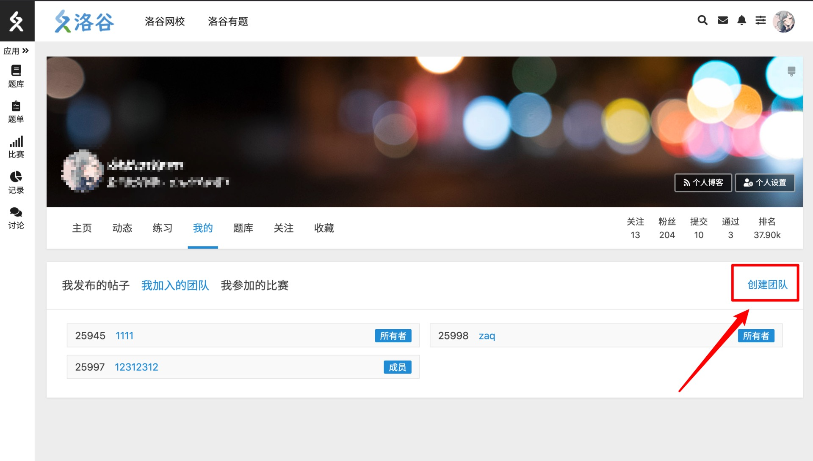
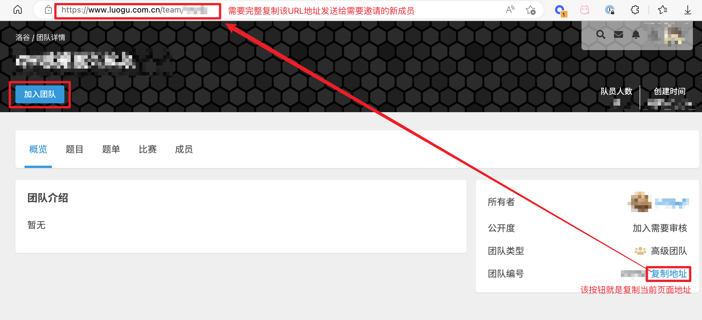
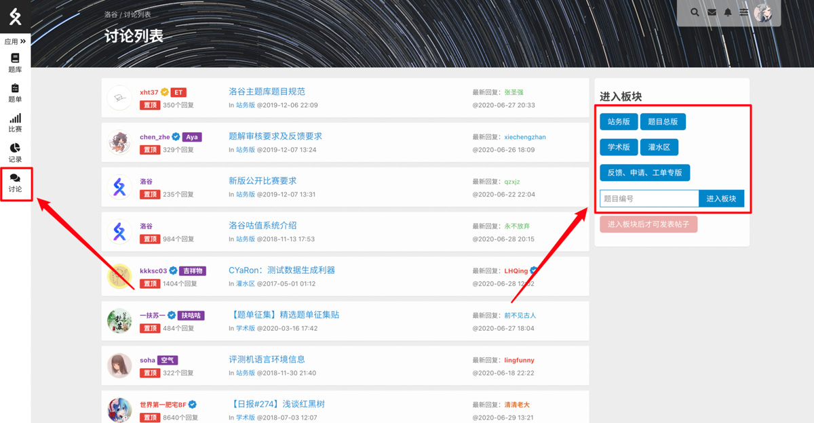
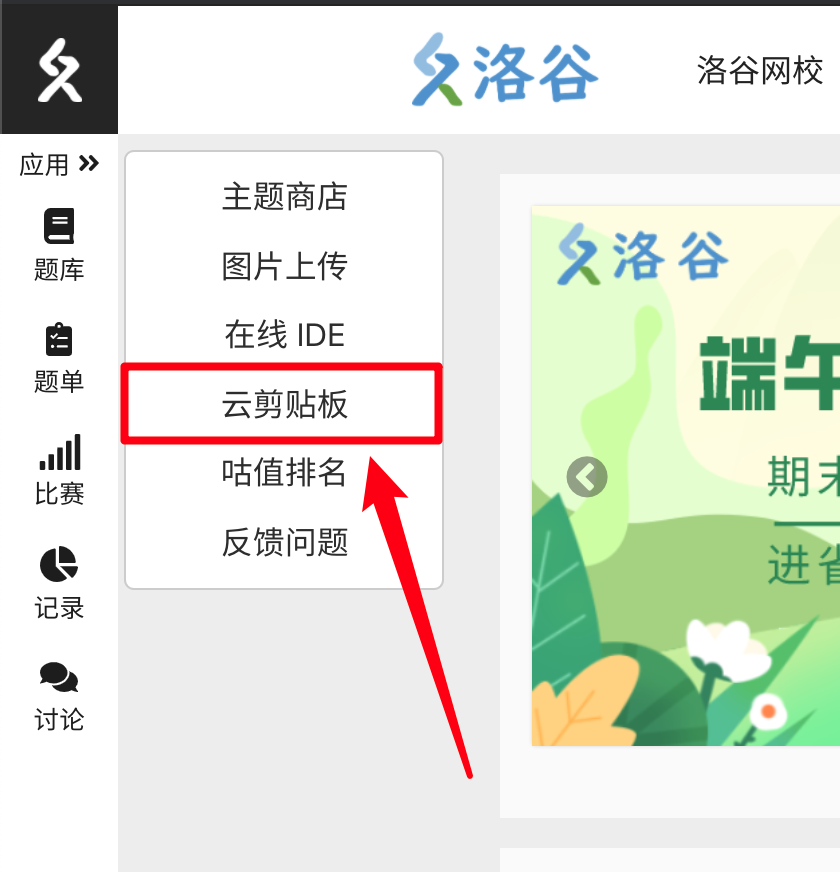
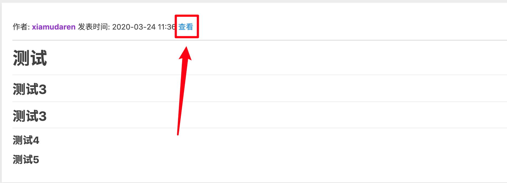
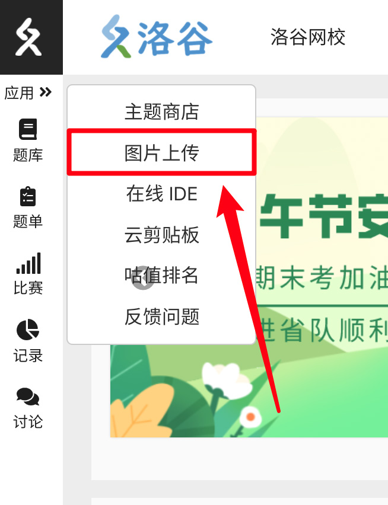
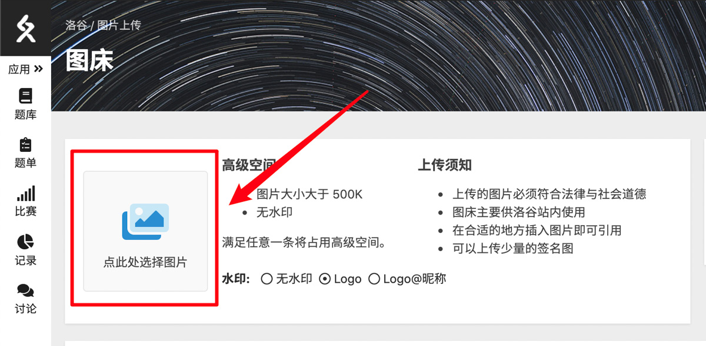
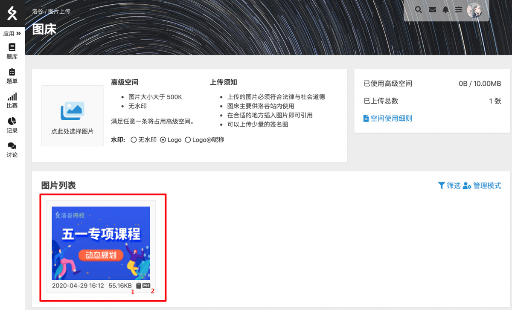

# 常见问题集合

:::tip

本页面集合了主站用户常见问题，您可点击右侧目录直接跳转到对应问题。

:::

## 有问题想反馈？ {#feedback}

在反馈问题请先通过查阅文档以及搜索，在确认无人反馈过/没有得到答案的前提下在通过相应的渠道反馈问题。

- 需要反馈问题请至[工单系统](https://www.luogu.com.cn/ticket)提交，提交工单前请先阅读[工单系统规则（待公布）](#feedback)。

## 如何查找题目？ {#problem-search}

洛谷的题目列表页面除了直接使用关键字搜索题目以外，还可以使用难度和标签来更细致地筛选题目。

详见[查找题目](./problem/search.md)

## 如何在线调试代码？测样例？ {#ide}

在题目详情页面，点击“进入 IDE 模式”，即可进入在线调试页面。此页面可以左右分屏编写代码和查看题面。

点击题面内各组样例边上的运行按钮即可自动输入样例运行程序比较输出结果与样例输出。

程序代码调试完成后可直接点击右上角的【提交】按钮，直接提交进行正式评测。

## 为什么有的题不能提交题解？ {#why-cannot-submit-solution}

当这个题题解数量过多，管理员认为没有必要再有更多题解的时候，会自动关闭本题的题解提交入口，故会闪出“不能提交该题题解”。

如果真的觉得自己的题解非常好，或者之前的题解大多有疏漏，那么可以私信找到管理员提出申请。如果确认为特别具有价值的优质题解，可以特许进入题解区。

若低质量题解多次私信申请，会被视为骚扰管理的行为，可能会被予以禁用私信的处罚。私信管理的时候，请附带上题目编号和题解链接。

## 为什么我在本地/其他网站 AC 了，洛谷上却没过？ {#why-unac}

- Linux 中换行符是 `\n` 而 Windows 中是 `\r\n`（多一个字符），有些数据在 Windows 中生成，而在洛谷评测机 Linux 环境下评测。这种情况在字符串输入中非常常见。
- 评测系统运行在 Linux 下，可能由于使用了 Linux 的保留字而出现 CE，但在 Windows 下正常。
- Linux 对内存的访问控制更为严格，因此在 Windows 上可能正常运行的无效指针或数组下标访问越界，在评测系统上无法运行。
- 严重的内存泄露的问题很可能会引起系统的保护模块杀死你的进程。因此，凡是使用 `malloc`（或 `calloc`、`realloc`、`new`）分配而得的内存空间，请使用 `free`（或 `delete`）完全释放。
- 数据可能真的有问题。但是，如果已有不止一个人通过了这道题，那最好不要怀疑是数据的锅。

## 如何创建题目？ {#problem-create}

通过“个人中心—题库”，创建比赛、题单同理。查看[帮助中心—题目](./problem/index.md)。

## 如何创建团队？ {#team-create}

通过“个人中心—我的”，创建团队，普通用户可以创建 3 个团队。查看[帮助中心—团队](./team/index.md)。

## 如何加入一个团队/邀请团队成员 {#team-member-invite}

新成员：  

请通过团队内成员分享的团队链接加入团队。请注意，洛谷个人用户可加入的团队是有上限的，超出了则会被限制加入其他团队。你可以通过撤销入团申请与退出一些团队解决。

邀请方：  

请进入你的团队主页，在团队主页点击团队编号后面的蓝色【复制地址】的文字，会将该页面的地址复制到剪贴板中。然后将该地址发送给需要邀请的新成员。

如果发现团队出现违反洛谷规则的行为，提交公开比赛等，需要向洛谷举报并退出团队，否则可能负连带责任。

## 如何使用讨论区？ {#discuss}

在左侧点击“讨论”进入讨论区域，选择相应的板块进行发帖，具体规则查看[帮助中心—讨论](./discuss.md)。

## 如何使用剪贴板？ {#pastebin}

云剪贴板可以存放任何文本，保存后的文本，通过点击“查看”，将文本的网页链接分享给其他人。

## 如何使用图床？ {#image-upload}

上传成功的图片右下脚有两个图标，点击 1 号图标表示复制了该图片的网页链接；点击 2 号链接表示复制后可以在 Markdown 里粘贴使用的链接。

洛谷的绝大多数模块支持用此方式（按钮 2）贴图。
