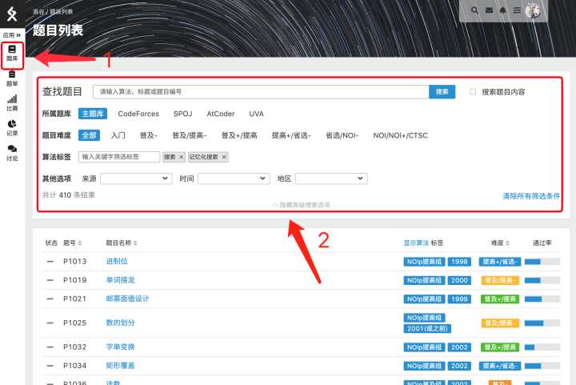

# 主站操作指南

:::caution 重要提示

本页面以及该系列帮助内容因为长时间未更新，可能不符合当前最新情况。洛谷正在编写全新的帮助与使用指南，以下内容仅供参考，不代表准确情况。

:::

洛谷创建于 2013 年 6 月 15 日，至今已有数万用户，致力于为编程爱好者提供清爽、快捷的编程体验。它不仅仅是一个在线测题系统，更拥有强大的社区、在线学习功能。同时，许多教程内容都是由五湖四海的用户提供的，保证了内容的广泛性。无论是初学 OI 的蒟蒻，还是久经沙场的神犇，均可从洛谷 Online Judge 获益，也可以帮助他人，共同进步。

## 用户

详见[洛谷账号功能说明](account/LuoGuAccount)帮助。

## 题库

洛谷的核心功能在于其丰富的题库。洛谷有六千多道题目，题材和算法涉及广泛，可以根据不同的难度、算法标签和来源进行搜索。例如，如果想查找某年 NOIP 题目的话就可以进行筛选，同样也可以根据题目的标题，甚至通过题目描述的内容来搜索题目。

## 题目

题目系统是洛谷 Online Judge 的核心，要开始写一道新的题目，一般就是从这里开始的。  
详见[题目功能说明](problem/)帮助。

## 评测

详见[在线评测功能说明](problem/OnlineJudge)帮助。

## 比赛

详见[比赛功能说明](contest)帮助。

## 题单

因为洛谷的题目数量特别多，专门寻找某一类题目的话，用题单功能会更方便。有些现成的题单就已经针对性的对很多专题做了汇总。

为了方便不同水平的同学们都能在洛谷快速找到适合自己的训练方式，洛谷开放了自定义题单功能，并且推出了官方题单以及允许用户/团队公开自己整理的题单，具体规则参见[公开题单规则](https://www.luogu.com.cn/discuss/show?postid=203644)

具体详见[题单功能说明](TrainingList)。

## 团队

具体详见[团队功能说明](team)。

## 讨论

具体详见[讨论区功能说明](discuss)。

## 设置

具体详见[个人设置功能说明](account/setting)。

## 图床

图床用于上传本地图片。如果题目、讨论、签名需要插入图片时，请将图片先上传至图床，再使用 Markdown 代码引用图片的链接即可。

具体规则请看 [图床规则](/rules/community/image-hosting)

## 联系我们

如果需要寻求其他帮助，请[联系我们](/contact-us)。
