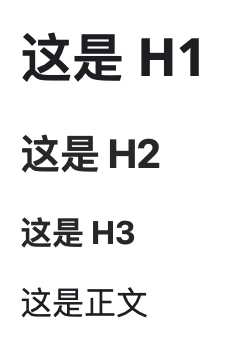
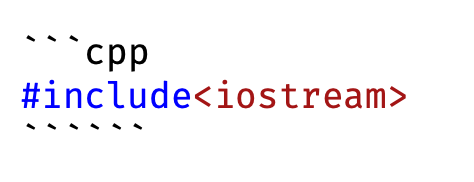

# 洛谷 Markdown 格式手册

Markdown 的目标是实现「易读易写」，成为一种适用于网络的书写语言。因此洛谷使用 Markdown 发布内容。

**请仔细阅读下列文档，如果没有按照要求正确使用格式，将可能无法发出讨论，或者被删除。**

## 段落和换行

一个 Markdown 段落是由一个或多个连续的文本行组成，它的前后要有一个以上的**空行**。普通的 Markdown 段落不可以用空格或制表符来缩进。

> 空行：一行之内只包含回车换行、空格、制表符。

## 标题

Markdown 的标题是在行首插入 1 到 6 个 `#`，`#` 和标题文字之间使用一个或多个空格，对应到标题 $1$ 到 $6$ 级。

**例如：**

```markdown
# 这是 H1

## 这是 H2

### 这是 H3

这是正文
```

显示的效果如下：



:::caution

不要全文使用标题，或者用标题强调特别多的文字。这会让读者觉得困扰。

:::

## 强调

Markdown 使用星号（`*`）和底线（`_`）作为标记强调字词的符号，被 `*` 或 `_` 包围的字词会被转成用 `<em>` 标签包围（即*斜体*），用两个 `*` 或 `_` 包起来的话，则会被转成 `<strong>`（即**粗体**）。

**例如：**

```markdown
*单引号斜体*

_单下划线斜体_

**双引号加粗**

__双下划线加粗__

~~删除线~~
```

显示的效果如下：

*单引号斜体*

*单下划线斜体*

**双引号加粗**

**双下划线加粗**

~~删除线~~

但是如果你的 `*` 和 `_` 两边都有空白的话，它们就只会被当成普通的符号。如果要在文字前后直接插入普通的星号或底线，你可以用反斜线（`\`）（参见下面的“反斜杠”部分）。

**例如：**

```markdown
\*使用反斜线开头的\*被当做是普通的字符\*
```

显示的效果如下：

\*使用反斜线开头的\*被当做是普通的字符\*

## 代码块

**如果要发送代码，但没有按照下面的方式进行格式化，将不能发送成功。**

### 大段代码

Markdown 建立代码块的方法：将 \`\`\` 置于这段代码的首行和末行，独立成一行。第一行的 \`\`\` 后面可以加上语言名称，例如 cpp、java、c、pascal 等（不要写成 c++）。

**例如：**



```cpp
#include<iostream>
```

### 小段代码

需要引用代码时，如果引用的语句只有一段，不分行，可以用 \` 将语句包起来。

注：如果你真的要打 \` 这个字符的话，可以仿照和 \* 这个字符一样的处理方式，在 \` 前加一个反斜杠。

## 区块引用

Markdown 标记区块引用的方法是在行的最前面加 `>`，也可以只在整个段落的第一行最前面加上 `>`，区块引用内部可以嵌套，只要根据层次加上不同数量的 `>` 即可，引用的区块内也可以使用其他的 Markdown 语法，包括标题、列表、代码区块等。

**例如：**

```markdown
> Markdown 标记区块引用的方法是在行的最前面加 `>`。
> 
> 也可以只在整个段落的第一行最前面加上 `>`。
> > 区块引用内部可以嵌套，只要根据层次加上不同数量的 `>` 即可。
> > 
> > *我是内部嵌套区块，我可以使用其他 Markdown 语法哦。*
> > 
> > ### 我是引用区块内使用 3 级标题语法。
> > 
> > ```java
> >     //在引用区块内可以加入代码块
> >     import java.net.URL;
> >     import java.util.Arrays;
> >     import java.util.Date;
> >     import java.util.Set;
> > ```
```

显示的效果如下：

> Markdown 标记区块引用的方法是在行的最前面加 `>`。
>
> 也可以只在整个段落的第一行最前面加上 `>`。
> > 区块引用内部可以嵌套，只要根据层次加上不同数量的 `>` 即可。
> >
> > *我是内部嵌套区块，我可以使用其他 Markdown 语法哦。*
> >
> > ### 我是引用区块内使用 3 级标题语法
> >
> > ```java
> >     //在引用区块内可以加入代码块
> >     import java.net.URL;
> >     import java.util.Arrays;
> >     import java.util.Date;
> >     import java.util.Set;
> > ```

## 列表

Markdown 支持有序列表和无序列表，无序列表使用星号、加号或是减号作为列表标记，有序列表则使用数字接着一个英文句点。两种列表方式格式都是：列表标记 + 空格 + 列表项，即列表项目标记通常是放在最左边，也可以缩进最多 $3$ 个空格，项目标记后面则一定要接着至少一个空格或制表符。

### 1 无序列表

星号、加号或是减号三种列表方式效果等同。

**例如：**

```markdown
*   Red
*   Green
*   Blue

+   Red
+   Green
+   Blue

-   Red
-   Green
-   Blue
```

它们的显示效果均为：

* Red
* Green
* Blue

### 2 有序列表

有序列表则使用数字接着一个英文句点。

**例如：**

```markdown
1.  Red
2.  Green
3.  Blue
```

显示效果为：

1. Red
2. Green
3. Blue

## 链接

在方块括号后面紧接着圆括号并插入网址链接即可，如果你还想要加上链接的 title 文字，只要在网址后面，用双引号把 title 文字包起来即可，例如：

```md
[行内式链接标题](http://www.luogu.org/)
```

显示效果：这是 [行内式链接标题](http://www.luogu.org/ "可选标题") 内联方式。

## 图片

Markdown 使用一种和链接很相似的语法来标记图片。在洛谷内可以使用[图床](https://www.luogu.com.cn/image)上传图片，具体使用说明可查看[新手指南](https://www.luogu.com.cn/discuss/241461#:~:text=%E7%BB%99%E5%85%B6%E4%BB%96%E4%BA%BA%E3%80%82-,%E5%A6%82%E4%BD%95%E4%BD%BF%E7%94%A8%E5%9B%BE%E5%BA%8A%EF%BC%9F,-%E4%B8%8A%E4%BC%A0%E6%88%90%E5%8A%9F)最后一部分

行内式的图片语法如下：

``

``

**详细叙述如下**：一个惊叹号 `!`，接着一个方括号，里面放上图片的替代文字（这些文字将在图片加载失败的时候显示），接着一个普通括号，里面放上图片的网址，最后还可以用引号包住并加上选择性的 'title' 文字。

**例如：**

```markdown

```

将会显示图片：


特别地，洛谷 Markdown 提供插入 **bilibili 视频**链接的功能（见[剪贴板](https://www.luogu.com.cn/paste/l9faoe0v)）：

语法为：``（省略 `av` 前缀）或 `` 或 `` 等：

**例如：**（去掉 `B` 和 `V` 之间的空格）

```markdown

```

将会显示视频：


## 自动链接

Markdown 支持以比较简短的自动链接形式来处理网址和电子邮件信箱，只要是用尖括号包起来，Markdown 就会自动把它转成链接。一般网址的链接文字就和链接地址一样，例如：

```markdown
<https://www.luogu.com.cn/>
```

显示效果为：

<https://www.luogu.com.cn/>

## 分隔线

可以在一行中用三个以上的星号、减号、底线来建立一个分隔线，行内不能有其他内容。也可以在星号或是减号中间插入空格。下面每种写法都可以建立分隔线：

```md
* * *

***

*****

- - -

---------------------------------------
```

显示的效果如下：

* * *

***

*****

- - -

---------------------------------------

## 反斜杠

Markdown 可以利用反斜杠来插入一些在语法中有其它意义的符号，例如：如果你想要用星号加在文字旁边的方式来做出强调效果（但不用 `<em>` 标签），你可以在星号的前面加上反斜杠。

Markdown 支持以下这些符号前面加上反斜杠来帮助插入普通的符号（加上反斜杠后，这些符号都会以原来的方式显示）：

```md
\   反斜线
`   反引号
*   星号
_   底线
{}  花括号
[]  方括号
()  括弧
#   井字号
+   加号
-   减号
.   英文句点
!   惊叹号
```

## 插入 Bilibili 视频

见 <https://www.luogu.com.cn/paste/l9faoe0v>。

## LaTeX 公式支持

见 [LaTeX 说明](latex.md)。
