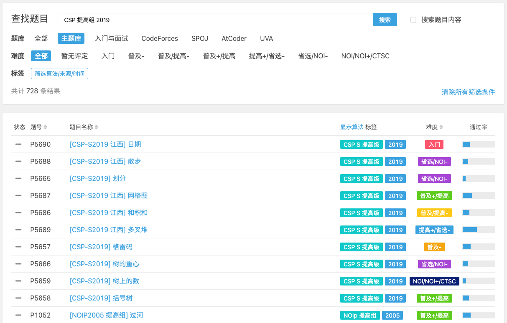
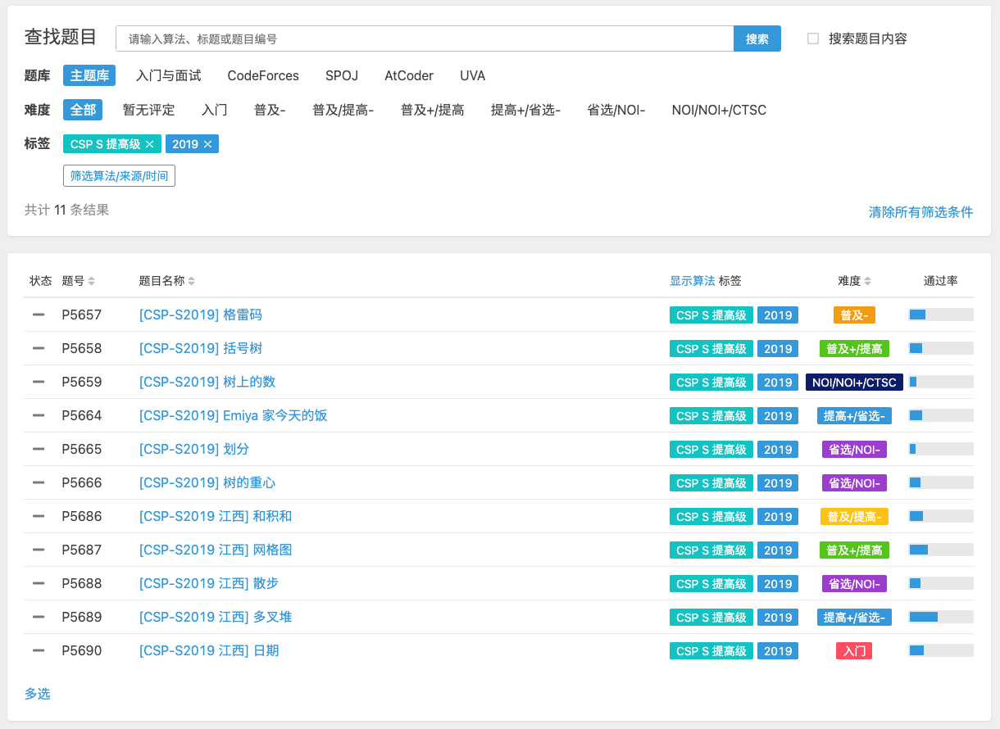
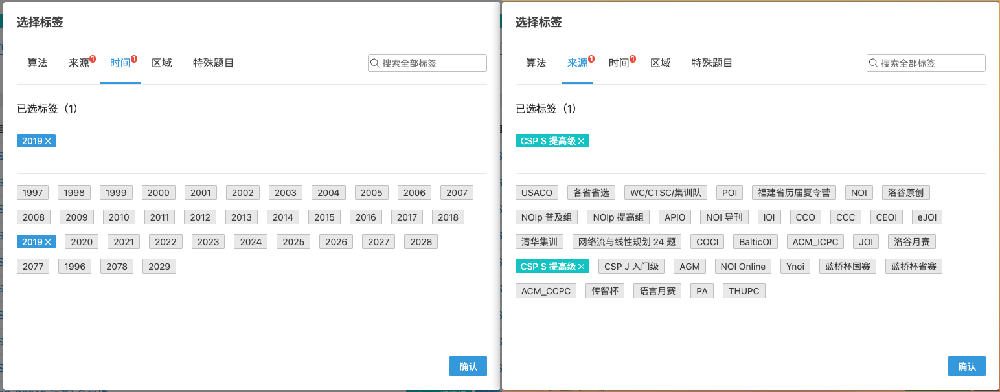

# 查找题目

洛谷的题目列表页面除了直接使用关键字搜索题目以外，还可以使用难度和标签来更细致的筛选题目。

比如，我们想搜索 CSP 提高组 2019 的题目，如果将此作为关键字直接填入搜索框并查找的话，会出现以下结果。  

我们最想要的题目并没有出现在最前面，而且一些不相关的题目也混入其中。

所以这时候建议使用标签选择器（点击【筛选算法/来源/时间】）来直接指定来源【CSP S 提高级】和时间【2019】。  

这样搜索结果就只有有这两个标签的题目，并且按照题号顺序排好了。

除此之外，您还可以使用算法来筛选题目，来找到只包含该算法的题目。再配合上难度筛选，就可以方便的找到适合自己的题目了。