# 团队

在洛谷，团队不再是简单的聚合体，而是多功能的集合型圈子。

## 创建

鼠标移到右上角图标，并且点击我的团队就可以看到我的团队。

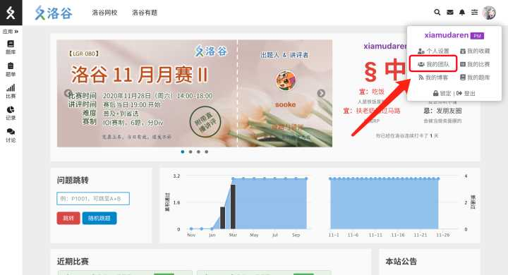

点击创建团队后，就可以根据要求来创建一个团队。

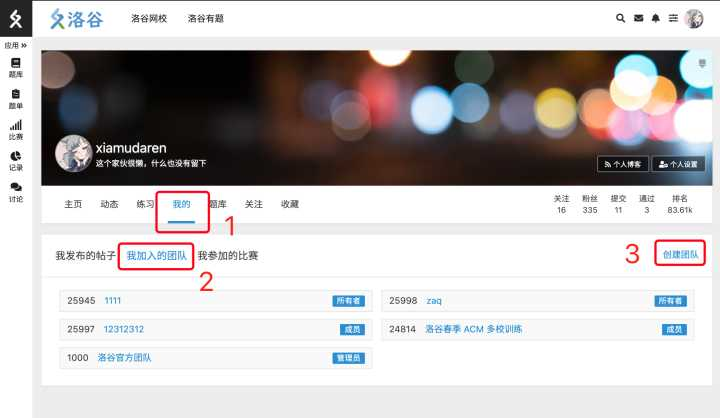

将创建好的团队的地址链接分发给自己的学生，让学生来主动加入，而管理员就可以在审核列表中，成员的审核列表中看到这个成员，然后通过或者拒绝审核。

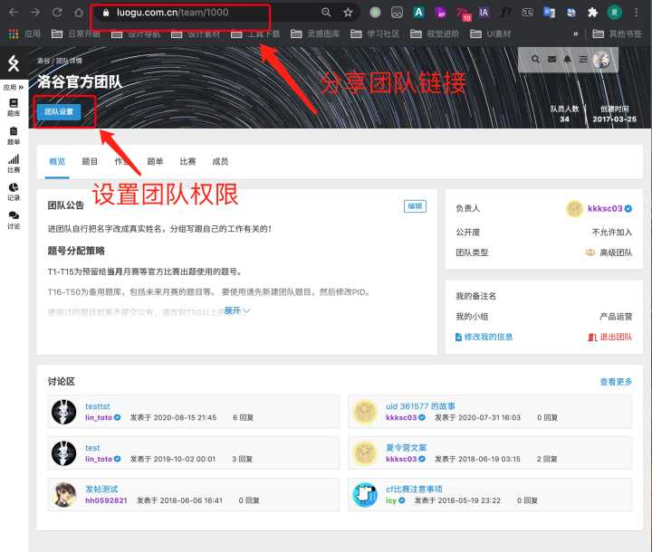

当然也可以把它设置为禁止任何人加入，或者是允许所有人直接加入。

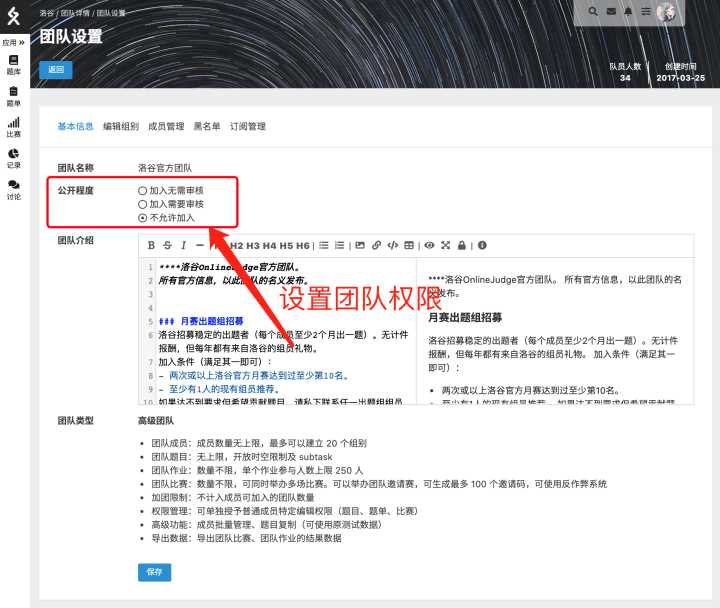

在洛谷团队中，还有团队公告，可以将一些重要的事情给写在这边。下面还有一个讨论区。所有同学都可以发贴，在团队区讨论区里面讨论各种事情。

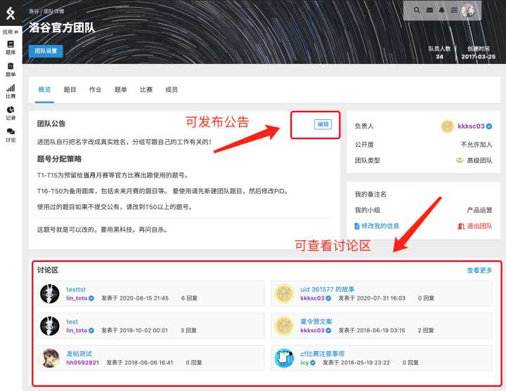

## 加入 {#invite}

新成员：  

请通过团队内成员分享的团队链接加入团队。

邀请方：  

请进入你的团队主页，在团队主页点击团队编号后面的蓝色【复制地址】的文字，会将该页面的地址复制到剪贴板中。然后将该地址发送给需要邀请的新成员。

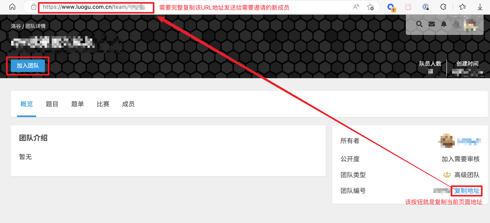

如果发现团队出现违反洛谷规则的行为，提交公开比赛等，需要向洛谷举报并退出团队，否则可能负连带责任。

## 题库

洛谷的团队包括自己的题目，作业，题单和比赛。

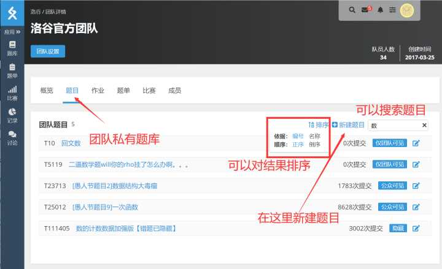

在团队题库中可以增加自己的题目。新建完题目后可以上传测试数据并进行评测。

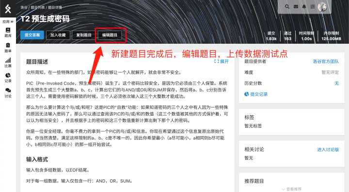
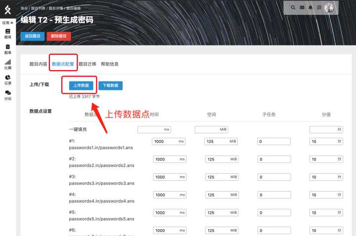

除此之外，高级团队用户还可以将洛谷主题库的题目复制到自己的团队中。此功能可以把题面以及测试数据都复制进团队的私有题目中。

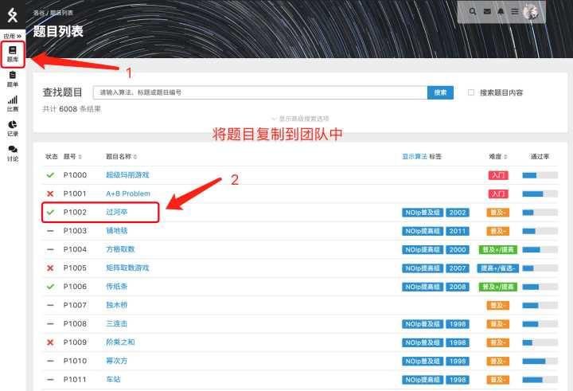

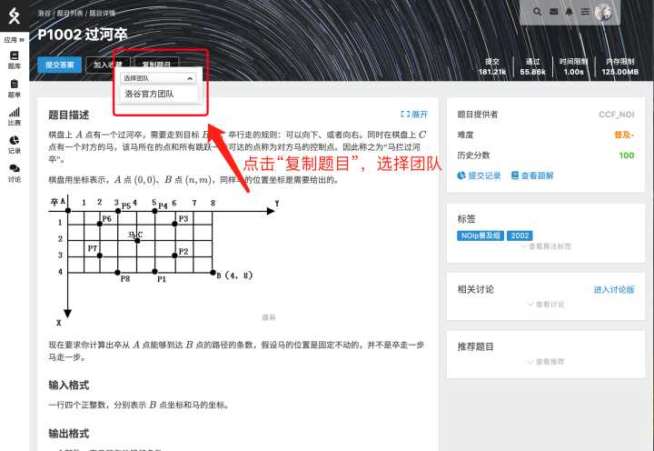

作为团队的管理员，还可以把复制过来的题目，修改它的题目描述。同学们可以提交自己的代码，但仍然使用原来测试数据进行评测。

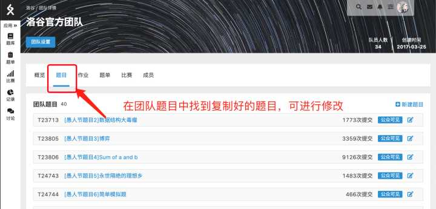
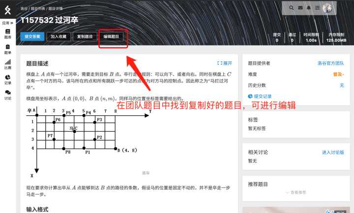

这个功能很好用，因为不需要去重新的出数据，直接从洛谷的题目复制一个题目到自己团队里面修改题面就可以成为一道新的题目。题目描述修改的比较多的话，如果学生做题做的没那么多，就可能不一定能够搜索到原题也找不到题解，这样能够很方便的帮助他们训练。

当然，也可以重新上传测试数据（覆盖原测试数据）这就可以变成一个自己的内部题目了。

## 比赛

洛谷还提供自定义比赛功能，这个比赛功能是可以自定义内部比赛，支持 OI 赛制、IOI 赛制、ACM 赛制等，不同赛制有不同的功能。选择比赛类型和公开程度，填写比赛描述以及起止时间后就可以建立比赛。

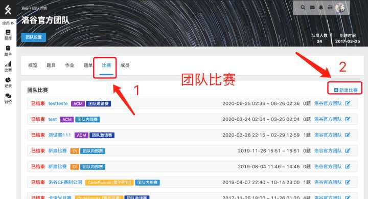

比赛的题目可以选用洛谷的公开的题目、其他 OJ（RemoteJudge）的题目，以及这个团队的内部题目。原则上可以参加比赛的人数不限制。

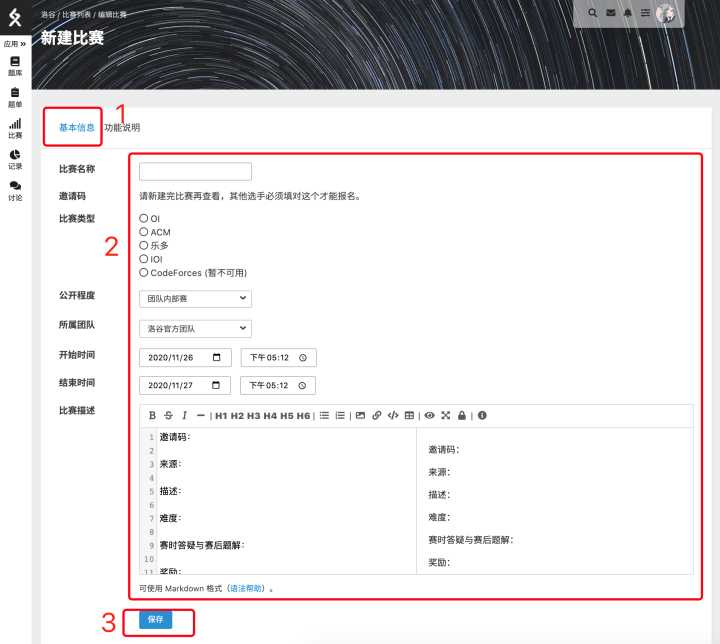

如图所示，这个比赛就是团队内部赛，也就是只有团队内部的成员才可以报名参加比赛。

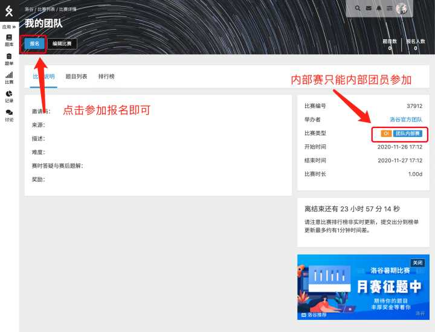

当然，还有其他别的比赛类别，例如团队公开赛，可以在洛谷上公开显示，需要经过洛谷管理员的审核。而团队邀请赛可以邀请团队外的成员在不加入团队的情况下参加比赛。 团队邀请赛可以使用固定邀请码或者是多个邀请码的方式来邀请其他人参加。

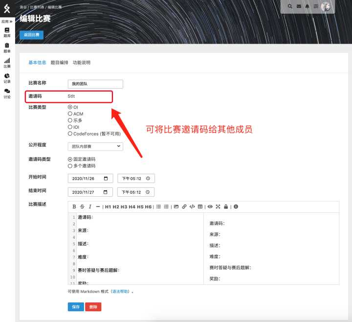

固定邀请码的意思指的是将比赛的链接和邀请码告诉给参加比赛的同学，然后这些选手可以通过。邀请码来报名这个比赛。

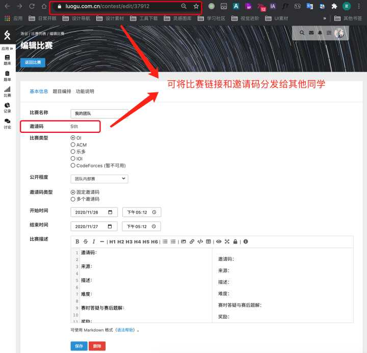

但问题在于如果有些人的邀请码被泄露出去了，那么他们也能够报名这个比赛。所以我们还提供使用多个邀请码的功能，可以生成一定数量的邀请码，然后将这些邀请码分配给每一个需要参加这个比赛的选手，并提供该邀请码来报名这个比赛，使得符合要求的人能够参加这个比赛。

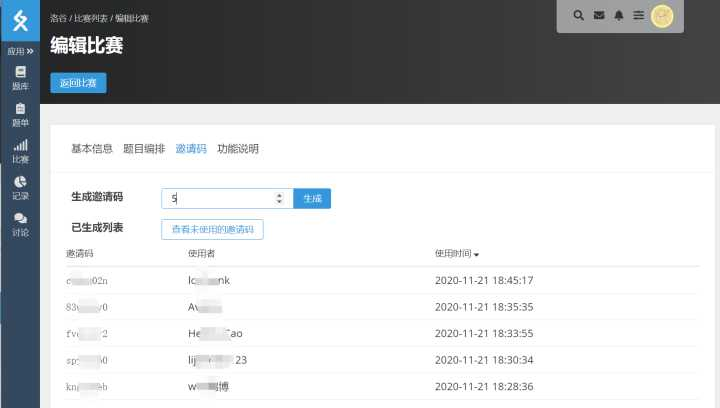

## 成员管理

洛谷的团队可以很方便的管理团队内的学生。团队中可以设定每一个成员的备注，例如更改某名成员的备注为真实姓名便于识别，在团队内的一些使用场景可以显示这些成员的备注名。

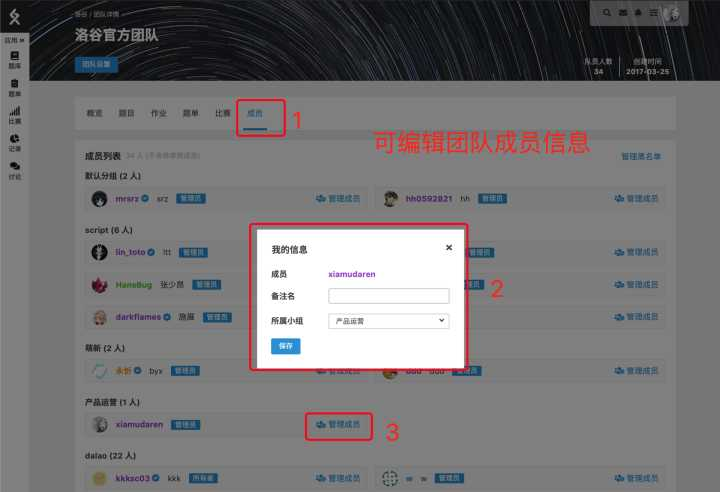

在团队设置中，可以增加和调整不同的组别，例如按照年级来分组别，并将学生归类进已经设定好的组别。

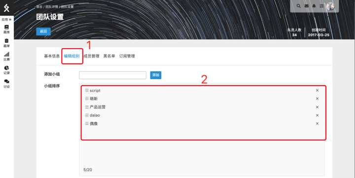

在成员管理中，高级团队的管理员可以将批量修改多名用户的组别，也可以把这些成员给批量的移除。

除此之外，管理员还可以修改他们对应的管理权限。例如，给予一些同学提供题目的管理权限，同时给予另外一些同学比赛和题单的管理权限，便于管理团队的内容。

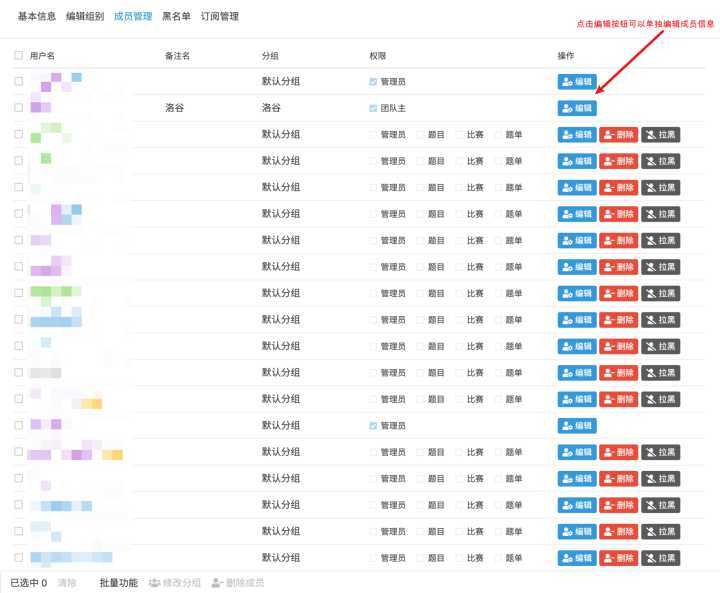

## 作业

洛谷团队还提供作业的功能供教练使用，帮助给学生布置作业，只需要指定题目编号和参与的用户名即可。

作业的排行榜根据学生的作业完成情况来排序。完成的作业越多，排序越靠前。当然还可以将团队成员作业的完成情况下载成电子表格进行保存，保存在本地。

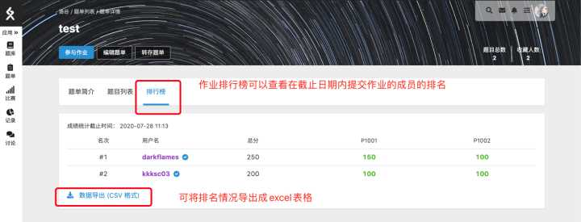

作业其实是一种特殊的题单，可以在题单描述中写上比较详细的描述。在编辑团队题单的时候，题单类型中选择团队作业，指定名称跟截止日期。

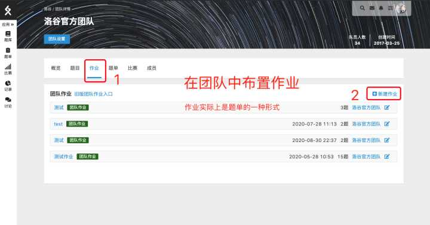

截止日期是指同学必须要在这个时间之前提交，否则就不计入统计。

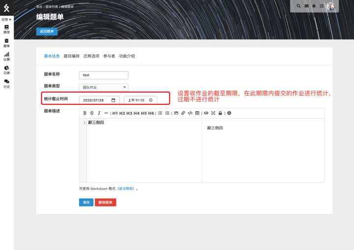

然后就可以在团队作业中添加各种题目了。洛谷的公有题目，或者是 Codeforces 等其他的 OJ 的题目，或者是团队的内部题目都可以在这边添加。

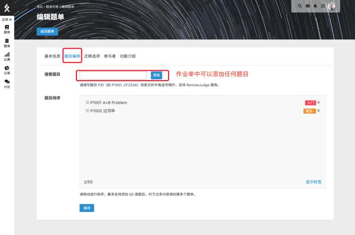

团队作业是可以设定参与者，只要勾选这些选手，就可以批量的添加作业的参与者。高级团队的管理员还可以按照组别批量选择作业的参与者。

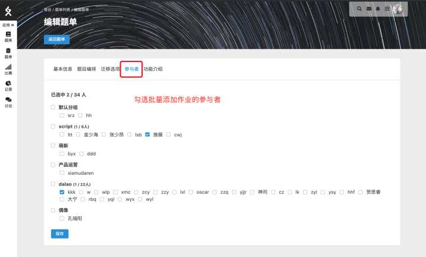

因此，使用团队的功能时，就不需要像传统学校那样去自建学校 OJ，自己处理题目，自己去统计学生的完成情况。只需要将题目、作业和比赛设置好，就可以很方便的进行训练和统计。这样可以大大节约教练的时间和精力，也不需要有额外的维护成本。

## 文件

todo

## 高级版本

我们提供了免费的普通团队和付费的高级团队服务。免费的普通团队已经包含刚才介绍的大多数功能，可以满足大多数学校训练的需求。

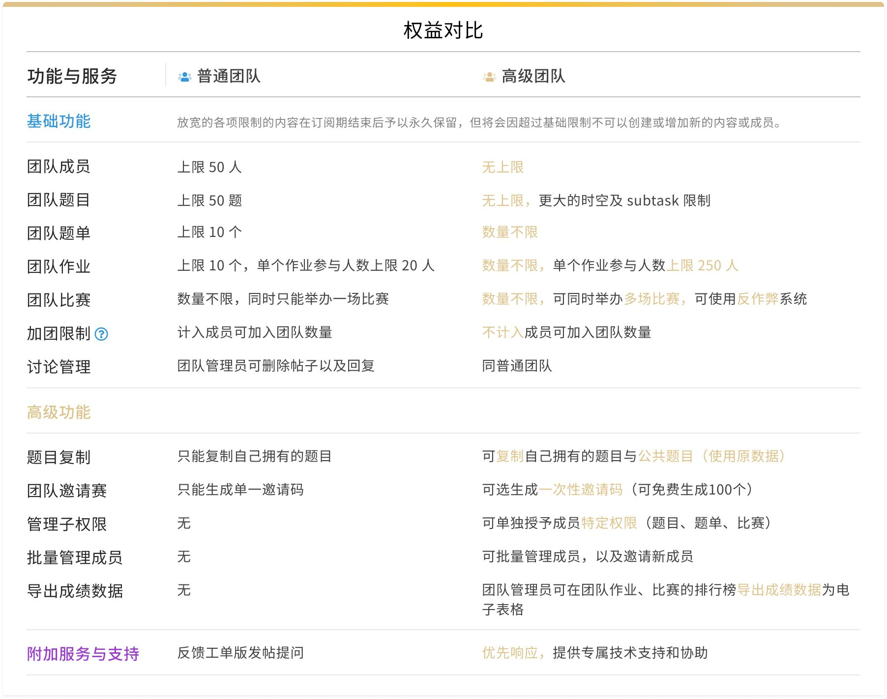

而高级团队服务则拥有更多的功能，同时也能够加入更多的成员，创建更多的题目和比赛，以及题单、作业等等。对于有较多用户的院校机构或者有更多需求的老师可以考虑订阅洛谷高级团队功能。

具体介绍详见：[高级团队](./premium.md)
