# 团队

洛谷团队是一个多功能集合型社区，而不仅仅是简单的用户聚合。

## 创建
:::caution

- 团队一旦创建将无法解散，请谨慎创建。
- 请勿滥用团队功能、违规公开宣传团队，仅邀请必要的成员加入。若团队存在违反[《洛谷社区规则》](/rules/community/index.md)的行为，团队负责人可能被追究连带责任。
- 团队被封禁后，所有现存成员无法自己退出团队。如需退出需通过申诉工单申请退出团队，由管理员审查后才能退出。

:::

点击页面右上角个人头像展开个人菜单，选择"我的团队"即可查看已加入的团队。

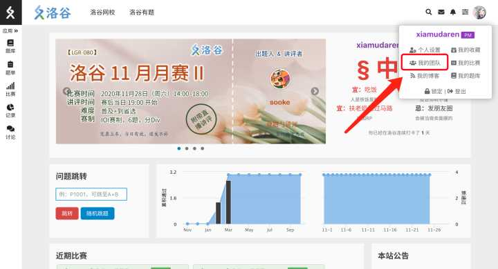

点击"创建团队"后，按页面指引完成创建。

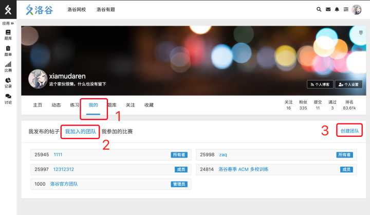

将团队链接分享给学生后，学生即可主动申请加入。管理员可在审核列表中查看申请并选择通过或拒绝。

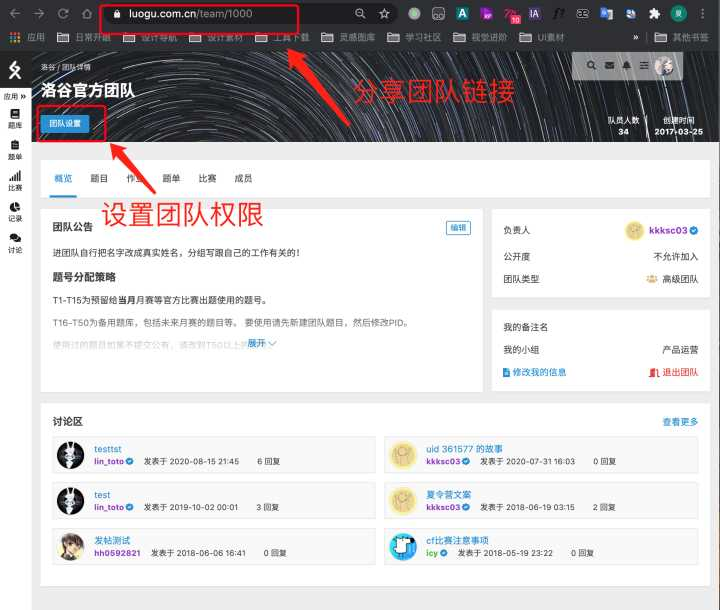

团队也可设置为禁止任何人加入，或允许所有用户直接加入。

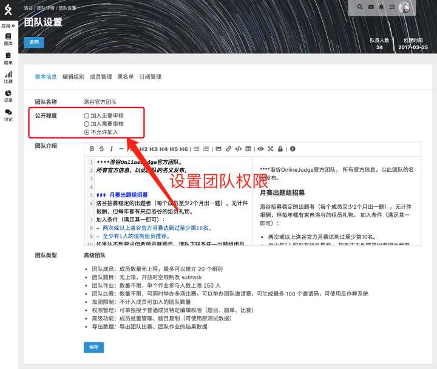

团队还提供公告功能，可用于发布重要通知。公告下方设有讨论区，所有成员均可发帖交流。

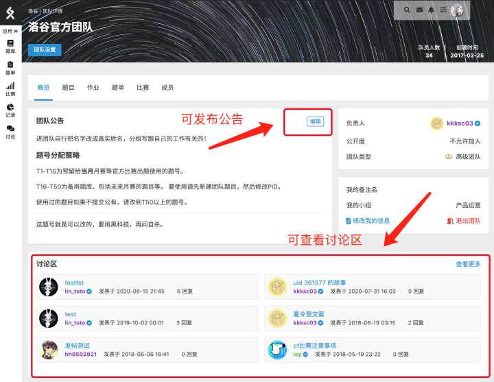

## 加入 {#invite}

新成员：  

请通过团队内成员分享的团队链接加入团队。

邀请方：  

请进入你的团队主页，在团队主页点击团队编号后面的蓝色【复制地址】的文字，会将该页面的地址复制到剪贴板中。然后将该地址发送给需要邀请的新成员。

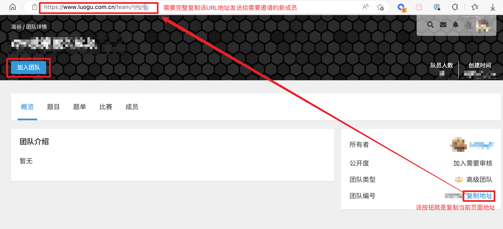

如果发现团队存在违反洛谷规则的行为（如**提交违规公开比赛**等），应向洛谷举报并退出团队，否则可能承担连带责任。

用户无法主动退出已被禁用的团队。

## 题库

洛谷团队包含私有题目、作业、题单和比赛功能。

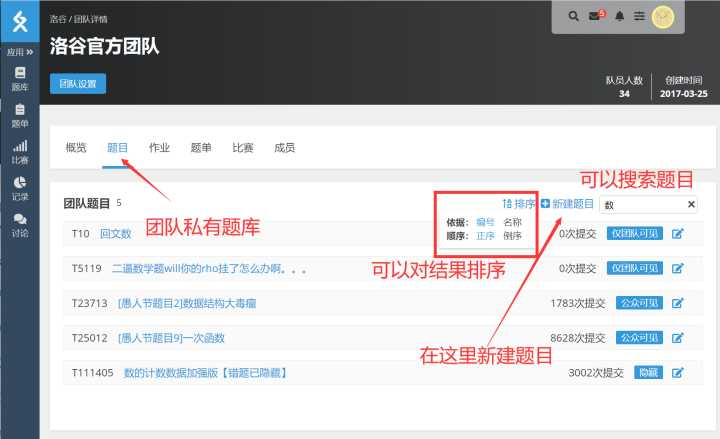

在团队题库中可以添加私有题目。新建题目后可上传测试数据并进行评测。

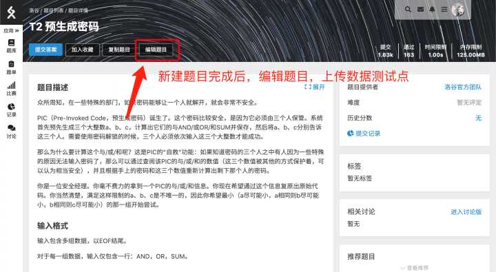
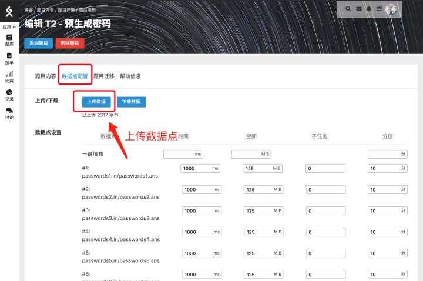

除此之外，高级团队用户还可以将洛谷主题库的题目复制到自己的团队中。此功能可以把题面以及测试数据都复制进团队的私有题目中。

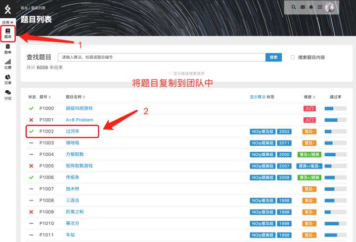

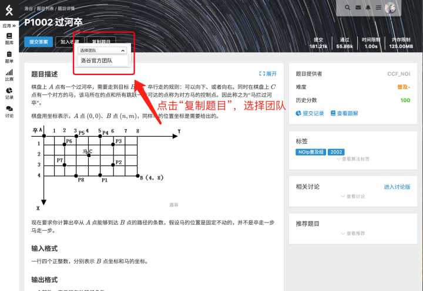

作为团队的管理员，还可以修改复制后的题目描述。成员可提交代码，评测仍使用原有测试数据。

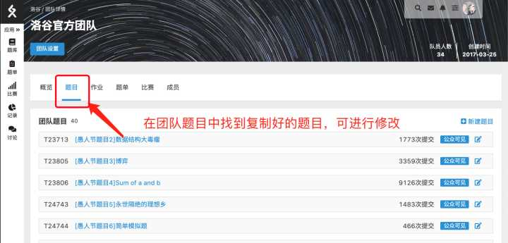
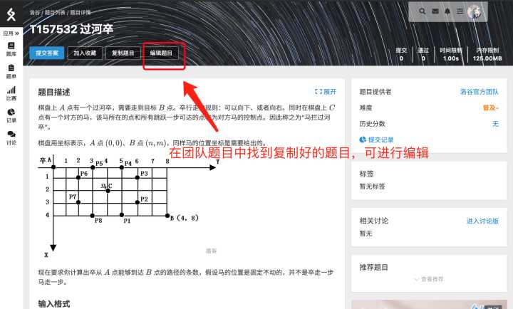

该功能免去了重新准备测试数据的步骤：从洛谷主题库复制题目后仅修改题面即可。若题目描述修改幅度较大，学生做题量较少时很可能无法搜到原题及题解，有助于独立训练。

此外，也可以重新上传测试数据（覆盖原有数据），将其变为完全的团队内部题目。

## 比赛

洛谷团队还提供自定义比赛功能，支持 OI、IOI、ICPC 等多种赛制。选择比赛类型和公开程度，填写比赛描述及起止时间后即可创建比赛。

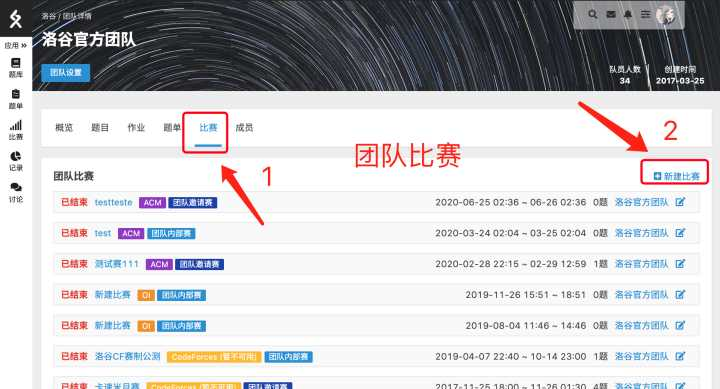

比赛题目可选用洛谷公开题目、其他 OJ（RemoteJudge）题目以及团队内部题目，参赛人数原则上不设限制。

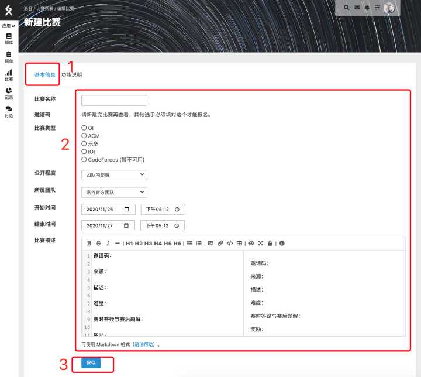

上图为团队内部赛示例，仅团队内部成员可报名参加。

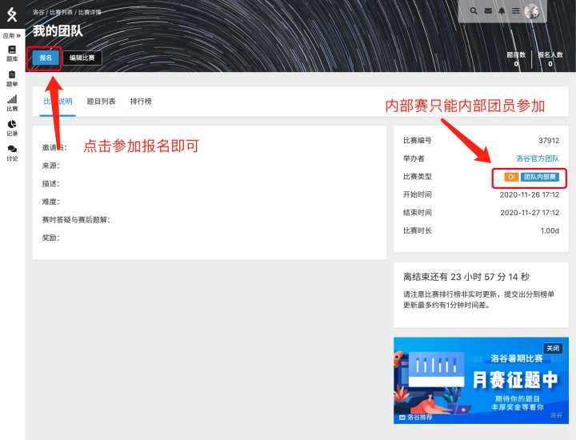

此外，团队公开赛可在洛谷首页公开展示，需经管理员审核。团队邀请赛可邀请团队外成员在不加入团队的情况下参赛，支持固定邀请码或多邀请码两种方式。

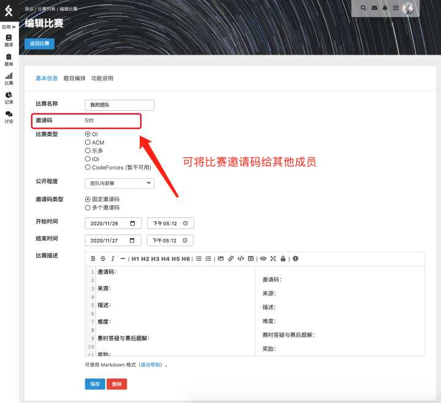

固定邀请码模式下，所有参赛者使用同一邀请码报名。

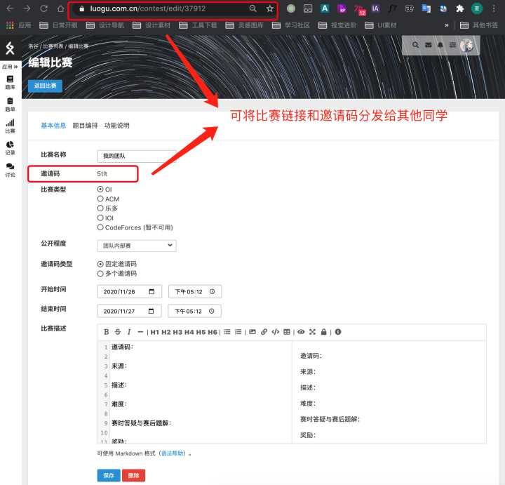

但固定邀请码一旦泄露，未授权用户也可能报名参赛。为此洛谷还提供多邀请码功能：可生成一定数量的邀请码，分配给每位参赛选手单独使用，确保仅有符合条件的人员能够参赛。

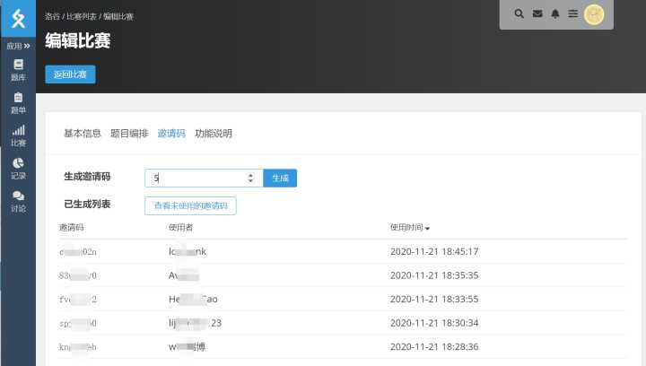

## 成员管理

洛谷团队支持便捷的成员管理。可为每位成员设置备注（如真实姓名），便于在团队内各场景识别。

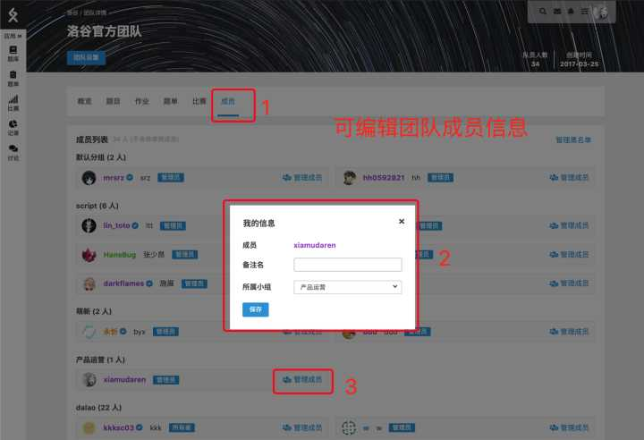

在团队设置中，可创建和调整不同组别（例如按年级分组），并将成员归入相应组别。

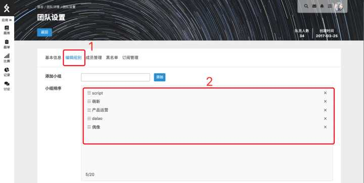

高级团队的管理员可在成员管理中批量修改成员组别或批量移除成员。并且可禁止团队成员自行变更所属组别。

此外，管理员还可为成员分配不同的管理权限。例如，授予部分成员题目管理权限，授予另一些成员比赛和题单管理权限，便于分工协作。

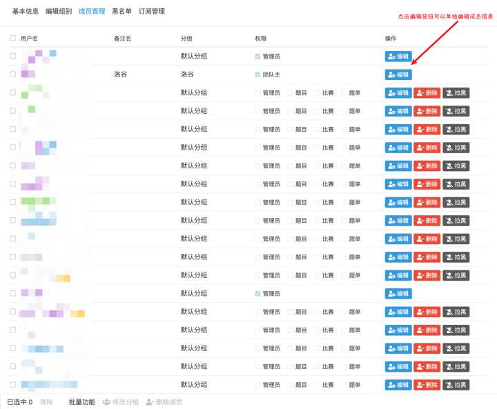

## 作业

洛谷团队还提供作业功能供教练使用，便于向学生布置练习，仅需指定题目编号和参与成员即可。

作业排行榜根据成员的作业完成情况排序，完成题目越多，排名越靠前。此外，可将成员的作业完成情况导出为电子表格保存至本地。

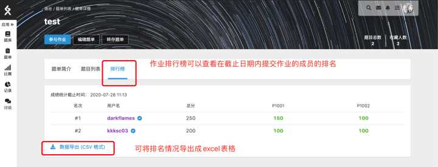

作业本质上是一种特殊题单，可在题单描述中填写详细说明。编辑团队题单时，在题单类型中选择"团队作业"，并指定名称和截止日期。

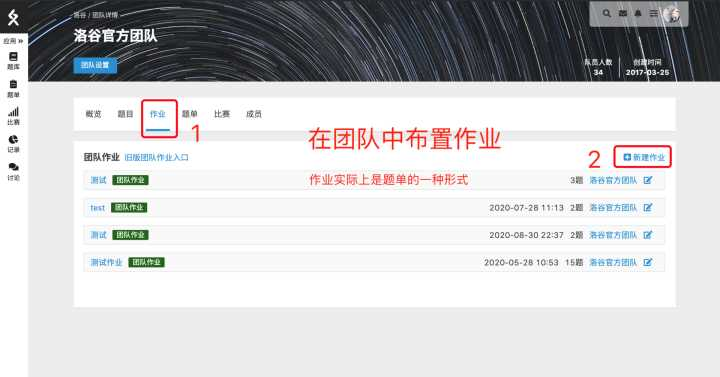

截止日期之后提交的代码将不计入作业统计。

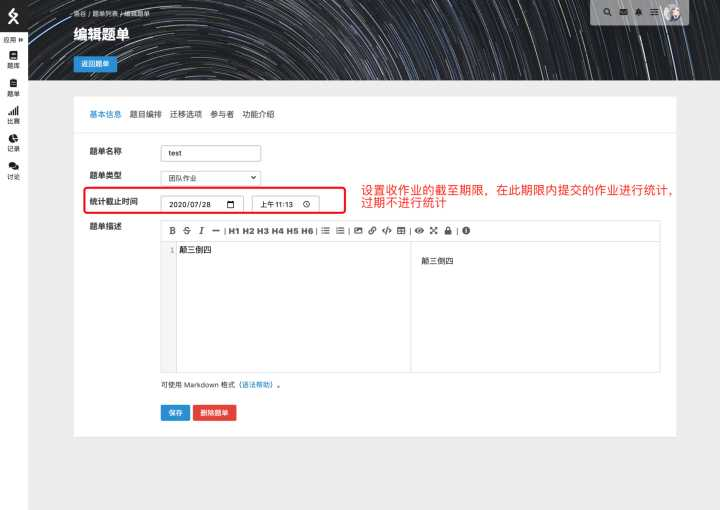

团队作业中可添加洛谷公有题目、Codeforces 等其他 OJ 的题目以及团队内部题目。

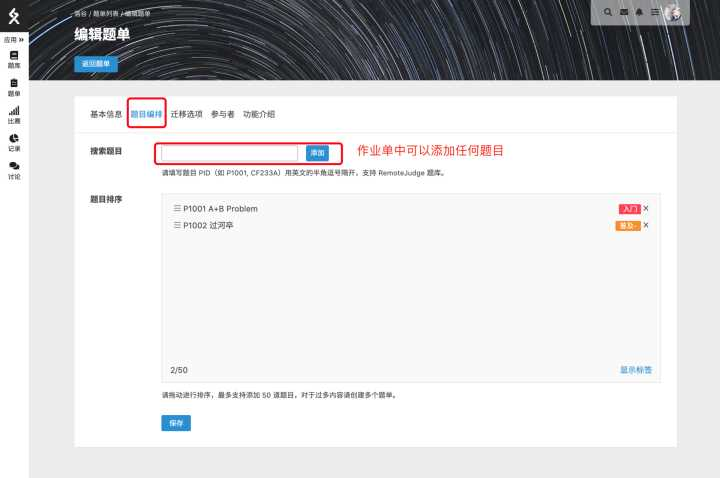

团队作业可设定参与者，勾选对应成员即可批量添加。高级团队的管理员还可按组别批量选择参与者。

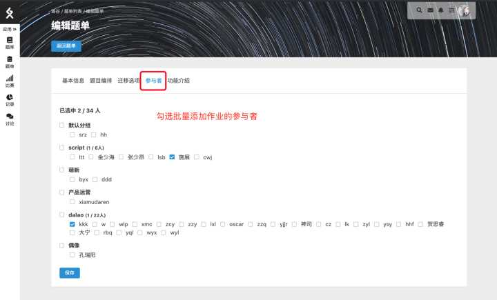

使用团队功能后，无需像传统方式那样自建 OJ、自行处理题目和统计完成情况，只需设置好题目、作业和比赛即可便捷地进行训练与统计。这显著节省了教练的时间精力，也免去了额外的维护成本。

## 文件

洛谷团队提供团队文件功能以便团队内部共享文件。团队文件空间和单文件大小都有上限。请勿上传违法违规内容，否则可能会被删除，严重者会被封禁团队甚至于于封禁主要责任者的账号。

## 高级版本

洛谷提供免费的普通团队和付费的高级团队服务。免费版已涵盖上述大多数功能，可满足一般学校的训练需求。

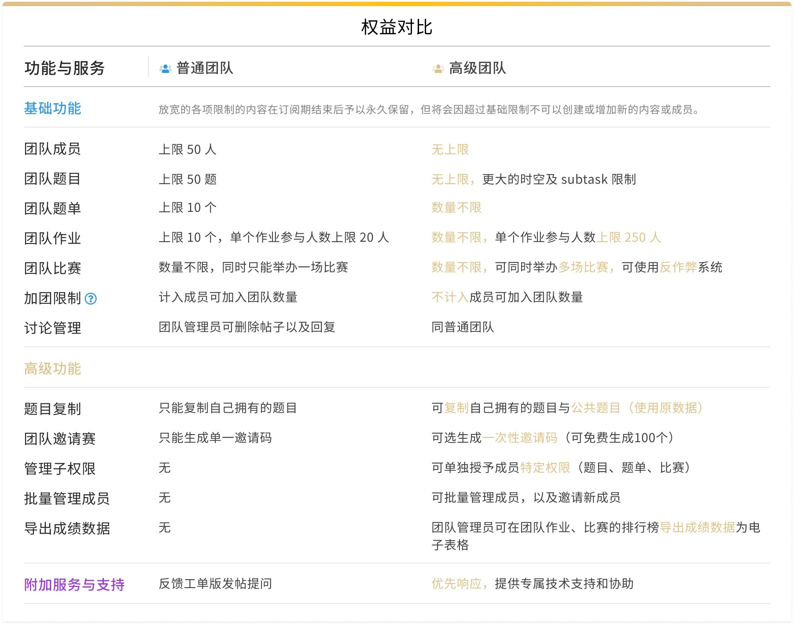

高级团队服务在免费版基础上提供更多功能，支持更多成员、更多题目和比赛以及题单、作业等资源。适合成员较多的院校机构或有更多需求的教师使用。

具体介绍详见：[高级团队](./premium.md)
