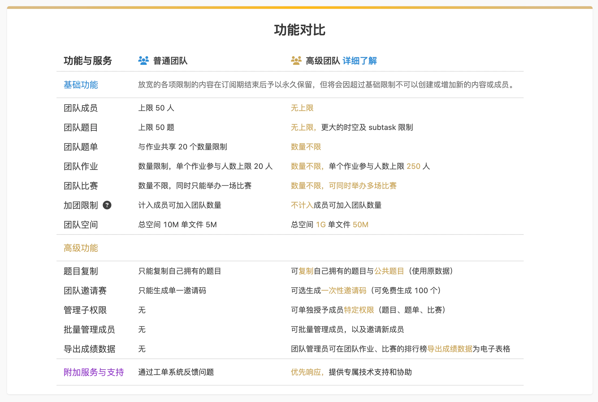
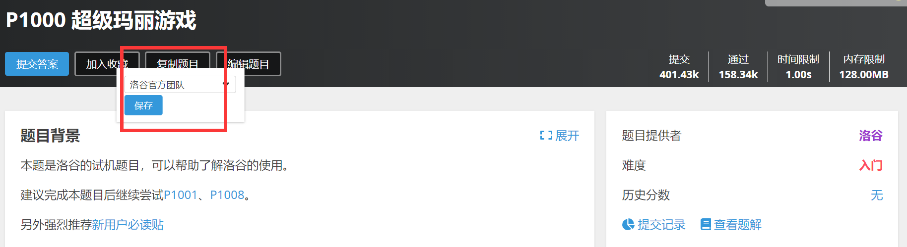
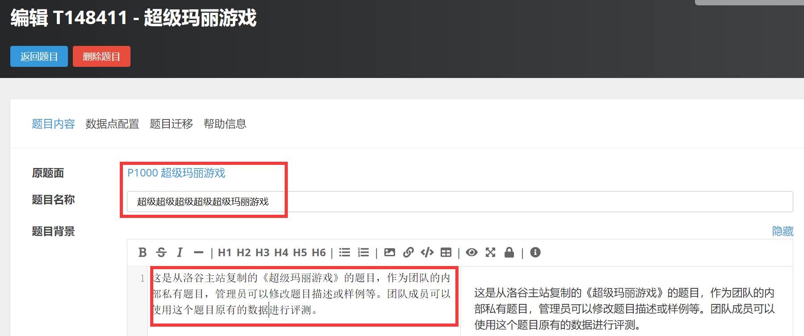
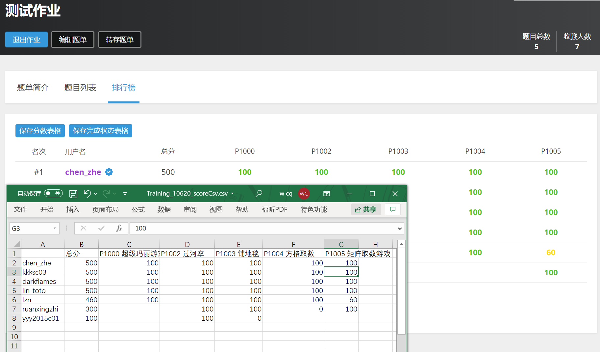
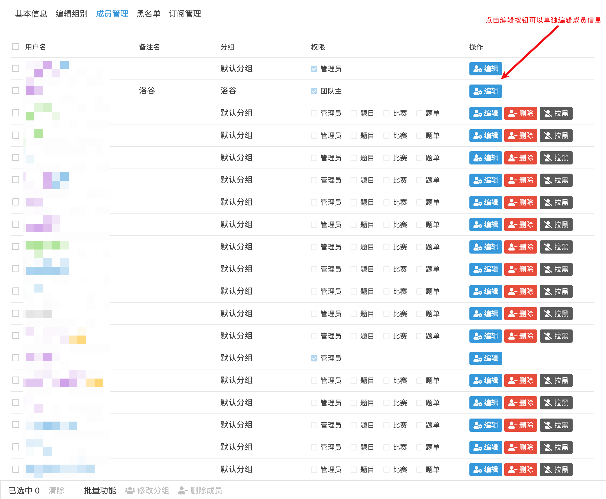
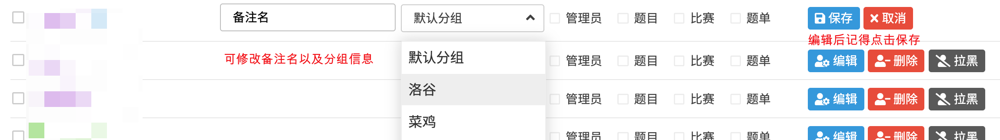
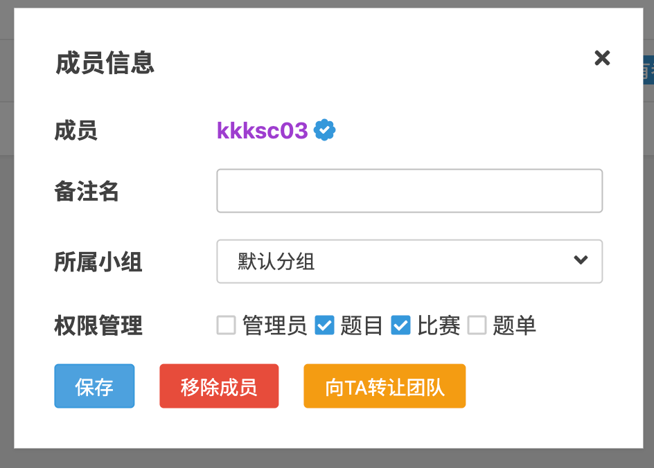
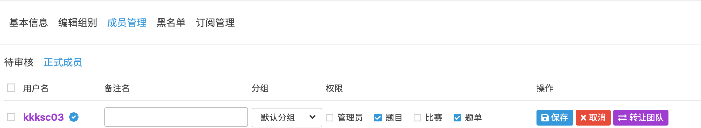
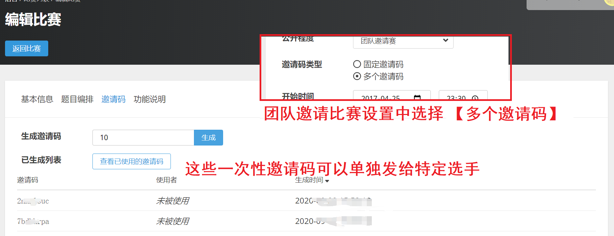
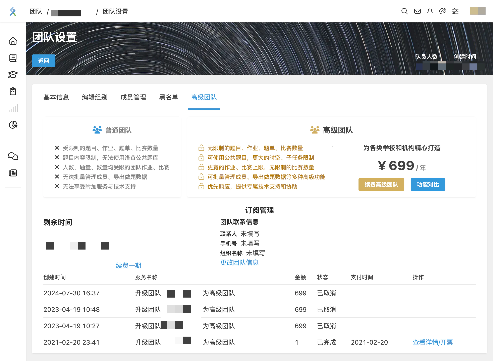

# 洛谷高级团队服务

**洛谷高级团队服务**是洛谷为各类学校和机构精心打造的算法竞赛训练管理的增值服务。在原有的免费使用的洛谷团队基础上放开了更多的配额限制，增加了许多针对进行集体训练的提升效率的功能。

## 一、权益概览

- 无限制的题目、作业、题单、比赛数量
- 可使用公共题目，更大的时空、子任务限制
- 更宽的作业、比赛上限，无限制的比赛数量
- 可批量管理成员、导出做题数据等多种高级功能
- 优先响应，提供专属技术支持和协助

:::note[注：]

* 放宽的各项限制的内容在订阅期结束后予以保留，但会因超过基础限制而无法新建或编辑内容，以及增加新的成员。

:::

## 二、权益对比

## 三、订阅费用

高级团队服务采取订阅制度，按年订阅，一年（365 天）699 元。首次开通的团队（试用过的除外）可额外获赠 30 天。

每个用户可享受一次**付费 10 元**试用一个月（30 天）高级团队服务的权益。

## 四、功能介绍

高级团队在普通团队基础上，增加了很多高级功能。使用这些高级功能可以在很大的程度上节约团队训练的时间和精力。

### 1 题目复制

高级团队的管理员可复制公共题目，并且可以使用题目的测试数据进行评测。

复制来的题目可更改题面等信息，也可以重新上传自己制造的测试数据。

### 2 更高级的团队作业功能

相比于普通团队的作业只能加入 20 个参与者，高级团队可以添加 250 个参与者。

团队管理员可在团队作业、比赛的排行榜导出成绩数据为电子表格。

### 3 成员批量管理

团队设置新增成员管理选项。可批量管理成员。

  

:::tip[如何邀请新成员]

请进入你的团队主页，在团队主页点击团队编号后面的蓝色【复制地址】的文字，会将该页面的地址复制到剪贴板中。然后将该地址发送给需要邀请的新成员。新成员在该页面点击【加入团队】即可完成加入申请。

之后管理员就可以在【成员】标签页或【团队设置/成员管理】中看到新成员的加入申请，根据核实身份后通过即可。

:::

### 4 子权限分配

团队管理员可在团队设置-成员管理中授予普通成员单独编辑权限（题目、比赛、题单）。

获得授权的普通成员编辑团队内对应类型的内容。而没有其他团队管理的权限。

这大大降低了团队内部的管理风险。

### 5 团队邀请赛

团队邀请赛可选择生成单独的一次性邀请码（可免费生成 100 个），可以分别发放特定人群。

也获取每个邀请码对应的洛谷 uid。

:::note

如果想举办更大规模的邀请赛，欢迎咨询 `k@luogu.org`。

:::

## 五、开通/续费流程

高级团队可以在创建团队时开通，也可以为已有的团队升级。

### 创建时开通高级团队

用户可在创建团队时选择创建高级团队，如该账户之前未试用过高级团队可支付 10 元试用 30 天。

#### 创建流程

1. 前往 **[新建团队](https://www.luogu.com.cn/team/create)**，点击【创建高级团队】，在弹出的弹窗内输入团队名称，点击【创建高级团队】。
2. 跳转至洛谷支付页面，选择支付方式，点击【立即支付】。如果您无法立即支付，可在 **用户设置-[订单记录](https://www.luogu.com.cn/user/setting/payment)** 找到这笔订单。
3. 支付成功后，系统将自动创建该高级团队。

### 为已有团队升级高级团队

团队主可在 **团队设置-高级团队** 升级高级团队，如该账户之前未试用过高级团队可支付 10 元试用 30 天。

### 续费高级团队

高级团队的团队主和管理员可在 **团队设置-高级团队** 续费高级团队。

**对公转账账户信息：**

> 户名: 上海洛谷网络科技有限公司
> 
> 账号: `8888 8885 9930 0884`
> 
> 开户行: 浙江网商银行（浙江-杭州-没有支行）
> 
> 联行号: `3233 3100 0001`（这个不是账号，通常只有在开户行列表中找不到网商银行时需要填写）

## 六、发票说明

对于高级团队服务洛谷提供全电增值税普通发票，开票类目是“信息系统服务”。我们会在 10 个工作日内开出。

### 创建高级团队的订单

创建人可在 **用户设置-[订单记录](https://www.luogu.com.cn/user/setting/payment)** 找到这笔订单。

### 升级/续期高级团队的订单

可在 **团队设置-高级团队** 找到对应的付款记录，该笔订单的**实际付款人**可以点击【查看详情/开票】，进入页面后按照提示申请发票。

发票开具完毕后会自动向用户所填写的手机与电子邮箱发送，并且提供存档下载，在重新进入支付详情页即可看到开票信息处已变成“已开票，点击下载”。

## 七、订阅说明

1. 在订阅时，请先阅读[《洛谷团队服务章程》](../../../ula/premium-team.md)：对于滥用高级团队功能的团队，将会采取封禁团队、封禁团队管理员账号等处罚。
2. 如果有其他任何售前咨询或者售后支持，请前往 **[洛谷支持中心](https://class.luogu.com.cn/service)** 提出所有的问题。
3. 我们为付费用户提供增值税普通发票，类目为“信息系统服务”。请付款后在课程支持中提供开票信息。（详见第六条）
4. 请勿在洛谷站内公开场合、或通过私信群发陌生人等方式宣传团队，将被认为是垃圾广告而删除。
5. 出现下面任一情况，团队将被管理员封禁。
   * 假冒其他团队、或使用与其他团队类似的名字的；
   * 团队发生对其他团队、个人侮辱、诽谤的；
   * 在使用高级团队的过程中，滥用功能的（例如创建或复制大量垃圾题目而没有正当理由）；
   * 其他管理员认为可能造成危害的情况。
