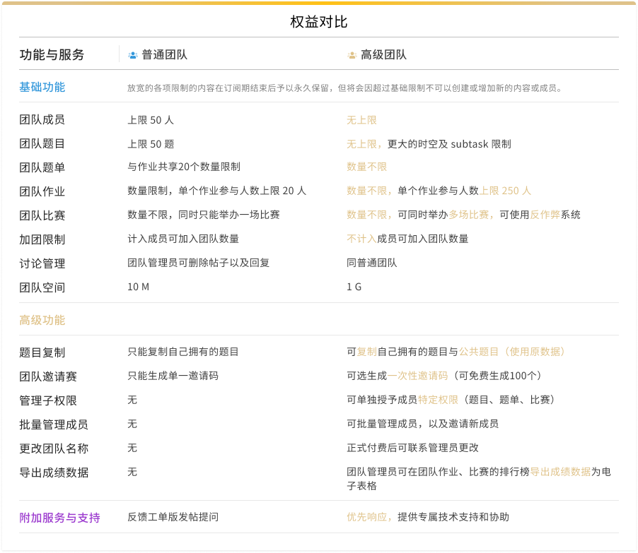

# 高级团队服务

**洛谷高级团队服务**是洛谷为各类学校和机构精心打造的算法竞赛训练管理的增值服务。在原有的免费使用的洛谷团队基础上放开了更多的配额限制，增加了许多针对进行集体训练的提升效率的功能。

## 一、权益概览

* 团队人数：无上限
* 团队题目：无上限，开放时空限制及 subtask。
* 团队作业：数量不限，单个作业参与人数上限 250 人。
* 团队比赛：数量不限，可同时举办多场比赛。可以举办团队邀请赛，可生成最多 100 个邀请码，允许使用反作弊系统。
* 加团限制：不计入成员可加入的团队数量。
* 成员管理：可以批量管理成员的组别和信息，并单独授予普通成员特定编辑权限（题目、题单、比赛）。
* 题目复制：允许从公有题库复制进团队题库，并可使用原测试数据进行评测。
* 导出数据：导出团队比赛、团队作业的结果数据。

:::note 注：

* 放宽的各项限制的内容在订阅期结束后予以永久保留，但将会因超过基础限制不可以创建或增加新的内容或成员。
* 如需运行反作弊请在比赛后发送比赛链接到邮箱 k@luogu.org 申请查重（仅限实际付费用户）

:::

## 二、权益对比

## 三、订阅费用

高级团队服务采取订阅制度，按年订阅，一年（365天）699 元。普通团队可试用一个月（30天）高级团队服务。

## 四、功能介绍

高级团队在普通团队基础上，增加了很多高级功能。使用这些高级功能可以在很大的程度上节约团队训练的时间和精力。

### 1 题目复制

高级团队的管理员可复制公共题目，并且可以使用题目的测试数据进行评测。

复制来的题目可更改题面等信息，也可以重新上传自己制造的测试数据。

### 2 更高级的团队作业功能

相比于普通团队的作业只能加入20个参与者，高级团队可以添加250个参与者。

团队管理员可在团队作业、比赛的排行榜导出成绩数据为电子表格。

### 3 成员批量管理

团队设置新增成员管理选项。可批量管理成员。

  

:::tip 如何邀请新成员

请进入你的团队主页，在团队主页点击团队编号后面的蓝色【复制地址】的文字，会将该页面的地址复制到剪贴板中。然后将该地址发送给需要邀请的新成员。新成员在该页面点击【加入团队】即可完成加入申请。

之后管理员就可以在【成员】标签页或【团队设置/成员管理】中看到新成员的加入申请，根据核实身份后通过即可。

:::

### 4 子权限分配

团队管理员可在团队设置-成员管理中授予普通成员单独编辑权限（题目、比赛、题单）。

获得授权的普通成员编辑团队内对应类型的内容。而没有其他团队管理的权限。

这大大降低了团队内部的管理风险。

### 5 团队邀请赛

团队邀请赛可选择生成单独的一次性邀请码（可免费生成 100个），可以分别发放特定人群。

也获取每个邀请码对应的洛谷 uid。

赛后可以运行反作弊系统，对所有提交的代码进行比对查重，以保证比赛的严肃性。  

如需运行请联系 [kkksc03](https://www.luogu.com.cn/user/1)  

>如果想举办更大规模的邀请赛，欢迎咨询 `k@luogu.org`。

## 五、开通流程

目前仅有团队的团队主方可开通高级权限功能。如果管理员希望开通团队，请提醒团队主开通。

1. 进入团队设置页面，在团队类型后点击“试用高级团队”。
     

2. 跳转至开通页面，填写联系信息，若想直接开通可点击右上角切换为正式开通。
   请务必认真填写联系信息。

  

3. 阅读并同意《洛谷团队服务章程》后，点击开通按钮。
     

4. 跳转至支付页面，选择支付方式付款即可。
     

5. 完成付款，成功开通。  

您还可以选择使用对公转账的方式支付洛谷课程或者其他增值服务的费用，请务必和客服或者管理确认后再进行付款。付款后请联系管理员开通权限。

客服咨询暂时和洛谷网校共用，您可以在客服中心咨询所有洛谷付费业务。客服工单留言：<https://class.luogu.com.cn/service>

> 账号：8888888599300884
> 开户行：浙江网商银行股份有限公司  
> 户名：上海洛谷网络科技有限公司  
> 联行号: 323331000001  

（以下不建议使用，虽然也可以转账但查询周期较长）

> ~31050180490000000410~  
> ~中国建设银行上海沪亭北路支行~  
> ~上海洛谷网络科技有限公司~

## 六、发票说明

洛谷提供增值税普通发票，开票类目是“技术服务费”。我们会在 10 个工作日内开出。

为简化流程、促进环保，我们已经启用电子发票。请团队主付款成功后进入【团队设置-订阅管理】找到对应的付款记录，点击【查看详情/开票】，进入页面后按照提示申请发票。

如果一定需要纸质发票的，请至客服中心（[https://class.luogu.com.cn/service](https://class.luogu.com.cn/service)）提交申请，这需要您承担运费。

## 七、订阅说明

1. 在订阅（无论是付费订阅还是免费试用）时，请先阅读[《洛谷团队服务章程》](../../../ula/premium-team.md)对于滥用高级团队功能的团队，尤其是免费试用的团队，将会采取封禁团队、封禁团队管理员账号等处罚。对于试用团队，仅能体验高级团队的大部分的功能，但并不能提供技术支持。
2. 如果有其他任何售前咨询或者售后支持，请前往洛谷网校课程支持中心（[https://class.luogu.com.cn/service](https://class.luogu.com.cn/service)）提出所有的问题。
3. 我们为付费用户提供增值税普通发票，类目为技术服务费。请付款后在课程支持中提供开票信息。（详见第六条）
4. 请勿在洛谷站内公开场合、或通过私信群发陌生人等方式宣传团队，将被认为是垃圾广告而删除。
5. 出现下面任一情况，团队将被管理员封禁。
   * 假冒其他团队、或使用与其他团队类似的名字的；
   * 团队发生对其他团队、个人侮辱、诽谤的；
   * 在使用高级团队的过程中，滥用功能的（例如创建或复制大量垃圾题目而没有正当理由）；
   * 其他管理员认为可能造成危害的情况。
