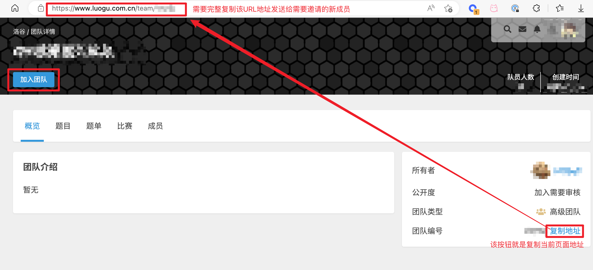
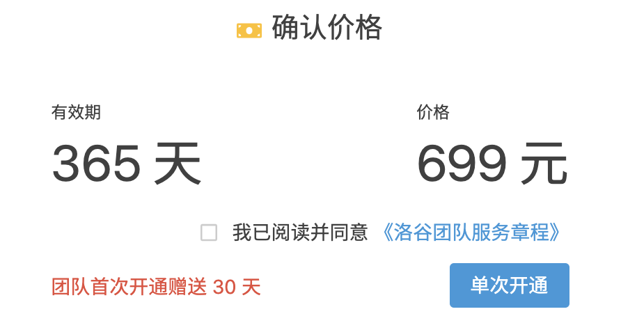
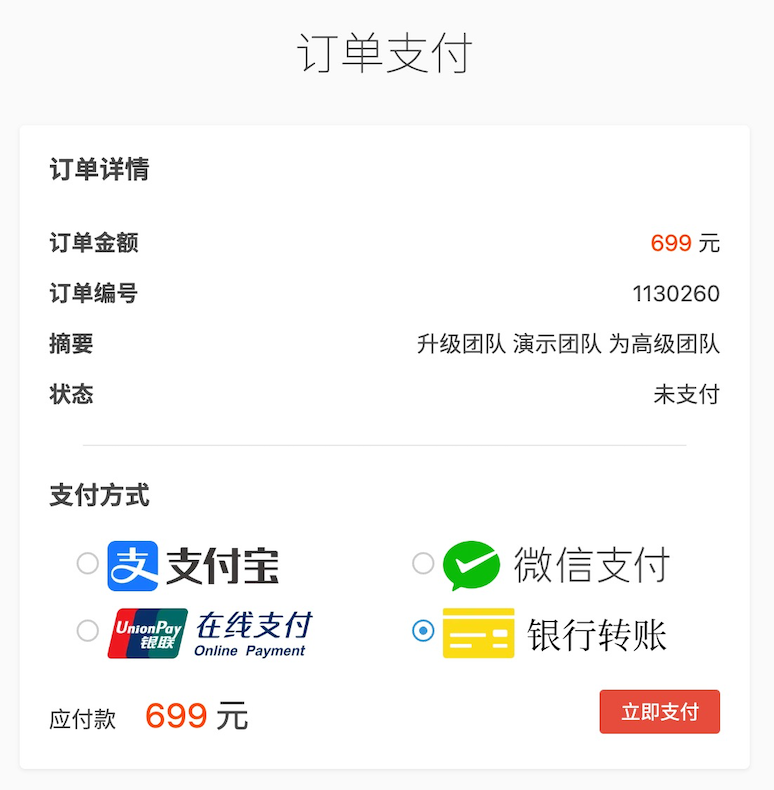
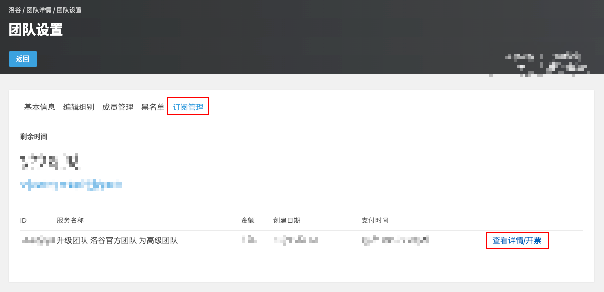

# 高级团队服务

**洛谷高级团队服务**是洛谷为各类学校和机构精心打造的算法竞赛训练管理的增值服务。在原有的免费使用的洛谷团队基础上放开了更多的配额限制，增加了许多针对进行集体训练的提升效率的功能。

## 一、权益概览

* 团队人数：无上限
* 团队题目：无上限，开放时空限制及 subtask。
* 团队作业：数量不限，单个作业参与人数上限 250 人。
* 团队比赛：数量不限，可同时举办多场比赛。可以举办团队邀请赛，可生成最多 100 个邀请码，允许使用反作弊系统。
* 加团限制：不计入成员可加入的团队数量。
* 成员管理：可以批量管理成员的组别和信息，并单独授予普通成员特定编辑权限（题目、题单、比赛）。
* 题目复制：允许从公有题库复制进团队题库，并可使用原测试数据进行评测。
* 导出数据：导出团队比赛、团队作业的结果数据。

:::note[注：]

* 放宽的各项限制的内容在订阅期结束后予以永久保留，但将会因超过基础限制不可以创建或增加新的内容或成员。
* 如需运行反作弊请在比赛后发送比赛链接到邮箱 `k@luogu.org` 申请查重（仅限实际付费用户）

:::

## 二、权益对比

## 三、订阅费用

高级团队服务采取订阅制度，按年订阅，一年（365 天）699 元。普通团队可试用一个月（30 天）高级团队服务。

## 四、功能介绍

高级团队在普通团队基础上，增加了很多高级功能。使用这些高级功能可以在很大的程度上节约团队训练的时间和精力。

### 1 题目复制

高级团队的管理员可复制公共题目，并且可以使用题目的测试数据进行评测。

复制来的题目可更改题面等信息，也可以重新上传自己制造的测试数据。

### 2 更高级的团队作业功能

相比于普通团队的作业只能加入 20 个参与者，高级团队可以添加 250 个参与者。

团队管理员可在团队作业、比赛的排行榜导出成绩数据为电子表格。

### 3 成员批量管理

团队设置新增成员管理选项。可批量管理成员。

  

:::tip[如何邀请新成员]

请进入你的团队主页，在团队主页点击团队编号后面的蓝色【复制地址】的文字，会将该页面的地址复制到剪贴板中。然后将该地址发送给需要邀请的新成员。新成员在该页面点击【加入团队】即可完成加入申请。

之后管理员就可以在【成员】标签页或【团队设置/成员管理】中看到新成员的加入申请，根据核实身份后通过即可。

:::

### 4 子权限分配

团队管理员可在团队设置-成员管理中授予普通成员单独编辑权限（题目、比赛、题单）。

获得授权的普通成员编辑团队内对应类型的内容。而没有其他团队管理的权限。

这大大降低了团队内部的管理风险。

### 5 团队邀请赛

团队邀请赛可选择生成单独的一次性邀请码（可免费生成 100 个），可以分别发放特定人群。

也获取每个邀请码对应的洛谷 uid。

赛后可以运行反作弊系统，对所有提交的代码进行比对查重，以保证比赛的严肃性。  

如需运行请联系 [kkksc03](https://www.luogu.com.cn/user/1)  

:::note

如果想举办更大规模的邀请赛，欢迎咨询 `k@luogu.org`。

:::

## 五、开通流程

目前仅有团队的团队主方可开通高级权限功能。如果管理员希望开通团队，请提醒团队主开通。

1. 进入团队设置页面，在团队类型后点击“试用高级团队”。
     

2. 跳转至开通页面，填写联系信息，若想直接开通可点击右上角切换为正式开通。
   请务必认真填写联系信息。
     

3. 阅读并同意《洛谷团队服务章程》后，点击开通按钮。
     

4. 跳转至支付页面，选择支付方式付款即可（对公转账选择银行转账即可）。
     

5. 完成付款，成功开通。  

客服咨询暂时和洛谷网校共用，您可以在客服中心咨询所有洛谷付费业务。客服工单留言：[https://class.luogu.com.cn/service](https://class.luogu.com.cn/service)

对公转账账户信息：

> 账号：`8888 8885 9930 0884`
> 开户行：浙江网商银行股份有限公司（浙江-杭州-没有支行）  
> 户名：上海洛谷网络科技有限公司  
> 联行号: `3233 3100 0001`（注意这个不是账号，一般仅于开户行列表中找不到网商银行时使用）

## 六、发票说明

洛谷提供全电增值税普通发票，开票类目是“技术服务费”。我们会在 10 个工作日内开出。

请团队主付款成功后进入【团队设置-订阅管理】找到对应的付款记录，点击【查看详情/开票】，进入页面后按照提示申请发票。

发票开具完毕后会自动向用户所填写的手机与电子邮箱发送，并且提供存档下载，在重新进入支付详情页即可看到开票信息处已变成“已开票，点击下载”。

## 七、订阅说明

1. 在订阅（无论是付费订阅还是免费试用）时，请先阅读[《洛谷团队服务章程》](../../../ula/premium-team.md)对于滥用高级团队功能的团队，尤其是免费试用的团队，将会采取封禁团队、封禁团队管理员账号等处罚。对于试用团队，仅能体验高级团队的大部分的功能，但并不能提供技术支持。
2. 如果有其他任何售前咨询或者售后支持，请前往洛谷网校课程支持中心（[https://class.luogu.com.cn/service](https://class.luogu.com.cn/service)）提出所有的问题。
3. 我们为付费用户提供增值税普通发票，类目为技术服务费。请付款后在课程支持中提供开票信息。（详见第六条）
4. 请勿在洛谷站内公开场合、或通过私信群发陌生人等方式宣传团队，将被认为是垃圾广告而删除。
5. 出现下面任一情况，团队将被管理员封禁。
   * 假冒其他团队、或使用与其他团队类似的名字的；
   * 团队发生对其他团队、个人侮辱、诽谤的；
   * 在使用高级团队的过程中，滥用功能的（例如创建或复制大量垃圾题目而没有正当理由）；
   * 其他管理员认为可能造成危害的情况。
