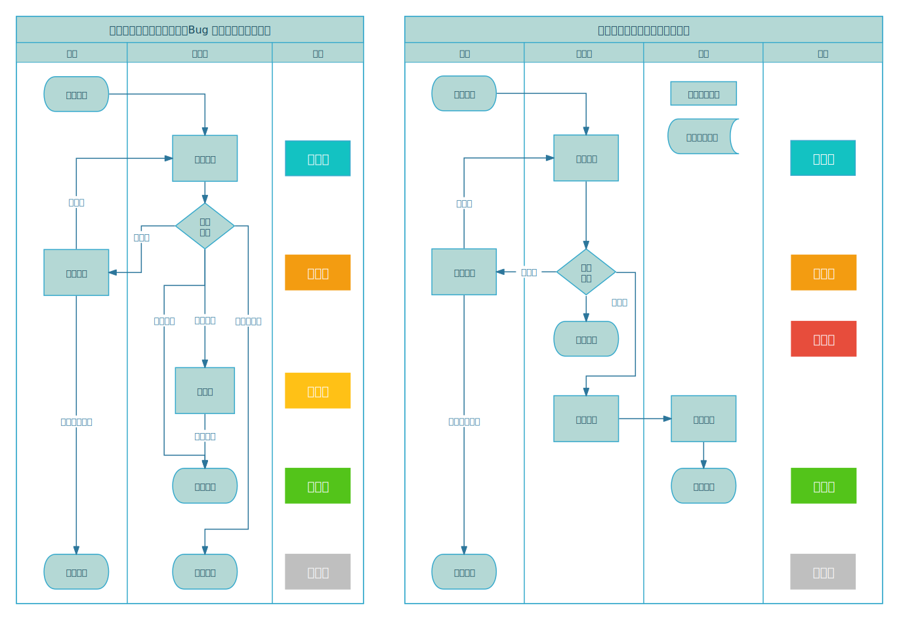

# 工单系统

## 简介

## 用户权限

### 普通用户

### 受信任的用户

某些工单类型仅限受信任用户提交。用户需满足以下条件之一：已认证的奖项不少于一个，比赛等级分不低于 1000，用户名颜色为橙名及以上。

### 封禁用户

已经被禁止登录主站，允许提交自己账号的申诉工单。

### 管理员

管理员大概分为大管理、题目管理志愿者、专栏审核志愿者、月赛审核员。不同类型的管理员根据其权限可以处理不同类型的工单。

具体管理员名单参考以下内容。

**题目管理志愿者（负责题目、专栏、比赛）与月赛审核员：**

详见[题目管理志愿者轮换制度](https://www.luogu.com.cn/discuss/show/186291)。

详见[洛谷月赛审核员名单](https://www.luogu.com.cn/paste/ognf1rs4)。

**专栏审核志愿者（负责题解、专栏）：**

详见[题解审核志愿者制度](https://www.luogu.com.cn/discuss/600159)。

## 一般流程

## 工单类型

工单主要按照字段内容与对应不同的管理权限进行分类。

### 一般工单

- 包含分类：Bug 反馈、功能建议。
- 公开程度：公开可见
- 字段：  
  - 反馈详情（10000 字符内）
- 处理权限：社区管理

一般工单仅接受普通文本内容，主要涉及洛谷主站、网校、有题等网站本身的操作问题，一般由管理员、开发组进行回应。

### 题库相关

此类别包含对题目的主题目、多语言、标签、难度、数据等贡献修改等请求的工单。主要由题目管理志愿者处理。

#### 主题面修缮

- 公开程度：公开可见
- 提交权限：受信任的用户
- 字段：
  - 题目标题（100 字符内）
  - 题目背景（1000 字符内）
  - 题目描述（10000 字符内）
  - 输入格式（10000 字符内）
  - 输出格式（10000 字符内）
  - 提示（10000 字符内）
  - 语言选择（中文，英文，日文*）*仅支持作为主语言时贡献
  - 修改理由（1000 字符内）
- 处理权限：题库管理、题库志愿者

允许用户对主题面、多语言题面申请修改或增加，由对应管理员审核通过后将自动应用。

相关规范请查阅：[《洛谷主题库题目规范》](../../rules/academic/problem-standard.md)

#### 题目难度/题目标签 修正

- 公开程度：公开可见
- 提交权限：受信任的用户
- 字段：
  - 难度选择
  - 标签选择
  - 修改原因（1000 字符内）
- 处理权限：题库管理、题库志愿者

对于题目难度仅受理两个或者以上级别的难度差异变更。请给出难度或者标签变更理由，由对应管理员审核通过后将自动应用。

### 贡献申请

#### 公开赛/月赛审核

- 公开程度：不公开
- 提交权限：受信任的用户
- 字段：
  - 比赛类型：普通公开赛/Rated公开赛/大月赛/小月赛/基础赛
  - QQ 号
  - 备注（1000 字符内）
- 处理权限：比赛管理、月赛审核员

用户只能提交自己有权限编辑的比赛。请根据[《公开比赛规范及要求》](../../rules/academic/opencontest-standard.md)和[《官方比赛规范》](../../rules/academic/lgr/contest-standard.md)的要求提交比赛。

#### 精选题单

- **暂未开放**
- 公开程度：公开可见
- 提交权限：受信任的用户
- 字段：
  - 备注（1000 字符内）
- 处理权限：题库管理、题库志愿者

用户只能提交自己有权限编辑的题单。请根据[《精选题单规范》](../../rules/academic/training-promotion-standard.md)的要求提交题单。
