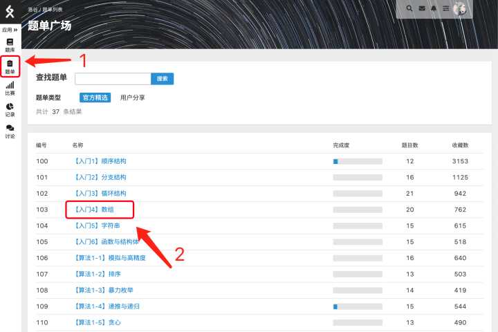
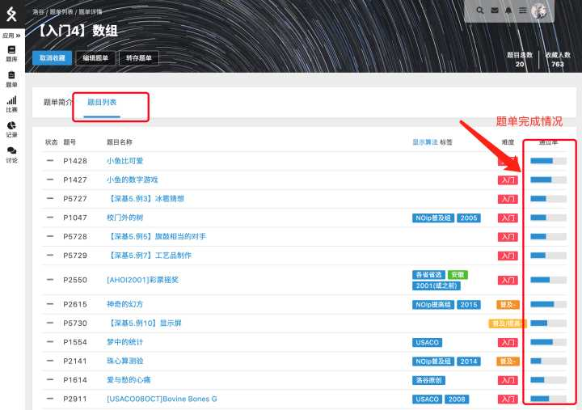
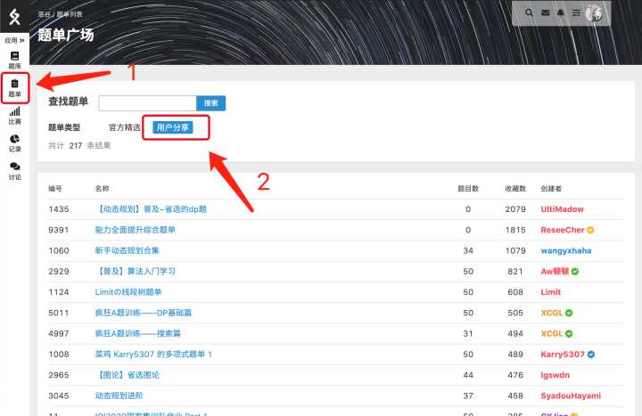
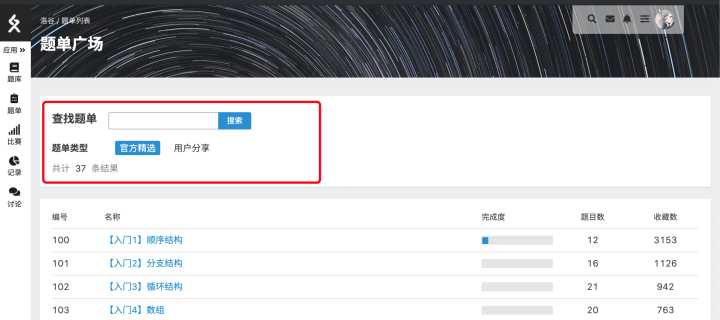

# 题单

因为洛谷的题目数量特别多，专门寻找某一类题目的话，用题单功能会更方便。有些现成的题单就已经针对性的对很多专题做了汇总。

## 使用流程

例如，如果想去查找跟数组有关的入门题目，在这边就可以点击题单中对应的这一项。

题单中可以有简介，同时加上一些指导说明的内容，下方是题目列表，集合了所有的这个题单的题目。对于用户来说，左边能够显示这个题目是否已经完成。

如果觉得官方题单数量太少，这里还有精选的用户分享题单，按照收藏的数量进行排序。比如说我想去对于动态规划想去找一些比较针对的题目，这边就提供了很多不错的选择，而且内容会比较详细。

题单也可以搜索。比如说想找带有搜索字样的题单。就可以找到相关的题目。

## 贡献题单

以及允许用户/团队公开自己整理的题单，具体规则参见 [公开题单规则](https://www.luogu.com.cn/discuss/show?postid=203644)。
