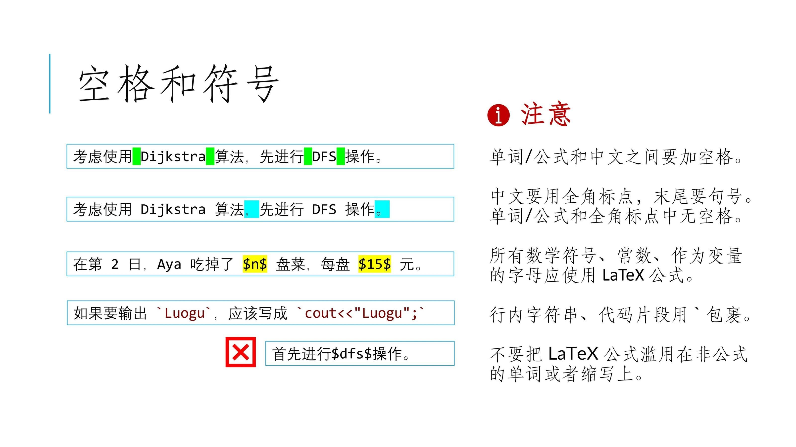
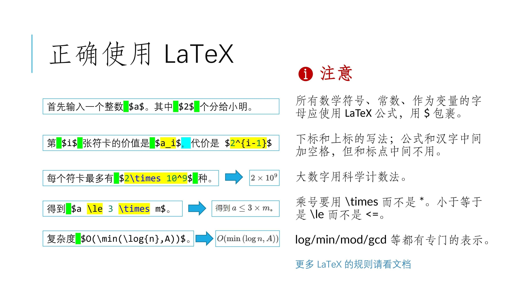

# 专栏全站推荐规范

## 专栏内容分类

目前，文章广场共分六个区域，各区域适用内容如下：

- 题解区：用于提交针对特定试题的题解。
- 科技·工程区：用于介绍各类工程项目，或者工程项目中会用到的技术。
- 算法·理论区：用于介绍某一个（或某一类）特定算法或数据结构，或者做题套路技巧。
- 生活·游记区：用于分享参加程序设计方面赛事的经历。
- 学习·文化课区：用于分享文化课学习心得，或者部分学科部分题型的做题技巧等。
- 休闲·娱乐区：用于分享娱乐内容。

目前，仅【题解】、【科技·工程】、【算法·理论】、【生活·游记】开放全站推荐。【学习·文化课】与【休闲·娱乐】暂不提供公开全站推荐渠道。

申请全站推荐的文章，应符合本规范对应模块的要求。

## 总体要求

### 排版规范

申请全站推荐的文章，排版均应符合如下规范：

  

  

### 内容规范

申请全站推荐的文章，内容均应符合如下规范：

- 使用的内容不应抄袭，且不会侵犯他人的版权，若需引用外部资料，必须使用链接标注来源。
- 如使用生成式 AI 辅助写作，必须在文末（或附录中）明确披露 GenAI 的具体贡献。[具体规范](./GenAI-assisted-article-writing.md)
- 不应宣传可能违反相关法律法规的内容。
- 不应包含可能危害计算机正常运行的项目、代码、教学。
- 不应出现侵犯他人权益（包括隐私权、肖像权等）的内容。
- 文章大部分内容应与文章主题紧密相关，尽量不出现与文章主题无关或无意义的内容，如『求管理员通过』。

## 【题解】板块要求

- 符合本规范所述『总体要求』，同时符合[洛谷主题库题解规范](solution-standard.md)。

## 【科技·工程】板块要求

- 符合本规范所述『总体要求』，同时符合[洛谷主题库题解规范](solution-standard.md)。
- 内容充实详细，对所介绍的项目或者技术有深入详尽的介绍。
- 如果文章的主题已在文章区有多篇文章介绍，且文章没有新意，同质化严重，将会被拒绝。

## 【算法·理论】板块要求

- 符合本规范所述『总体要求』，同时符合[洛谷主题库题解规范](solution-standard.md)。
- 内容充实详细，对所介绍的算法或者技巧有详尽的原理介绍、正确性分析、复杂度证明、相关例题等内容。
- 【算法·理论】区并不接受单题题解。单题题解应当投稿至【题解】区。
- 如果文章的主题已在文章区有多篇文章介绍，且文章没有新意，同质化严重，将会被拒绝。
- 如果文章介绍的算法、理论过于简单，或内容不够丰富详实，将会被拒绝。

## 【生活·游记】板块要求

- 符合本规范所述『总体要求』。
- 目前仅接受分享参加程序设计方面赛事的经历的内容，暂时不接受其他内容。
