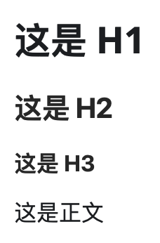
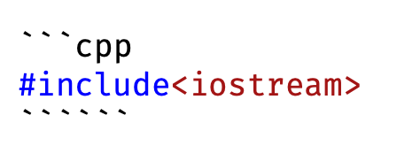
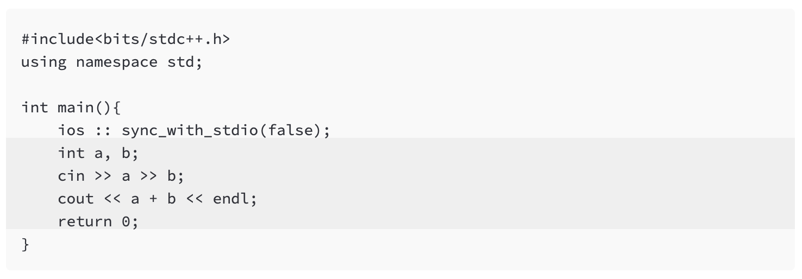
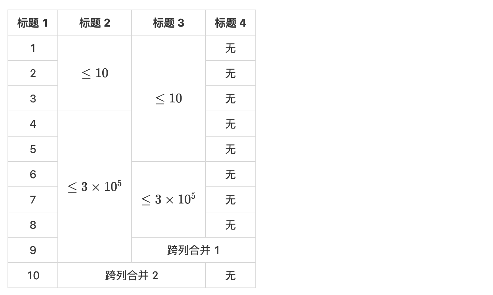
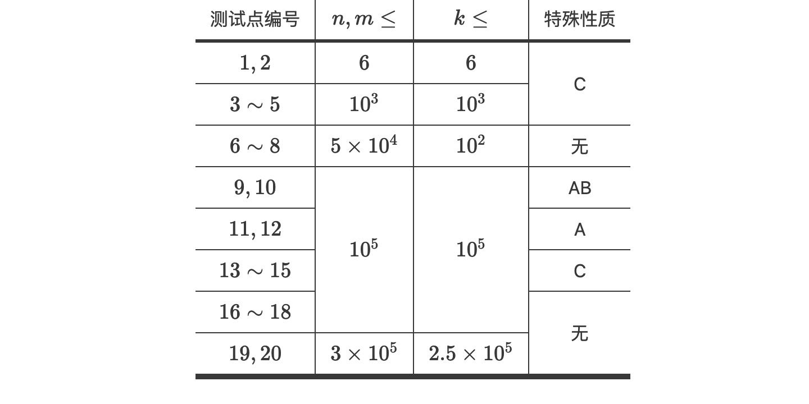
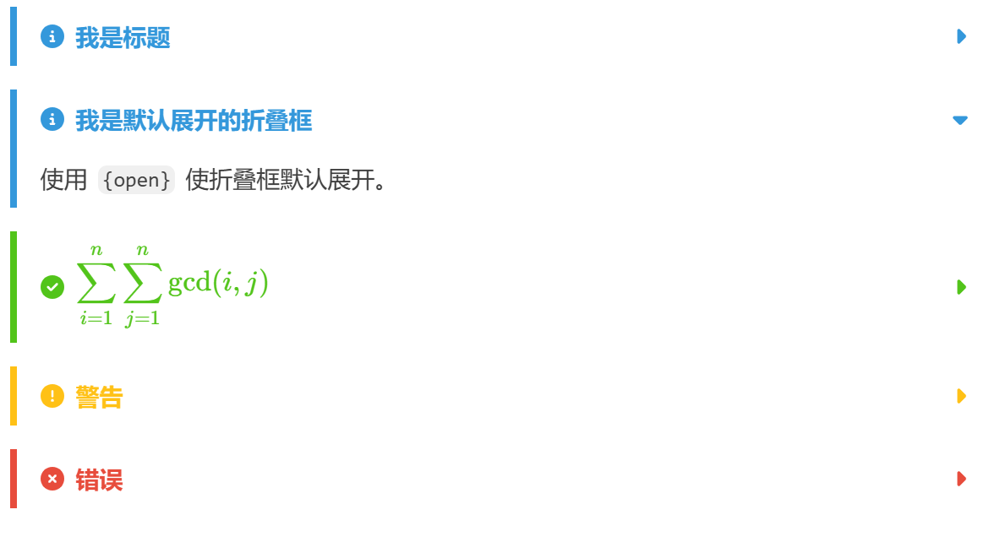

# 洛谷 Markdown 格式手册

Markdown 的目标是实现「易读易写」，成为一种适用于网络的书写语言。因此洛谷使用 Markdown 发布内容。

**请仔细阅读下列文档，如果没有按照要求正确使用格式，将可能无法发出讨论，或者被删除。**

:::info[请注意]

- 本页面显示效果非洛谷主站实际效果，仅作为参考。部分语法的实际效果使用截图展示。
- 部分标注了新特性的功能在老页面不支持展示，可使用编辑器的预览模式确定是否可用。

:::

## 段落和换行

一个 Markdown 段落是由一个或多个连续的文本行组成，它的前后要有一个以上的**空行**。普通的 Markdown 段落不可以用空格或制表符来缩进。

> 空行：一行之内只包含回车换行、空格、制表符。

**例如：**

```markdown
这是第一段话

这是第二段话
```

显示的效果如下：

这是第一段话

这是第二段话

**如果两段之间不空一行，则无法正确分段。反面例子：**

```markdown
这是第一段话
这是第二段话
```

显示的效果如下：

这是第一段话 这是第二段话

## 段落内部换行

在行末输入**两个空格**可以达到比分段更加紧凑的换行的效果。

**例如：**

```markdown
这是第一行  
这是第二行
```

（请注意“这是第一行”后的两个空格，可以用鼠标拖动选中它们）

显示的效果如下：

这是第一行  
这是第二行

## 标题

Markdown 的标题是在行首插入 1 到 6 个 `#`，`#` 和标题文字之间使用一个或多个空格，对应到标题 $1$ 到 $6$ 级。

**例如：**

```markdown
# 这是 H1

## 这是 H2

### 这是 H3

这是正文
```

显示的效果如下：



:::caution

不要全文使用标题，或者用标题强调特别多的文字。这会让读者觉得困扰。

:::

## 强调

Markdown 使用星号（`*`）和底线（`_`）作为标记强调字词的符号，被 `*` 或 `_` 包围的字词会被转成用 `<em>` 标签包围（即*斜体*），用两个 `*` 或 `_` 包起来的话，则会被转成 `<strong>`（即**粗体**）。

**例如：**

```markdown
*单星号斜体*

_单下划线斜体_

**双星号加粗**

__双下划线加粗__

~~删除线~~
```

显示的效果如下：

*单星号斜体*

*单下划线斜体*

**双星号加粗**

**双下划线加粗**

~~删除线~~

但是如果 `*` 或 `_` 的两边都有空白的话，它们就只会被当成普通的符号。如果要在文字前后直接插入普通的星号或底线，可以用反斜线（`\`）（参见下面的“反斜杠”部分）。

**例如：**

```markdown
\*使用反斜线开头的\*被当做是普通的字符\*
```

显示的效果如下：

\*使用反斜线开头的\*被当做是普通的字符\*

## 代码块

**如果要发送代码，但没有按照下面的方式进行格式化，将不能发送成功。**

### 大段代码

Markdown 建立代码块的方法：将 \`\`\` 置于这段代码的首行和末行，独立成一行。第一行的 \`\`\` 后面可以加上语言名称，例如 cpp、java、c、pascal 等（不要写成 c++）。

**例如：**



```cpp
#include<iostream>
```

### 指定范围高亮【新特性】

在代码块中首行使用 `lines=<start>-<end>` 参数来指定高亮范围。例如：

```markdown
```cpp lines=5-6
```



这样代码块的第 5~6 行会被高亮显示。

### 小段代码

需要引用代码时，如果引用的语句只有一段，不分行，可以用 \` 将语句包起来。

**例如：**

```markdown
前面的内容 `printf("Hello World!\n");` 后面的内容。
```

**显示的效果如下：**

前面的内容 `printf("Hello World!\n");` 后面的内容。

注：如果真的要打 \` 这个字符的话，可以仿照和 \* 这个字符一样的处理方式，在 \` 前加一个反斜杠 `\`。

## 区块引用

Markdown 标记区块引用的方法是在行的最前面加 `>`，也可以只在整个段落的第一行最前面加上 `>`，区块引用内部可以嵌套，只要根据层次加上不同数量的 `>` 即可，引用的区块内也可以使用其他的 Markdown 语法，包括标题、列表、代码区块等。

**例如：**

```markdown
> Markdown 标记区块引用的方法是在行的最前面加 `>`。
> 
> 也可以只在整个段落的第一行最前面加上 `>`。
> > 区块引用内部可以嵌套，只要根据层次加上不同数量的 `>` 即可。
> > 
> > *我是内部嵌套区块，我可以使用其他 Markdown 语法哦。*
> > 
> > ### 我是引用区块内使用 3 级标题语法。
> > 
> > ```java
> >     //在引用区块内可以加入代码块
> >     import java.net.URL;
> >     import java.util.Arrays;
> >     import java.util.Date;
> >     import java.util.Set;
> > ```
```

**显示的效果如下：**

> Markdown 标记区块引用的方法是在行的最前面加 `>`。
>
> 也可以只在整个段落的第一行最前面加上 `>`。
> > 区块引用内部可以嵌套，只要根据层次加上不同数量的 `>` 即可。
> >
> > *我是内部嵌套区块，我可以使用其他 Markdown 语法哦。*
> >
> > ### 我是引用区块内使用 3 级标题语法
> >
> > ```java
> >     //在引用区块内可以加入代码块
> >     import java.net.URL;
> >     import java.util.Arrays;
> >     import java.util.Date;
> >     import java.util.Set;
> > ```

## 列表

Markdown 支持有序列表和无序列表，无序列表使用星号、加号或是减号作为列表标记，有序列表则使用数字接着一个英文句点。两种列表方式格式都是：列表标记 + 空格 + 列表项，即列表项目标记通常是放在最左边，也可以缩进最多 $3$ 个空格，项目标记后面则一定要接着至少一个空格或制表符。

### 1 无序列表

星号、加号或是减号三种列表方式效果等同。

**例如：**

```markdown
*   Red
*   Green
*   Blue

+   Red
+   Green
+   Blue

-   Red
-   Green
-   Blue
```

它们的显示效果均为：

* Red
* Green
* Blue

### 2 有序列表

有序列表则使用数字接着一个英文句点。

**例如：**

```markdown
1.  Red
2.  Green
3.  Blue
```

显示效果为：

1. Red
2. Green
3. Blue

## 链接

在方块括号后面紧接着圆括号并插入网址链接即可，如果还想要加上链接的 title 文字，只要在网址后面，用双引号把 title 文字包起来即可，例如：

```markdown
[行内式链接标题](http://www.luogu.com.cn/ "可选标题")
```

显示效果为：

这是[行内式链接标题](http://www.luogu.com.cn/ "可选标题") 。可将光标移至链接上查看 title 效果。

## 图片

Markdown 使用一种和链接很相似的语法来标记图片。在互联网上发表含有图片的内容时，需要将该图片上传至可公开访问的存储空间内（也就是俗称的图床），在洛谷内可以使用[图床](https://www.luogu.com.cn/image)上传图片后复制图片引用地址来使用该图片，具体使用说明可查看[操作说明](/manual/luogu/faq#image-upload)

行内式的图片语法如下：

``

``

**详细叙述如下**：一个惊叹号 `!`，接着一个方括号，里面放上图片的替代文字（这些文字将在图片加载失败的时候显示），接着一个普通括号，里面放上图片的网址，最后还可以用引号包住并加上选择性的 title 文字。

**例如：**

```markdown

```

将会显示图片：


## 自动链接

Markdown 支持以比较简短的自动链接形式来处理网址和电子邮件信箱，只要是用尖括号包起来，Markdown 就会自动把它转成链接。一般网址的链接文字就和链接地址一样，例如：

```markdown
<https://www.luogu.com.cn/>
```

显示效果为：

[https://www.luogu.com.cn/](https://www.luogu.com.cn/)

## 分隔线

可以在一行中用三个以上的星号、减号、底线来建立一个分隔线，行内不能有其他内容。也可以在星号或是减号中间插入空格。下面每种写法都可以建立分隔线：

```md
* * *

***

*****

- - -

---------------------------------------
```

显示的效果如下：

* * *

***

*****

- - -

---------------------------------------

## 反斜杠

Markdown 可以利用反斜杠来插入一些在语法中有其它意义的符号，例如：如果想要用星号加在文字旁边的方式来做出强调效果（但不用 `<em>` 标签），可以在星号的前面加上反斜杠。

Markdown 支持以下这些符号前面加上反斜杠来帮助插入普通的符号（加上反斜杠后，这些符号都会以原来的方式显示）：

```md
\   反斜线
`   反引号
*   星号
_   底线
{}  花括号
[]  方括号
()  括弧
#   井字号
+   加号
-   减号
.   英文句点
!   惊叹号
```

## 表格

使用 `|` 划分单元格，并使用 `:` 与三个及以上的 `-` 在第二行用于调整对齐。

```md
| 我是左对齐 | 我是居中对齐 | 我是右侧对齐 |
|:---|:---:|---:|
| 内容 | 内容 | 内容 |
```

显示效果为

| 我是左对齐 | 我是居中对齐 | 我是右侧对齐 |
|:---|:---:|---:|
| 内容 | 内容 | 内容 |

## 表格合并【新特性】

在正常 Markdown 语法的基础上，结合 `^` 向上合并单元格，结合 `<` 向左合并单元格。在同一个表格内可混合使用这两种方式。

```markdown
| 标题 1| 标题 2| 标题 3    |标题 4|
|:-:|:--------:|:--------:|:--:|
|1  |$\le 10$  |$\le 10$  |无   |
|2  |^         |^         |无   |
|3  |^         |^         |无   |
|4  |$\le 3\times 10^5$|^         |无   |
|5  |^         |^         |无   |
|6  |^         |$\le 3\times 10^5$|无   |
|7  |^         |^         |无   |
|8  |^         |^         |无   |
|9  |^         | 跨列合并 1         |<   |
|10 |跨列合并 2         |<         |无   |
```

**效果：**



## 更像 Tuack 的表格【新特性】

使用 ```:::cute-table{tuack}``` 来创建更像 Tuack 的表格。可以结合上文的表格合并语法使用。

```markdown
::cute-table{tuack}

| 测试点编号 | $n, m \leq$ | $k \leq$ | 特殊性质 |
| :-: | :-: | :-: | :-: |
| $1, 2$ | $6$ | $6$ | C |
| $3 \sim 5$ | $10^3$ | $10^3$ | ^ |
| $6 \sim 8$ | $5 \times 10^4$ | $10^2$ | 无 |
| $9, 10$ | $10^5$ | $10^5$ | AB |
| $11, 12$ | ^ | ^ | A |
| $13 \sim 15$ | ^ | ^ | C |
| $16 \sim 18$ | ^ | ^ | 无 |
| $19, 20$ | $3 \times 10^5$ | $2.5 \times 10^5$ | ^ |
```

**显示效果：**



## 居中排版【新特性】

使用 ```:::align{center}``` 来居中排版。被此语法包裹的内容将居中显示（部分元素不支持）。

**例如：**

```markdown
:::align{center}


 123
#### 标题 4
:::
```
**显示效果：**


## 居右排版【新特性】

使用 ```:::align{right}``` 来居右排版。被此语法包裹的内容将居右显示。

**例如：**

```markdown
:::align{right}


 123
#### 标题 4
:::
```
**显示效果：**


## 引言【新特性】

使用 ```:::epigraph``` 来创建引言。

**例如：**

```markdown
:::epigraph[——otto]
大家好啊，我是说的道理，今天来点大家想看的东西。
:::
```

**显示效果：**


## 折叠框【新特性】

使用 ```:::info```、```:::success```、```:::warning```、```:::error``` 来创建折叠框。并使用 `{open}` 参数来使折叠框默认展开。折叠框的标题支持 LaTeX 公式。

:::tip
建议复制以下代码至洛谷文章编辑页内测试体验。
:::

**例如：**

```markdown
::::info[我是标题]
大家好啊，我是说的道理，今天来点大家想看的东西。
::::

::::info[我是默认展开的折叠框]{open}
使用 `{open}` 使折叠框默认展开。
::::

::::success[$$\displaystyle\sum_{i = 1}^n \sum_{j = 1}^n \gcd(i, j)$$]
数学公式也是可以出现在标题上的。
::::

::::warning[警告]
这是一个警告框。
::::

::::error[错误]
这是一个错误框。
::::
```



嵌套语法：最深的一层是三个 `:`，每往外一层就增加一个 `:`。

```markdown
::::::warning[我是警告]

:::::warning[不要]

::::warning[滥用]

:::warning[嵌套]
不然会被 chen_zhe 封号！！！！！
:::
::::
:::::
::::::
```

**显示效果：**


## 插入 Bilibili 视频

见 [https://www.luogu.com.cn/paste/okqcziz9](https://www.luogu.com.cn/paste/okqcziz9)。

## LaTeX 公式支持

见 [LaTeX 说明](./latex.md)。
