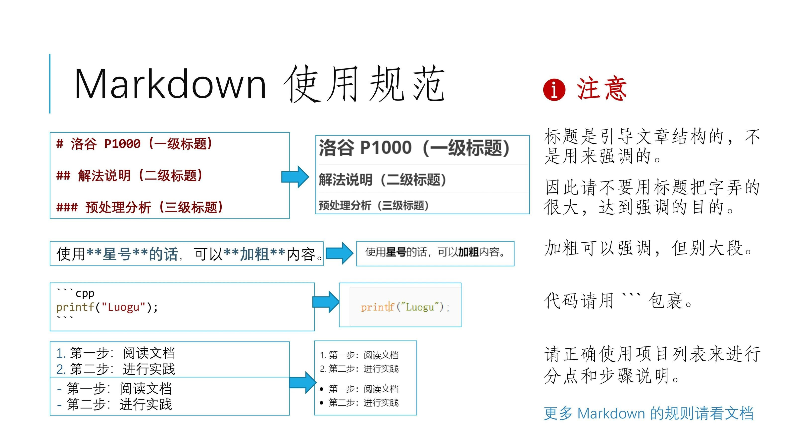

# 洛谷主题库题解规范（2023 试行版）

## 前言

随着题解审核工作的不断发展，原有的题解审核及反馈要求已经不再满足当前的需求。

本文将对一系列题解规范相关的内容进行**整合**，形成一套适用于当前洛谷的完整的规范，帮助用户快速熟悉题解的创作与提交流程。

## 声明

本规范将作为洛谷主题库题解的审核要求以及反馈要求。规范的最终解释权归管理所有。

## 图文说明

  

  

  


## 基本规范

- 请正确使用**全角中文**标点符号。特别地，句末要有**句号**。
- 数学公式（运算式、运算符、参与运算的常数、作为变量的字母等）应使用 LaTeX，非数学公式（一般英文单词、题目名、算法名、人名等）不应使用 LaTeX。
- **中文**与**英文、数字或公式**之间以半角空格隔开，但**中文标点符号**与**英文、数字或公式**之间不应有空格。

## 题解内容

- 应只包含题目相关内容，包括但不限于题意简述、题目分析等；不应出现大量无关内容，包括但不限于闲聊、吐槽、加戏、求赞、求管理员通过、「蒟蒻的第一篇题解」等内容。
- 对于题面较长的题目，**建议**加入题意简述，但不应完整复制题面至题解中。
- 题目分析中**必须**包含做这一道题目的主要思路，包括但不限于：使用了什么算法或数据结构，以及对于相应算法或者数据结构的具体分析。
- 题目分析应给出完整正确的解法与说明，并对解法中的重要结论进行解释与证明。给出的解法应能够在合理的时间复杂度内通过题目。
- 如果需要引用一些来自他人博客的内容，请确保**不会侵犯**他人的版权，并且**必须使用**链接标注来源。

## 排版

- 应使用 markdown 正确排版。
- 应使用 `#, ##, ###, ####` 符号表示标题行。标题应对文章结构进行引导；不应滥用标题行表示强调与无意义内容。
- 应使用 `-, +, *` 来表示无序列表，用 `1.` 来表示有序列表。以下是一个例子：

```markdown
- QAQ
- QwQ
- QvQ
```

- QAQ
- QwQ
- QvQ

```markdown
1. QAQ
2. QwQ
3. QvQ
```

1. QAQ
2. QwQ
3. QvQ

- 应使用行内代码块表示字符串或代码，如 `aabc`。

- 应使用行间代码块引用代码。

- 应使用 `[]()` 引用链接，如 [题解审核及反馈要求](https://www.luogu.com.cn/discuss/174934)（`[题解审核及反馈要求](https://www.luogu.com.cn/discuss/174934)`）。

- 应使用 `` 引用图片，如 ``。


## 数学公式

- 数学公式（运算式、运算符、参与运算的常数、作为变量的字母等）应使用 LaTeX。**同一个数学公式应写在一个 LaTeX 环境内。**
- 数学公式中的文本应使用 `\text`，字符串应使用 `\texttt`。如 $a \text{ is prime}$（`$a \text{ is prime}$`），$S = \texttt{aabcd}$（`$S = \texttt{aabcd}$`）。
- 公式独立成行时应使用行间公式。以下是一个行间公式的例子：

```latex
$$a + b = c$$
```

$$a + b = c$$

- 数学公式中应使用数学语言而非代码语言。
  - 赋值语句 `a = b;` 可以写作 $a \gets b$（`$a \gets b$`）或 $b \to a$（`$b \to a$`）。
  - 判定语句应使用 $=, \ne, <, \le, >, \ge$（`$=, \ne, <, \le, >, \ge$`）与艾佛森括号（$[P]$ 当 $P$ 为真时取值为 $1$，$P$ 为假时取值为 $0$）进行描述。
  - 整除应使用 $\lfloor \frac{a}{b} \rfloor, \lfloor a / b \rfloor, \lfloor a \div b \rfloor$（`$\lfloor \frac{a}{b} \rfloor, \lfloor a / b \rfloor, \lfloor a \div b \rfloor$`），不应使用 $\frac{a}{b}$ 或 $a/b$ 直接表示整除。
  - 取模应使用 $a \bmod b$（`$a \bmod b$`） 或 $a \equiv b \pmod p$（`$a \equiv b \pmod p$`）。
  - 不应出现 $a.b$ 等结构体式的写法，如有需要可以使用上下标表示。
  - 位运算应使用 $\operatorname{and}, \operatorname{or}, \operatorname{xor}$（`$\operatorname{and}, \operatorname{or}, \operatorname{xor}$`）。特别地，对于状态压缩 DP 等一类常用位运算实现集合运算的代码，建议在题解中用**集合语言**直接描述。以下是一个例子：

```latex
$$dp_{S \cup \{u\}} \gets dp_{S}+w_u$$
```

$$dp_{S \cup \{u\}} \gets dp_{S}+w_u$$

- 上下标应使用 $a _ {b} ^ {c}$（`$a _ {b} ^ {c}$`）进行表示。
- 大数字应使用科学计数法表示，如 $5 \times 10 ^ 9$。
- 时间复杂度的大 $O$ 记号中不应带有常数，如有值域、字符集大小等常量，应使用字母进行表示。
- 应正确使用运算符，如 $+, -, \pm, \times, \cdot, \div, \le, \ge, \mid$（`$+, -, \pm, \times, \cdot, \div, \le, \ge, \mid$`）。
- 特定的、约定俗成的函数名称应该使用正体，如 $\gcd, \max, \min, \log, \det$（`$\gcd, \max, \min, \log, \det$`）。特别地，对于一些未定义的函数，应使用 `\operatorname`，如 $\operatorname{lcm}$（`\operatorname{lcm}`）。
- 应正确使用大型运算符，如 $\sum, \prod, \bigcup, \bigcap$（`$\sum, \prod, \bigcup, \bigcap$`）。建议在可能引起误解的地方加上括号。
- 应正确使用取模符号。
  - 取模运算应使用 `\bmod`，如 $a \bmod b = c$（`$a \bmod b = c$`）。
  - 同余符号应使用 `\equiv` 与 `\pmod`，如 $a \equiv c \pmod b$（`$a \equiv c \pmod b$`）。
- 应正确使用数学结构符号，如 $\frac{a}{b}, \sqrt{a}, \overline{a}, \{a\}$（`$\frac{a}{b}, \sqrt{a}, \overline{a}, \{a\}$`）。
- 应正确使用箭头符号，用 $\to, \gets$（`$\to, \gets$`）表示赋值，用 $\Leftarrow, \Rightarrow$（`$\Leftarrow, \Rightarrow$`）表示因果关系。
- 省略号应使用 $\dots, \cdots, \ldots$（`$\dots, \cdots, \ldots$`），特别地，矩阵中其它方向的省略号应使用 $\vdots, \ddots$（`$\vdots, \ddots$`）。
- 波浪线应使用 $\sim$（`$\sim$`）。
- 连等式应使用 `\aligned` 环境，分段函数应使用 `\cases` 环境，矩阵应使用 `\bmatrix` 环境。以下是一些例子：

```latex
$$\begin{aligned} \sum _ {i = 1} ^ n \sum _ {j = 1} ^ n \gcd(i, j) &= \sum _ {i = 1} ^ n \sum _ {j = 1} ^ n \sum _ {d \mid \gcd(i, j)} \varphi(d) \\ &= \sum _ {d = 1} ^ n \varphi(d) \sum _ {i = 1} ^ n \sum _ {j = 1} ^ n [d \mid \gcd(i, j)] \\ &= \sum _ {d = 1} ^ n \varphi(d) \sum _ {i = 1} ^ n \sum _ {j = 1} ^ n [d \mid i][d \mid j] \\ &= \sum _ {d = 1} ^ n \varphi(d) \left\lfloor \frac{n}{d} \right\rfloor ^ 2 \end{aligned}$$
```

$$\begin{aligned} \sum _ {i = 1} ^ n \sum _ {j = 1} ^ n \gcd(i, j) &= \sum _ {i = 1} ^ n \sum _ {j = 1} ^ n \sum _ {d \mid \gcd(i, j)} \varphi(d) \\ &= \sum _ {d = 1} ^ n \varphi(d) \sum _ {i = 1} ^ n \sum _ {j = 1} ^ n [d \mid \gcd(i, j)] \\ &= \sum _ {d = 1} ^ n \varphi(d) \sum _ {i = 1} ^ n \sum _ {j = 1} ^ n [d \mid i][d \mid j] \\ &= \sum _ {d = 1} ^ n \varphi(d) \left\lfloor \frac{n}{d} \right\rfloor ^ 2 \end{aligned}$$

```latex
$$\lvert 2x - 1 \rvert = \begin{cases} 2x - 1 & x > \frac{1}{2} \\ 0 & x = \frac{1}{2} \\ 1 - 2x & x < \frac{1}{2} \end{cases}$$
```

$$\lvert 2x - 1 \rvert = \begin{cases} 2x - 1 & x > \frac{1}{2} \\ 0 & x = \frac{1}{2} \\ 1 - 2x & x < \frac{1}{2} \end{cases}$$

```latex
$$\begin{bmatrix} f_{i + 1} \\ f_i \end{bmatrix} = \begin{bmatrix} 1 & 1 \\ 1 & 0 \end{bmatrix} \times \begin{bmatrix} f_i \\ f_{i - 1} \end{bmatrix}$$
```

$$\begin{bmatrix} f_{i + 1} \\ f_i \end{bmatrix} = \begin{bmatrix} 1 & 1 \\ 1 & 0 \end{bmatrix} \times \begin{bmatrix} f_i \\ f_{i - 1} \end{bmatrix}$$

- 更多的符号与记号可以参考 [LaTeX Mathematical Symbols](https://ipic.luogu.com.cn/docs/latex-symbols.pdf)。

## 图片与代码

- 题解中引用的图片应简洁、清晰、美观，图片中的文本也需要满足格式要求。请不要引用带有链接的图片。
- 建议题解附有代码，可以在题目分析中穿插给出，也可以在题目分析后完整给出。
- 过长的代码不应放在题解中。如有必要，请使用洛谷云剪贴板。
- 代码应具有一定的可读性，可以适当添加有意义的注释进行阐释。
- 解法不应只在代码注释中描述，应在代码外使用正常文字书写。
- 若需引用他人代码，请请确保**不会侵犯**他人的版权，并且**必须使用**链接标注来源，位置建议放于代码之前。
- **不应在代码中加入防抄袭内容。**

## 提交与审核

- 请在文章编辑页点击【提交题解】按钮，具体见[个人文章功能-申请提交为题解](../../../manual/luogu/article#submit-solution)。
- 提交审核时应确保题解符合以上规范。
- 提交审核后，一般情况下，题解将于七天内被审核。如果超过七天仍未被审核，可以私信管理提醒，**七天内禁止催审**。
- 若题解被打回，应按照规范与反馈进行修改。多次打回后仍未实质性修改将会封禁博客权限。
- 当一道题的题解数目较多时，管理员会关闭该题的题解提交通道。如果认为自己的题解可以被采纳，可以联系管理员申请加入题解区。申请时需要阐述可以被采纳的理由。
- 如有更多问题，可以进一步询问负责题解审核板块的[题目管理志愿者](https://www.luogu.com.cn/discuss/186291)。

## 参考链接

- [个人专栏文章功能说明](../../../manual/luogu/article)
- [如何用 Markdown & LaTeX 写一篇排版整齐的题解？](./guide/solution.md)
- [题解审核及反馈要求（原讨论帖）](https://www.luogu.com.cn/discuss/174934)
