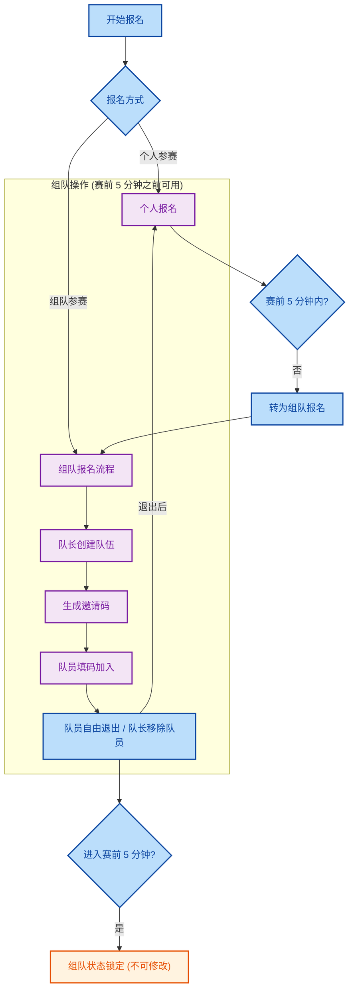

# 洛谷公开比赛参赛规则

## 序言

本规则用于规范公开比赛参赛选手的行为，以保障洛谷公开比赛，特别是计入比赛等级分的比赛（下称 rated 比赛）的公平有序进行。

本规则默认适用于所有洛谷公开比赛。部分公开比赛另有规则规定的，遵照相关规定执行。

## 对公开比赛的定义

本规则所述的洛谷公开比赛，包括全部的“官方比赛”，“团队公开赛”和“个人公开赛”。

## 报名规则

### 个人报名

个人用户可以在比赛结束前报名比赛，可在**比赛开始前 5 分钟之前**转为组队报名。  

一旦报名比赛，无法取消报名。

### 组队报名

部分比赛允许以组队的形式报名参赛，需在**比赛开始前 5 分钟之前**完成组队。

**比赛开始前 5 分钟之前**组队状态将锁定，不允许再作修改。

组队报名流程如下：

1. 由一名用户创建队伍，生成邀请码；
2. 其他成员填写邀请码加入小队；
3. **比赛开始前 5 分钟之前**：队员可自由退出小队转为个人参赛，小队队长可以移除队员；
4. **比赛开始前的最后 5 分钟**：组队状态将锁定，之后都不允许再修改。

组队报名的其他说明：

1. 队伍人数由所参加的比赛决定，默认最多 3 人（即可加入 2 名成员）；
2. 暂时不开放自定义小队名，统一由系统生成随机字符串；
3. 队员退出小队后将转为个人报名状态，可重新加入小队或发起新的小队；
4. 队长退出小队时，队长权限将由第一个加入小队的成员接替；
5. 组队状态锁定指的是，小队成员不再变化，所有人不允许退出小队、队长也不允许移除队员。
6. 当前开放组队的比赛均不计算等级分。

## 赛时答疑与公告

选手在比赛过程中，如果对题目存在疑问，应在指定的比赛答疑帖中提出。禁止在答疑帖之外的公开场合进行提问。

选手的提问不应包含任何与题目做法相关的内容。

在比赛主办者认为必要的场合下（如题目描述的补充解释、更正，测试数据的更新，比赛时长的更改等），主办者会通过比赛页面的“比赛说明”模块等渠道发布赛时公告，以通报相关信息。选手应该定期检查赛时公告。

## 参赛要求

为了保障公开比赛的公平性，请各位参赛选手自觉遵守如下参赛要求：

1. 一个人只能使用一个帐号参加比赛。禁止一个人同时操纵多个帐号参加比赛；当一道题目被用于两场以上同时举办的公开比赛时，如果其中一场比赛采用了乐多赛制，ICPC 赛制等成绩与提交次数有关的赛制，则禁止利用其中一场比赛测试提交，以绕过错误提交造成的罚时或分数扣除等措施。
2. 如无特殊说明，所有的公开比赛均为个人比赛。允许多人组队参加的比赛，将在比赛描述页面的明显位置进行标注。
3. 对于个人比赛，比赛期间，禁止多人共用同一帐号比赛；禁止用户与他人交流比赛相关内容。
4. 对于多人组队的比赛，比赛期间，队内成员可以以任意形式交流比赛内容；禁止非队内成员使用队内成员的帐号参与比赛；禁止队内成员与队外的其他人交流比赛相关内容。
5. 严禁在比赛期间直接使用、修改后使用或借鉴由人工智能（AI）模型（如大型语言模型、代码生成模型等）自动生成的代码。
6. 比赛期间，选手可以使用自己在比赛开始前编写好的代码，请勿使用他人编写的代码。
7. 比赛期间，禁止用户通过攻击评测系统的方式获得成绩。
8. 如果参赛者在比赛期间发现了影响比赛公平的因素，包括但不限于发现比赛存在原题等，应通过私信等非公开渠道向管理组进行反馈。禁止在比赛期间公开发布相关信息。

## 处罚措施

在比赛期间，用户在公开场合发布比赛原题等影响比赛公平因素的信息的，应认定为扰乱比赛秩序，视情节轻重，可处以警告，禁言的处罚。

在比赛期间，用户有如下违背公平公正原则的行为时，应认定为比赛作弊，将处以比赛成绩记为 -1 分（仍然参与比赛等级分计算）和警告性棕名的处罚，视情节严重性，可并处未来一定时间内不得在 rated 比赛中参与比赛等级分计算的处罚：

1. 在个人比赛期间与其他人交流比赛解法等内容的；
2. 在组队比赛期间，团队成员与非团队成员交流比赛解法等内容的；
3. 一个人同时控制多个帐号参加同一场比赛（分 Div 的比赛，所有 Div 均视为同一场比赛）；
4. 当一道题目被用于两场以上同时举办的公开比赛时，利用其中一场比赛测试提交，以绕过错误提交造成的罚时或分数扣除等措施的；
5. 使用非本人（含 AI）编写的代码的；
6. 刻意测试反作弊系统检测机制的；
7. 在比赛进行期间，将题目的解法或代码有意或无意地公开给他人（包括未保管好账号，泄露代码；或者被他人提交可能被判定作弊的代码）；
8. 通过攻击评测系统，利用评测系统漏洞获得成绩的。

用户在公开比赛中存在如下行为，造成恶劣影响的，可处以封禁帐号和比赛等级分归零，终身不在 rated 比赛中参与比赛等级分计算的处罚：

1. 多次在公开比赛作弊，屡教不改的；
2. 组织多人在公开比赛作弊的；
3. 其他性质严重，造成恶劣影响的行为的。

## 作弊申诉

若用户在公开比赛中被判定为作弊（见赛后公告），申诉人须满足下面的至少一个条件，方可提交申诉：

1. 提交参赛全程的全屏录制视频，视频内容须清晰展示整场比赛完整操作过程，且画面可辨识参赛者身份及操作界面。视频可以在 bilibili 等视频网站上传，也可以提交百度网盘等网盘链接。
2. 由金钩或金气球认证用户代为提交申诉。
3. 洛谷付费用户本人提交申诉（需满足相应消费门槛：蓝钩及以上用户累计消费满 599 元，其他用户累计消费满 998 元）。

若不符合上述任一条件，相关申诉将不予受理。

此外，若由金钩/金气球用户代为提交的申诉经核实为无效申诉，则该代申诉用户将被处以棕名 14 天的处理。

洛谷的比赛作弊者中，经过申诉判定并非作弊的用户占比约为 3‰到 4‰，误判率极低。一场比赛的作弊者数量通常不超过报名人数的 2%。因此我们认为该要求并不妨碍正常用户参与比赛。

望各位用户自觉遵守比赛规则，共同维护洛谷社区的公平与秩序。
